# Devbox -- Technical Design

> **Living document** -- maintained alongside OpenSpec artifacts, code, and tests.
> Complements [`ARCHITECTURE.md`](../ARCHITECTURE.md) (codemap), [`lfm.md`](lfm.md) (assurance posture), and the normative specs under [`openspec/specs/`](../openspec/specs/).

---

## Table of Contents

1. [Overview](#1-overview)
2. [Scope and Boundaries](#2-scope-and-boundaries)
3. [Architecture](#3-architecture)
4. [Domain Model](#4-domain-model)
5. [Preconditions, Postconditions, and Invariants](#5-preconditions-postconditions-and-invariants)
6. [State Machines](#6-state-machines)
7. [Interaction Protocols](#7-interaction-protocols)
8. [Failure Modes and Error Model](#8-failure-modes-and-error-model)
9. [Safety and Liveness Claims](#9-safety-and-liveness-claims)
10. [Quality Attributes](#10-quality-attributes)
11. [Verification Strategy](#11-verification-strategy)
12. [Distribution and Packaging](#12-distribution-and-packaging)
13. [Security and Trust Boundaries](#13-security-and-trust-boundaries)
14. [Operational Concerns](#14-operational-concerns)
15. [Forward Evolution](#15-forward-evolution)
16. [Command and Interaction Summary](#16-command-and-interaction-summary)
17. [Relationship to Other Documents](#17-relationship-to-other-documents)
18. [Maintenance Rules](#18-maintenance-rules)

---

## 1. Overview

### 1.1 What Devbox Is

`devbox` is a small TypeScript CLI for creating, tracking, starting, stopping, connecting to, and uploading files to AWS EC2 development machines. It wraps the most common development-box workflows (launch, connect, copy files, teardown) into safe, bounded operations with clear failure semantics and no ambient shell risk.

### 1.2 Why It Exists

Cloud-based development boxes require repetitive, error-prone AWS CLI commands. `devbox` provides a dependable, explicit workflow for common operations without forcing users to manually compose raw `aws`, `ssh`, `scp`, and SSM-backed access commands each time.

### 1.3 Core Design Challenge

`devbox` is intentionally narrow. It is a CLI, not a control plane. Its core challenge is not feature breadth; it is preserving trust across three kinds of state:

- local registry state in `~/.config/devbox.json`
- live AWS state in the active account and region
- temporary remote-host state created during SSM-backed SSH access

### 1.4 Design Philosophy

This project applies **lightweight formal methods** ([docs/lfm.md](lfm.md)): state machines are modeled in Alloy before implementation, critical properties are expressed as preconditions/postconditions/invariants in code, and the verification pyramid (formal models, property-based tests, unit / contract tests, integration tests) provides layered assurance.

The design is centered on:

- preconditions for every command family and boundary crossing
- postconditions that describe the observable outcome after success or failure
- invariants over config shape, alias integrity, source-of-truth boundaries, and cross-system sequencing
- failure modes that are explicit rather than hidden behind generic exceptions
- safety properties that forbid bad things from happening
- liveness properties that describe when bounded progress is expected

The goal is not a proof of the whole system. The goal is justified confidence: the design claims are explicit, mechanically checkable, traceable into the capability specs, and re-checked in tests as the system evolves.

### 1.5 Relevant Capability Specs

| Capability | Purpose |
|---|---|
| [`box-registry`](../openspec/specs/box-registry/spec.md) | local tracking, alias management, config-store invariants, `init`/`add`/`rm`/`switch` |
| [`instance-lifecycle`](../openspec/specs/instance-lifecycle/spec.md) | `up`/`down`, EC2 state transitions, bounded polling |
| [`remote-access`](../openspec/specs/remote-access/spec.md) | `connect`, `cp`, SSH-user resolution, SSM readiness, temp-key staging |
| [`distribution`](../openspec/specs/distribution/spec.md) | `npm` distribution and `dist/devbox.js` parity |

---

## 2. Scope and Boundaries

### 2.1 In Scope

- top-level informational behavior for `--help` and `--version`
- local box-registry behavior for `list`, `init`, `add`, `rm`, and `switch`
- lifecycle control for `up` and `down`
- remote access for `connect` and upload-only `cp`
- packaging and runtime parity between `npm` installation and `dist/devbox.js`
- traceability infrastructure that keeps specs, tests, and evidence connected

### 2.2 Out of Scope

- AWS profile, credential, or region management inside `devbox`
- replacing AWS CLI with the AWS SDK
- download, sync, directory copy, or general SSH orchestration beyond the documented command set
- tracking multiple AWS execution contexts in one local registry
- a background daemon, service, or distributed lock manager

### 2.3 Goals and Non-Goals

#### Goals

- provide a layered CLI architecture that isolates deterministic domain logic from subprocess execution and filesystem effects
- preserve the key invariants of alias uniqueness, valid `current` selection, source-of-truth separation, explicit destructive behavior, and atomic local mutation
- make lifecycle and remote-access flows explicit enough to reason about as state machines
- normalize errors and output contracts so the CLI is predictable across validation failure, dependency failure, timeout, stale-resource, and post-external consistency failure cases
- preserve the same user-visible behavior across supported distribution forms

#### Non-Goals

- hiding AWS execution context management inside the tool
- widening the product into a general-purpose SSH orchestration framework
- building a separate always-on service or persistent agent
- collapsing remote-host state into durable local truth

### 2.4 Source-of-Truth Boundaries

| Concern | Authoritative Source | Consequence |
|---|---|---|
| tracked aliases and current selection | committed local config | registry commands must not invent aliases or recover missing local state from AWS |
| instance existence and lifecycle state | AWS in the active account and region | lifecycle and remote-access commands must query AWS at command time |
| remote authorization and transfer state | bounded remote-access session | remote-host state is never treated as durable registry truth |
| resolved SSH user | invocation override, then per-box override, then defaults | remote access must not guess a user |

### 2.5 Thin-Wrapper Boundaries

- AWS effects are performed through `aws`
- remote transport is performed through `ssh` and `scp`
- local persistence is performed through one config-store boundary that owns locking and atomic replacement

---

## 3. Architecture

### 3.1 High-Level Architecture Diagram

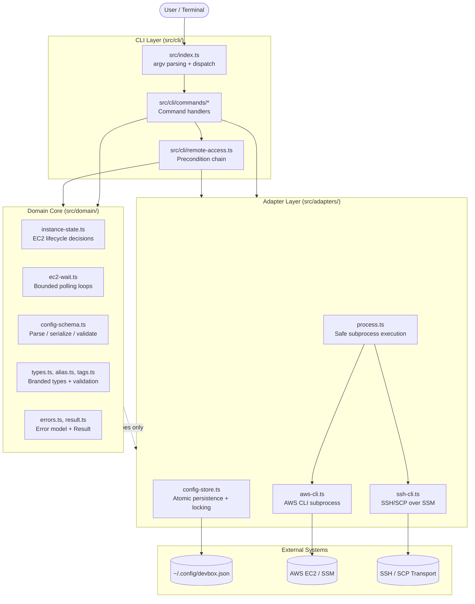
```mermaid
graph TD
    User([User / Terminal])

    subgraph CLI["CLI Layer (src/cli/)"]
        Entry["src/index.ts<br/>argv parsing + dispatch"]
        Commands["src/cli/commands/*<br/>Command handlers"]
        RemoteAccess["src/cli/remote-access.ts<br/>Precondition chain"]
    end

    subgraph Domain["Domain Core (src/domain/)"]
        StateMachine["instance-state.ts<br/>EC2 lifecycle decisions"]
        Polling["ec2-wait.ts<br/>Bounded polling loops"]
        ConfigSchema["config-schema.ts<br/>Parse / serialize / validate"]
        Types["types.ts, alias.ts, tags.ts<br/>Branded types + validation"]
        Errors["errors.ts, result.ts<br/>Error model + Result<T,E>"]
    end

    subgraph Adapters["Adapter Layer (src/adapters/)"]
        ConfigStore["config-store.ts<br/>Atomic persistence + locking"]
        AwsCli["aws-cli.ts<br/>AWS CLI subprocess"]
        SshCli["ssh-cli.ts<br/>SSH/SCP over SSM"]
        Process["process.ts<br/>Safe subprocess execution"]
    end

    subgraph External["External Systems"]
        FS[("~/.config/devbox.json")]
        AWS[("AWS EC2 / SSM")]
        SSH[("SSH / SCP Transport")]
    end

    User --> Entry
    Entry --> Commands
    Commands --> RemoteAccess
    Commands --> Domain
    RemoteAccess --> Domain
    Commands --> Adapters
    RemoteAccess --> Adapters
    Domain -.->|"types only"| Adapters
    ConfigStore --> FS
    AwsCli --> AWS
    SshCli --> SSH
    Process --> AwsCli
    Process --> SshCli
```

The architecture is layered:

- The **CLI layer** parses invocation shape, chooses a command handler, and renders normalized stdout and stderr.
- The **domain layer** owns deterministic reasoning: validation, state-transition decisions, merge rules, wait policies, and invariants.
- The **adapter layer** owns side effects: config persistence, subprocess execution, AWS normalization, SSH/SCP transport, and cleanup.

This split matters for assurance. The more the decision logic is isolated from the side-effecting mechanics, the easier it is to express invariants, encode state machines, and mechanically test the behavior that matters. The domain depends on the adapter layer only through types, never through calls.

### 3.2 Component Descriptions

| Component | Responsibility | Key Invariant |
|---|---|---|
| **Entry point** ([`src/index.ts`](../src/index.ts)) | Parse argv into typed `Invocation`, dispatch to command handler, write stdout/stderr, set exit code | No business logic; only routing and I/O |
| **Command handlers** ([`src/cli/commands/`](../src/cli/commands/)) | Compose domain decisions with adapter calls; produce `CommandResult` | Each handler is a single async function with a `Result` return |
| **Remote-access chain** ([`src/cli/remote-access.ts`](../src/cli/remote-access.ts)) | Sequential precondition resolution for SSH-dependent commands | Short-circuits on first failure; no partial side effects |
| **Domain core** ([`src/domain/`](../src/domain/)) | Pure, deterministic functions -- state decisions, parsing, validation | Zero I/O; injectable `Clock` for time; fully testable in isolation |
| **Config store** ([`src/adapters/config-store.ts`](../src/adapters/config-store.ts)) | Atomic config persistence with advisory locking | Write protocol: write-temp -> fsync -> rename -> dir-fsync |
| **AWS CLI adapter** ([`src/adapters/aws-cli.ts`](../src/adapters/aws-cli.ts)) | Subprocess calls to `aws ec2` / `aws ssm` | argv-only execution; 10 MiB buffer cap; no shell interpolation |
| **SSH adapter** ([`src/adapters/ssh-cli.ts`](../src/adapters/ssh-cli.ts)) | Key material management, SSM-backed SSH sessions, SCP uploads, opt-in agent forwarding on interactive sessions | Ephemeral keys with signal-safe cleanup |
| **Process adapter** ([`src/adapters/process.ts`](../src/adapters/process.ts)) | Safe `child_process.execFile` wrapper | ENOENT -> `DependencyError`; non-zero exit -> `TransportError` |

### 3.3 Design Principles

- Make important invariants explicit.
- Keep the core deterministic and push nondeterminism to the edges.
- Treat local config and AWS live state as distinct sources of truth.
- Reject invalid input before crossing AWS, filesystem, or remote-shell boundaries.
- Bound all waits and surface timeouts explicitly.
- Keep destructive behavior opt-in and explicit.
- Surface cross-system divergence rather than collapsing it into a local-only error.
- Keep packaging and traceability in the product contract.

---

## 4. Domain Model

### 4.1 Conceptual Entity-Relationship Diagram

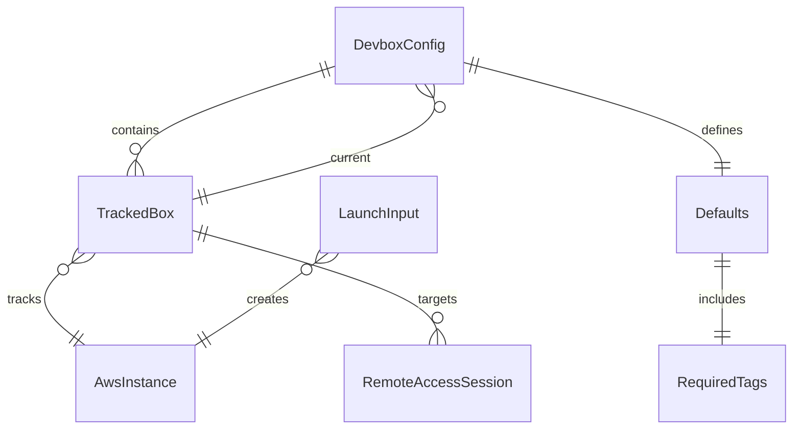
```mermaid
erDiagram
    DevboxConfig ||--o{ TrackedBox : contains
    DevboxConfig ||--|| Defaults : defines
    DevboxConfig }o--|| TrackedBox : current
    TrackedBox }o--|| AwsInstance : tracks
    TrackedBox ||--o{ RemoteAccessSession : targets
    Defaults ||--|| RequiredTags : includes
    LaunchInput }o--|| AwsInstance : creates
```

### 4.2 Persistent Config Model (ER)

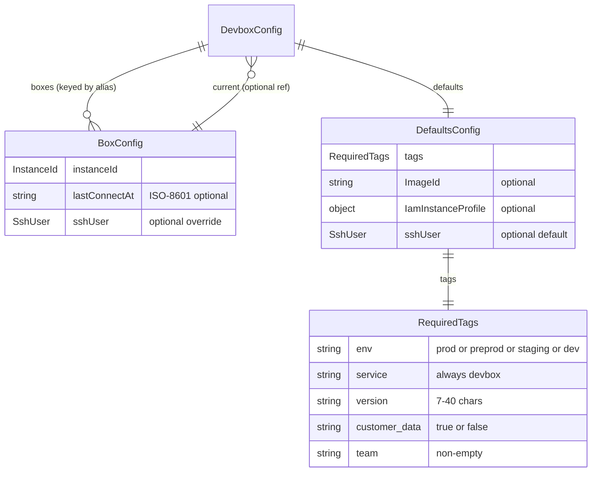
```mermaid
erDiagram
    DevboxConfig ||--o{ BoxConfig : "boxes (keyed by alias)"
    DevboxConfig ||--|| DefaultsConfig : "defaults"
    DevboxConfig }o--|| BoxConfig : "current (optional ref)"
    DefaultsConfig ||--|| RequiredTags : "tags"
    BoxConfig {
        InstanceId instanceId
        string lastConnectAt "ISO-8601 optional"
        SshUser sshUser "optional override"
    }
    DefaultsConfig {
        RequiredTags tags
        string ImageId "optional"
        object IamInstanceProfile "optional"
        SshUser sshUser "optional default"
    }
    RequiredTags {
        string env "prod or preprod or staging or dev"
        string service "always devbox"
        string version "7-40 chars"
        string customer_data "true or false"
        string team "non-empty"
    }
```

### 4.3 Primary Domain Entities

| Entity | Meaning | Authority | Key Invariants |
|---|---|---|---|
| Box Alias | stable local name chosen by the user | local config | syntactically valid and unique |
| Tracked Box | durable local record for one alias | local config | contains a non-empty `instanceId`; optional `sshUser` and `lastConnectAt` belong only to tracked aliases |
| Current Box | optional pointer used by current-box commands | local config | absent or references an existing alias |
| Defaults | shared config values for tags, launch defaults, and default SSH user | local config | required tags are always present and valid |
| Launch Input | launch-template-style JSON for `init` | invocation plus defaults | only documented allowlisted fields are accepted |
| AWS Instance | live EC2 machine in the active account and region | AWS | lifecycle and existence are checked at command time |
| Remote Access Session | bounded interaction for `connect` or `cp` | command runtime | transport is gated on running state, SSM readiness, and staged authorization |
| Distribution Artifact | `npm` CLI or bundled `dist/devbox.js` | build and package output | preserves the same command contract |
| Spec Catalog and Trace Evidence | active OpenSpec identifiers and traced tests | active specs and test harness | identifiers come from active specs, not archived changes |

### 4.4 Authority Rules

| Rule | Reason |
|---|---|
| alias membership and current selection come only from committed local config | the registry is the durable local source of truth |
| instance existence and lifecycle state come only from AWS describes at command time | persisted live-state guesses become stale and unsafe |
| `lastConnectAt` is local metadata, not proof of live reachability | remote access is bounded and transient |
| resolved SSH user is derived from invocation override, then per-box override, then defaults | remote access must stay explicit and predictable |

### 4.5 Branded Types and Encoding Constraints

The domain uses **phantom-branded string types** to prevent accidental interchange of semantically distinct identifiers at compile time:

| Type | Brand | Validation Rule | Construction |
|------|-------|----------------|--------------|
| `BoxAlias` | `"BoxAlias"` | `^[A-Za-z0-9][A-Za-z0-9_-]{0,63}$` | `parseAlias()` |
| `InstanceId` | `"InstanceId"` | Non-empty trimmed string | `parseInstanceId()` in config-schema |
| `SshUser` | `"SshUser"` | `^[^\s\x00-\x1f\x7f]+$` (no whitespace/control chars) | `parseSshUser()` in config-schema |
| `RemotePath` | `"RemotePath"` | Starts with `/` or `~/`; no null bytes; no ASCII control chars | `parseRemotePath()` |

**Encoding:** The config file is UTF-8 encoded JSON with 2-space indentation and a trailing newline. Serialization is deterministic (`JSON.stringify` with stable key order). A leading BOM is invalid and treated as a config error.

Relevant code: [`src/domain/alias.ts`](../src/domain/alias.ts), [`src/domain/config-schema.ts`](../src/domain/config-schema.ts), [`src/domain/remote-path.ts`](../src/domain/remote-path.ts)

### 4.6 Persistent Config Shape

The durable local registry is stored at `~/.config/devbox.json`. The advisory lock file is stored at `~/.config/devbox.json.lock`.

#### Top-Level Shape

| Field | Meaning | Constraints |
|---|---|---|
| `boxes` | alias-keyed tracked-box map | required; keys are unique aliases |
| `current` | current alias pointer | optional; if present, must name an existing alias |
| `defaults.tags` | required default tags | required; must contain the required tag keys |
| `defaults.ImageId` | default AMI or SSM parameter expression | optional; must exist after merge for `init` |
| `defaults.IamInstanceProfile` | default instance profile | optional; must exist after merge for `init` |
| `defaults.sshUser` | default SSH user | optional |

#### Per-Box Shape

| Field | Meaning | Constraints |
|---|---|---|
| `instanceId` | tracked EC2 instance ID | required; non-empty string |
| `sshUser` | per-box SSH user override | optional |
| `lastConnectAt` | last successful remote-access timestamp | optional; ISO-8601 UTC string |

#### Encoding and Storage Constraints

| Constraint | Rule |
|---|---|
| config encoding | UTF-8 JSON |
| BOM handling | a leading BOM is invalid and treated as a config error |
| config file mode | `0600` |
| lock file mode | `0600` |
| lock file content | holder PID encoded as a decimal ASCII string |
| config writes | temp-file write, file `fsync`, atomic rename, and directory sync |
| crash during write | the committed config remains intact; temp files may be orphaned |

### 4.7 Data Invariants

| ID | Invariant | Enforced By | Failure Mode |
|----|-----------|-------------|--------------|
| **D-1** | `current` references an existing key in `boxes` | `parseConfig()` validation | `ConfigError` |
| **D-2** | All alias keys satisfy `BoxAlias` pattern | `parseConfig()` iteration | `ConfigError` |
| **D-3** | Each `BoxConfig.instanceId` is non-empty | `parseBoxConfig()` | `ConfigError` |
| **D-4** | `defaults.tags` satisfies all `RequiredTags` constraints | `validateRequiredTags()` | `ConfigError` |
| **D-5** | `lastConnectAt` is valid ISO-8601 when present | `parseLastConnectAt()` | `ConfigError` |
| **D-6** | Config file permissions are `0o600` | `commitConfig()` write mode | OS-level enforcement |
| **D-7** | Round-trip: `parseConfig(JSON.parse(serializeConfig(c))) === c` | Module-level invariant | Property tests |
| **D-8** | Failed local mutations do not partially commit JSON | Atomic write protocol | Write-fsync-rename-fsync |
| **D-9** | Per-box `sshUser` and `lastConnectAt` only defined for tracked aliases | Map keying | `ConfigError` |

**Spec reference:** [`box-registry`](../openspec/specs/box-registry/spec.md) -- see `[ALIAS-FORMAT]`, `[CONFIG-CURRENT-VALID]`, `[TAG-DEFAULTS-SCHEMA]`.

### 4.8 Locking and Concurrency Constraints

| Constraint | Rule |
|---|---|
| mutation path | all config mutations flow through one adapter path |
| writer policy | mutation requires exclusive advisory lock acquisition |
| live lock behavior | a live, recent lock holder is never preempted |
| stale detection | PID validity, PID liveness, and lock mtime older than 5 minutes |
| stale recovery | best effort and retried once |
| concurrency model | single-writer semantics are preferred over concurrent merge behavior |

Stale lock detection uses three criteria:
1. Lock age exceeds `CONFIG_LOCK_STALE_AFTER_MS` (5 minutes)
2. PID content is unparseable (corrupted)
3. Referenced PID is dead (`kill(pid, 0)` fails with ESRCH)

**Spec reference:** [`box-registry`](../openspec/specs/box-registry/spec.md) -- see `[CONFIG-ATOMIC-WRITE]`, `[CONFIG-LOCK-ADVISORY]`, `[CONFIG-LOCK-STALE-RECOVERY]`.

### 4.9 Launch Template and Tag Constraints

Relevant code: [`src/domain/init-mapper.ts`](../src/domain/init-mapper.ts)

`init` accepts a launch-template-style JSON object (sent to `aws ec2 run-instances --cli-input-json`).
The supported top-level keys are:

```json
{
  "BlockDeviceMappings": [ "BlockDeviceMapping, ..." ],
  "CapacityReservationSpecification": "CapacityReservationSpecification",
  "CpuOptions": "CpuOptions",
  "CreditSpecification": "CreditSpecification",
  "DisableApiStop": "Boolean",
  "DisableApiTermination": "Boolean",
  "EbsOptimized": "Boolean",
  "EnclaveOptions": "EnclaveOptions",
  "HibernationOptions": "HibernationOptions",
  "IamInstanceProfile": "IamInstanceProfile",
  "ImageId": "String",
  "InstanceInitiatedShutdownBehavior": "String",
  "InstanceMarketOptions": "InstanceMarketOptions",
  "InstanceType": "String",
  "KernelId": "String",
  "KeyName": "String",
  "LicenseSpecifications": [ "LicenseSpecification, ..." ],
  "MaintenanceOptions": "MaintenanceOptions",
  "MetadataOptions": "MetadataOptions",
  "Monitoring": "Monitoring",
  "NetworkInterfaces": [ "NetworkInterface, ..." ],
  "Placement": "Placement",
  "PrivateDnsNameOptions": "PrivateDnsNameOptions",
  "RamDiskId": "String",
  "SecurityGroupIds": [ "String, ..." ],
  "SecurityGroups": [ "String, ..." ],
  "TagSpecifications": [ "TagSpecification, ..." ],
  "UserData": "String"
}
```

This is a top-level allowlist, not a complete nested schema. Unknown fields and `InstanceRequirements` are rejected before any AWS call.

#### Required Values After Merge

| Field | Requirement |
|---|---|
| `ImageId` | must be present |
| `IamInstanceProfile` | must be present |
| required tags | must be present and valid |
| `MinCount` and `MaxCount` | always set to `1` |

#### Structural Conflict Rules

| Condition | Rule |
|---|---|
| template contains `NetworkInterfaces` | reject top-level `SecurityGroupIds` and `SecurityGroups` |
| template uses top-level `SecurityGroups` without `NetworkInterfaces` | allow and surface any AWS rejection clearly |
| template contains `UserData` | pass through unchanged, including `file:` values |

#### Required Tag Constraints

| Tag | Constraint |
|---|---|
| `env` | one of `prod`, `preprod`, `staging`, `dev` |
| `service` | exactly `devbox` |
| `version` | 7 to 40 characters, with `0000000` allowed as the built-in placeholder default |
| `customer-data` | one of `true`, `false` |
| `team` | non-empty short identifier |

#### Tag Merge Precedence

1. built-in required tag defaults
2. `config.defaults.tags`
3. template instance `TagSpecifications`
4. forced `Name=<alias>` override
5. required-tag validation

#### Additional Tag Rules

| Rule | Purpose |
|---|---|
| `devbox` emits exactly one merged instance `TagSpecification` | avoids duplicate instance-tag blocks |
| non-instance `TagSpecifications` pass through unchanged | preserves AWS request shape outside the instance resource |
| template `Name` is ignored and replaced with the alias | preserves stable user-facing naming |

**Spec reference:** [`box-registry`](../openspec/specs/box-registry/spec.md)

### 4.10 Remote Path and File Constraints

| Input | Constraint |
|---|---|
| local file for `cp` | exactly one readable regular local file |
| file size | no artificial size limit is imposed by `devbox` |
| remote path | must be non-empty after trimming |
| remote path characters | must not contain ASCII control characters or null bytes |
| transport gating | unsafe remote paths are rejected before any SSH, SCP, or AWS transport command is executed |

**Spec reference:** [`remote-access`](../openspec/specs/remote-access/spec.md)

---

## 5. Preconditions, Postconditions, and Invariants

### 5.1 System-Wide Invariants

| ID | Invariant | How Maintained |
|----|-----------|----------------|
| **I-1** | Config consistency: `current` always references an existing `boxes` key | Validated on load; enforced on every mutation |
| **I-2** | Alias uniqueness: no two boxes share an alias within the registry | Map keying (object keys are unique) |
| **I-3** | No shell interpolation: all subprocess calls use argv arrays | `process.ts` uses `execFile`, never `exec` |
| **I-4** | Bounded work: every polling loop has a finite timeout ceiling | `EC2_WAIT_TIMEOUT_MS`, `SSM_WAIT_TIMEOUT_MS` constants |
| **I-5** | Signal-safe cleanup: SIGINT/SIGTERM always trigger resource release | `finally` blocks + explicit signal handlers |
| **I-6** | Deterministic domain: all domain functions are pure (given same Clock) | No I/O in `src/domain/`; Clock is injectable |
| **I-7** | Error completeness: every error path produces a typed `DevboxError` | `Result<T,E>` return types; no thrown exceptions in domain |
| **I-8** | Destructive AWS effects occur only on explicit command paths | No implicit termination or deletion |
| **I-9** | Persisted state is never treated as authoritative for live AWS state | Re-describe before every action; no caching |
| **I-10** | `lastConnectAt` updates only after external success and local commit | Two-phase success gate |

### 5.2 Per-Command Contracts

| Command | Preconditions | Postconditions | Error Outcomes |
|---------|---------------|----------------|----------------|
| `--version` | none | stdout: version string; exit 0 | -- |
| `--help` | none | stdout: usage text; exit 0 | -- |
| `list` | Config loadable | stdout: all tracked boxes with AWS state | `ConfigError`, `AwsCliError` (degraded) |
| `init` | Valid alias (not taken), valid template file, valid defaults | New box tracked, instance launched, alias is `current` | `ValidationError`, `ConfigError`, `AwsCliError`, `ConsistencyError` |
| `add` | Valid alias (not taken), valid instance ID | Instance tracked under alias, set as `current` | `ValidationError`, `ConfigError` |
| `rm` | Alias exists in registry | Alias removed; if `--terminate`, instance terminated first | `ValidationError`, `ConfigError`, `AwsCliError`, `ConsistencyError` |
| `switch` | Alias exists in registry | `current` updated to target alias | `ValidationError`, `ConfigError` |
| `up` | `current` set, instance in {stopped, stopping, pending, running} | Instance in `running` state | `ConfigError`, `NotFoundError`, `InstanceStateError`, `TimeoutError`, `AwsCliError` |
| `down` | `current` set, instance in {running, stopping, stopped} | Instance in `stopped` state | `ConfigError`, `NotFoundError`, `InstanceStateError`, `TimeoutError`, `AwsCliError` |
| `connect` | Full remote-access precondition chain satisfied; if `--forward-agent`, resolved key material must come from a local agent | Interactive SSH session established (exit code passthrough); agent forwarding enabled when requested | `ValidationError`, `ConfigError`, `NotFoundError`, `InstanceStateError`, `TimeoutError`, `TransportError`, `ConsistencyError` |
| `cp` | Full remote-access precondition chain + valid local/remote paths | File uploaded atomically to remote destination | `ValidationError`, `ConfigError`, `NotFoundError`, `InstanceStateError`, `TimeoutError`, `TransportError`, `ConsistencyError` |

**Spec references:**
- [`box-registry`](../openspec/specs/box-registry/spec.md) -- registry commands
- [`instance-lifecycle`](../openspec/specs/instance-lifecycle/spec.md) -- up/down
- [`remote-access`](../openspec/specs/remote-access/spec.md) -- connect/cp

### 5.3 Global Preconditions

- The process can access the user's home directory and config path when local state is needed.
- Config, if present and required, is valid according to the config model.
- AWS-dependent commands run with credentials, account, and region established outside `devbox`.
- Remote-access commands require the relevant local executables (`ssh`, `ssh-keygen`, `scp`) and SSM prerequisites.

### 5.4 Global Postconditions

- Successful mutating local commands leave a schema-valid committed config.
- Successful external mutation followed by failed local commit is reported explicitly as divergence (`ConsistencyError`).
- Supported distribution forms preserve the same user-visible command contracts.

---

## 6. State Machines

All state machines are implemented using discriminated unions with exhaustive switch statements and `assertNever` guards. The implementation pattern is documented in [docs/state_machines.md](state_machines.md).

### 6.1 Top-Level Invocation

Relevant specs: [`box-registry`](../openspec/specs/box-registry/spec.md), [`distribution`](../openspec/specs/distribution/spec.md)

Relevant code: [`src/index.ts`](../src/index.ts)

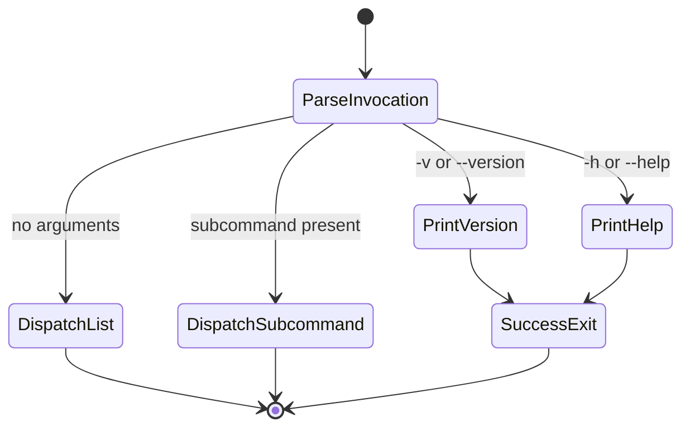
```mermaid
stateDiagram-v2
    [*] --> ParseInvocation
    ParseInvocation --> PrintVersion: -v or --version
    ParseInvocation --> PrintHelp: -h or --help
    ParseInvocation --> DispatchList: no arguments
    ParseInvocation --> DispatchSubcommand: subcommand present
    PrintVersion --> SuccessExit
    PrintHelp --> SuccessExit
    DispatchList --> [*]
    DispatchSubcommand --> [*]
    SuccessExit --> [*]
```

#### Decision Table

| Invocation Shape | Action | Side Effects |
|---|---|---|
| `-v`, `--version` | print version | none |
| `-h`, `--help` | print help and version | none |
| no args | dispatch `list` | same as `list` contract |
| subcommand | dispatch command handler | command-specific |

#### Invariants

| Invariant | Meaning |
|---|---|
| I-INV-1 | help and version do not read config |
| I-INV-2 | help and version do not contact AWS or remote-access adapters |
| I-INV-3 | bare invocation is not a hidden special case; it is defined as `list` |

#### Safety and Liveness

- Safety: informational commands never cross config, AWS, or remote-access boundaries.
- Liveness: informational commands terminate immediately on local process success paths.

### 6.2 Config-Store Mutation

Relevant specs: [`box-registry`](../openspec/specs/box-registry/spec.md)

Relevant code: [`src/adapters/config-store.ts`](../src/adapters/config-store.ts), [`src/domain/config-schema.ts`](../src/domain/config-schema.ts)

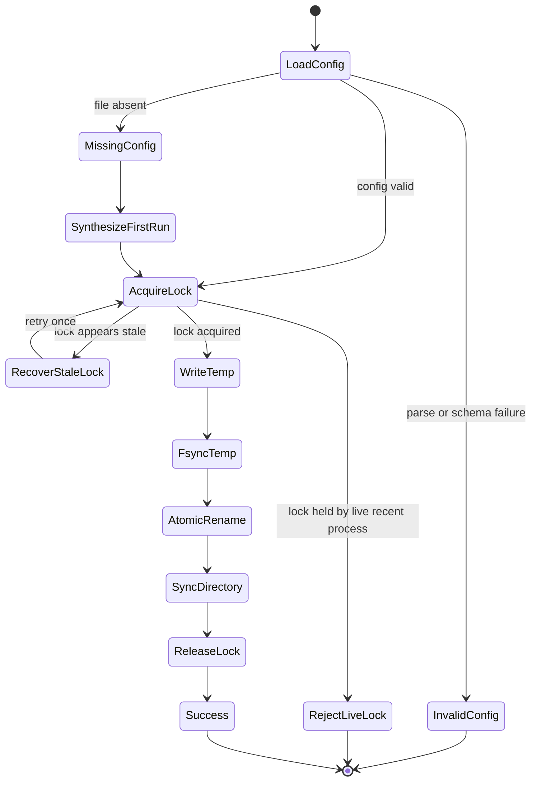
```mermaid
stateDiagram-v2
    [*] --> LoadConfig
    LoadConfig --> MissingConfig: file absent
    LoadConfig --> InvalidConfig: parse or schema failure
    LoadConfig --> AcquireLock: config valid
    MissingConfig --> SynthesizeFirstRun
    SynthesizeFirstRun --> AcquireLock
    AcquireLock --> RecoverStaleLock: lock appears stale
    AcquireLock --> RejectLiveLock: lock held by live recent process
    AcquireLock --> WriteTemp: lock acquired
    RecoverStaleLock --> AcquireLock: retry once
    WriteTemp --> FsyncTemp
    FsyncTemp --> AtomicRename
    AtomicRename --> SyncDirectory
    SyncDirectory --> ReleaseLock
    ReleaseLock --> Success
    InvalidConfig --> [*]
    RejectLiveLock --> [*]
    Success --> [*]
```

#### Decision Table

| Condition | Result |
|---|---|
| config missing on mutation path | synthesize first-run state, then proceed |
| config invalid | fail with `ConfigError` |
| lock absent | acquire and continue |
| lock live and recent | reject mutation |
| lock stale by PID validity, PID liveness, or age > 5 minutes | remove and retry once |

#### Invariants

| Invariant | Meaning |
|---|---|
| C-1 | all config mutations flow through one adapter path |
| C-2 | write protocol is write temp -> `fsync` temp -> atomic rename -> directory `fsync` |
| C-3 | lock release happens on every exit path |
| C-4 | readers see either old or new config, never a partial write |

#### Safety and Liveness

- Safety: no mutation can leave partially committed config state.
- Safety: a live, recent lock holder is never preempted.
- Liveness: bounded progress is expected when the lock is free or stale rather than live and contended.
- Durability: after successful `commitConfig`, the new config survives power loss because both data (via temp fsync) and directory metadata (via dir fsync) are hardened before the lock is released.

**Spec reference:** [`box-registry`](../openspec/specs/box-registry/spec.md) -- see `[CONFIG-ATOMIC-WRITE]`, `[CONFIG-LOCK-ADVISORY]`, `[CONFIG-LOCK-STALE-RECOVERY]`.

### 6.3 Registry Mutation

Relevant specs: [`box-registry`](../openspec/specs/box-registry/spec.md)

Relevant code: [`src/cli/commands/init.ts`](../src/cli/commands/init.ts), [`src/cli/commands/add.ts`](../src/cli/commands/add.ts), [`src/cli/commands/rm.ts`](../src/cli/commands/rm.ts), [`src/cli/commands/switch.ts`](../src/cli/commands/switch.ts), [`src/domain/alias.ts`](../src/domain/alias.ts), [`src/domain/init-mapper.ts`](../src/domain/init-mapper.ts)

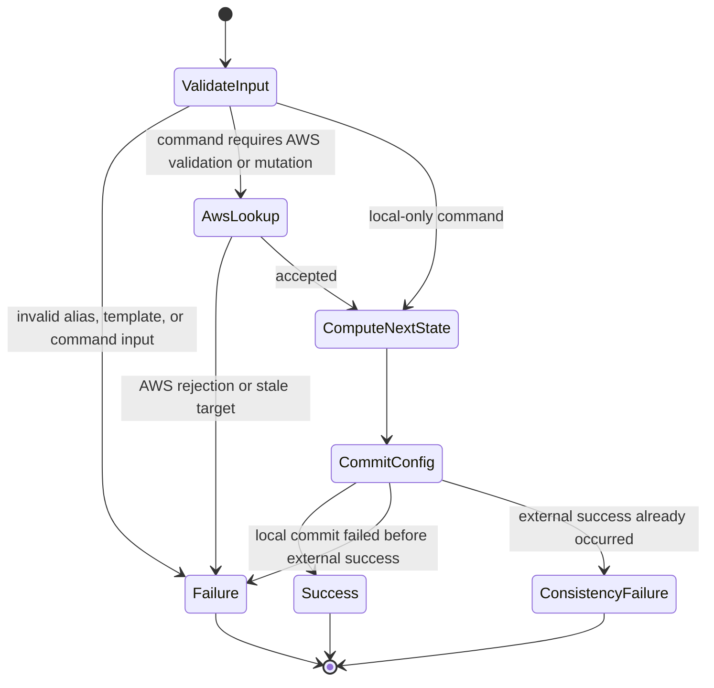
```mermaid
stateDiagram-v2
    [*] --> ValidateInput
    ValidateInput --> Failure: invalid alias, template, or command input
    ValidateInput --> AwsLookup: command requires AWS validation or mutation
    ValidateInput --> ComputeNextState: local-only command
    AwsLookup --> Failure: AWS rejection or stale target
    AwsLookup --> ComputeNextState: accepted
    ComputeNextState --> CommitConfig
    CommitConfig --> Success
    CommitConfig --> Failure: local commit failed before external success
    CommitConfig --> ConsistencyFailure: external success already occurred
    Success --> [*]
    Failure --> [*]
    ConsistencyFailure --> [*]
```

#### Decision Table

| Command | AWS Interaction | Commit Order | Divergence Risk |
|---|---|---|---|
| `switch` | none | local commit only | none beyond local config failure |
| `rm` | none unless `--terminate` | local commit only | none beyond local config failure |
| `add` | AWS describe only | commit after describe success | no AWS mutation, so no post-external divergence |
| `init` | AWS launch | commit after launch success | yes; failed local commit after launch becomes `ConsistencyError` |
| `rm --terminate` | AWS termination | commit after accepted termination or already-absent result | yes; failed local commit after accepted termination becomes `ConsistencyError` |

#### Invariants

| Invariant | Meaning |
|---|---|
| R-1 | invalid aliases and invalid template shapes fail before any AWS mutation |
| R-2 | removing the current alias clears `current` rather than reassigning it |
| R-3 | `rm` without `--terminate` is local-only, even for stale instances |
| R-4 | AWS describe is authoritative for `add` and `init` validation involving live state |

#### Safety and Liveness

- Safety: destructive AWS behavior is never implicit.
- Safety: external success followed by failed local commit is surfaced explicitly as `ConsistencyError`.
- Liveness: local-only registry operations complete once lock acquisition succeeds.

**Spec reference:** [`box-registry`](../openspec/specs/box-registry/spec.md)

### 6.4 EC2 Instance Lifecycle -- Up

**Goal:** Bring the current instance to `running` state from any valid starting state.

Relevant specs: [`instance-lifecycle`](../openspec/specs/instance-lifecycle/spec.md)

Relevant code: [`src/domain/instance-state.ts`](../src/domain/instance-state.ts), [`src/domain/ec2-wait.ts`](../src/domain/ec2-wait.ts), [`src/cli/commands/up.ts`](../src/cli/commands/up.ts)

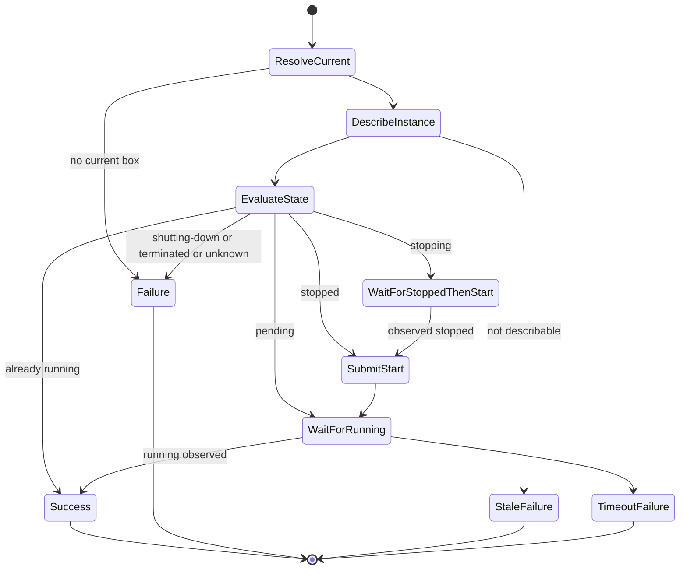
```mermaid
stateDiagram-v2
    [*] --> ResolveCurrent
    ResolveCurrent --> Failure: no current box
    ResolveCurrent --> DescribeInstance
    DescribeInstance --> StaleFailure: not describable
    DescribeInstance --> EvaluateState
    EvaluateState --> Success: already running
    EvaluateState --> WaitForRunning: pending
    EvaluateState --> SubmitStart: stopped
    EvaluateState --> WaitForStoppedThenStart: stopping
    EvaluateState --> Failure: shutting-down or terminated or unknown
    SubmitStart --> WaitForRunning
    WaitForStoppedThenStart --> SubmitStart: observed stopped
    WaitForRunning --> Success: running observed
    WaitForRunning --> TimeoutFailure
    Success --> [*]
    Failure --> [*]
    StaleFailure --> [*]
    TimeoutFailure --> [*]
```

#### Decision Table (`decideUpAction` at `src/domain/instance-state.ts`)

| Current State | `submitStart` | `wait` | `waitForStoppedBeforeStart` | Outcome |
|---|:---:|:---:|:---:|---|
| `running` | no | no | no | already at target |
| `pending` | no | yes | no | wait for `running` |
| `stopped` | yes | yes | no | start, then wait |
| `stopping` | no | yes | yes | wait for `stopped`, then start, then wait for `running` |
| `shutting-down` | no | no | no | `InstanceStateError` |
| `terminated` | no | no | no | `InstanceStateError` |
| `unknown` | no | no | no | `InstanceStateError` |

#### Invariants

| Invariant | Meaning |
|---|---|
| U-1 | only the current tracked instance is targeted |
| U-2 | AWS describe in the active context is authoritative |
| U-3 | a redundant start request is never sent when the instance is already `pending` |
| U-4 | the 5-minute budget covers the whole path, including `stopping -> stopped -> start -> running` |

#### Safety and Liveness

- Safety: `shutting-down`, `terminated`, and `unknown` never trigger a start request.
- Safety: success is reported only after observing `running`.
- Safety: no start while stopping -- the machine waits for `stopped` before issuing `StartInstances`.
- Liveness: `up` succeeds if the instance reaches `running` within `EC2_WAIT_TIMEOUT_MS` (5 minutes) with 5-second polling.
- Liveness: SIGINT/SIGTERM abort polling immediately.

**Spec reference:** [`instance-lifecycle`](../openspec/specs/instance-lifecycle/spec.md)

### 6.5 EC2 Instance Lifecycle -- Down

**Goal:** Bring the current instance to `stopped` state.

Relevant specs: [`instance-lifecycle`](../openspec/specs/instance-lifecycle/spec.md)

Relevant code: [`src/domain/instance-state.ts`](../src/domain/instance-state.ts), [`src/domain/ec2-wait.ts`](../src/domain/ec2-wait.ts), [`src/cli/commands/down.ts`](../src/cli/commands/down.ts)

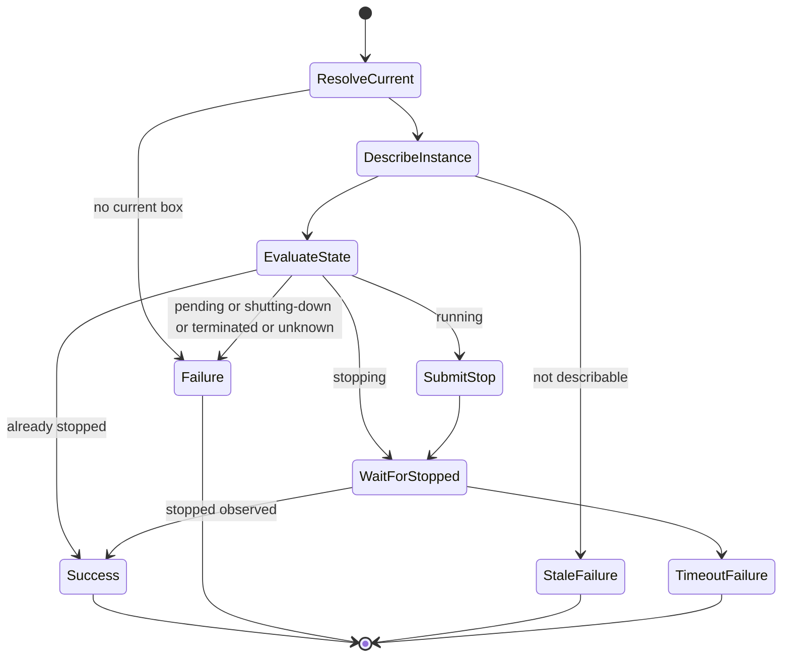
```mermaid
stateDiagram-v2
    [*] --> ResolveCurrent
    ResolveCurrent --> Failure: no current box
    ResolveCurrent --> DescribeInstance
    DescribeInstance --> StaleFailure: not describable
    DescribeInstance --> EvaluateState
    EvaluateState --> Success: already stopped
    EvaluateState --> WaitForStopped: stopping
    EvaluateState --> SubmitStop: running
    EvaluateState --> Failure: pending or shutting-down or terminated or unknown
    SubmitStop --> WaitForStopped
    WaitForStopped --> Success: stopped observed
    WaitForStopped --> TimeoutFailure
    Success --> [*]
    Failure --> [*]
    StaleFailure --> [*]
    TimeoutFailure --> [*]
```

#### Decision Table (`decideDownAction` at `src/domain/instance-state.ts`)

| Current State | `submitStop` | `wait` | Outcome |
|---|:---:|:---:|---|
| `stopped` | no | no | already at target |
| `stopping` | no | yes | wait for `stopped` |
| `running` | yes | yes | stop, then wait |
| `pending` | no | no | `InstanceStateError` |
| `shutting-down` | no | no | `InstanceStateError` |
| `terminated` | no | no | `InstanceStateError` |
| `unknown` | no | no | `InstanceStateError` |

#### Invariants

| Invariant | Meaning |
|---|---|
| D-1 | only the current tracked instance is targeted |
| D-2 | a redundant stop request is never sent when the instance is already `stopping` |
| D-3 | stale tracked instances fail with `NotFoundError` rather than guessed alternate-context behavior |

#### Safety and Liveness

- Safety: `pending`, `shutting-down`, `terminated`, and `unknown` never trigger a stop request.
- Safety: success is reported only after observing `stopped`.
- Safety: no stop from `pending` (instance may not have finished launching).
- Liveness: `down` succeeds if the instance reaches `stopped` within `EC2_WAIT_TIMEOUT_MS` (5 minutes) with 5-second polling.

**Spec reference:** [`instance-lifecycle`](../openspec/specs/instance-lifecycle/spec.md)

### 6.6 EC2 Polling Loop

Both `waitForEc2TargetState` and `waitForSsmOnline` (at [`src/domain/ec2-wait.ts`](../src/domain/ec2-wait.ts)) follow the same bounded polling structure:

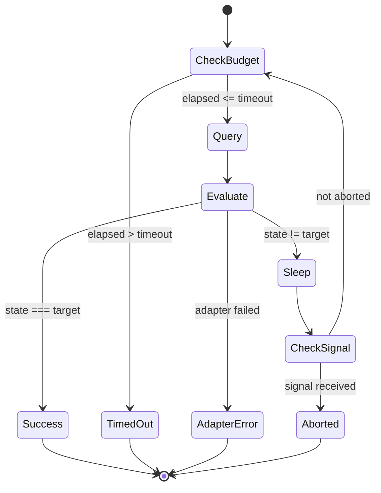
```mermaid
stateDiagram-v2
    [*] --> CheckBudget

    CheckBudget --> Query : elapsed <= timeout
    CheckBudget --> TimedOut : elapsed > timeout

    Query --> Evaluate
    Evaluate --> Success : state === target
    Evaluate --> Sleep : state != target
    Evaluate --> AdapterError : adapter failed

    Sleep --> CheckSignal
    CheckSignal --> CheckBudget : not aborted
    CheckSignal --> Aborted : signal received

    Success --> [*]
    TimedOut --> [*]
    AdapterError --> [*]
    Aborted --> [*]
```

#### Parameters

| Loop | Poll Interval | Timeout | Target |
|------|:---:|:---:|--------|
| EC2 state | 5 s | 5 min | `"running"` or `"stopped"` |
| SSM readiness | 5 s | 2 min | `"Online"` |

#### Invariants

- `elapsed` is monotonically non-decreasing (injectable `Clock`).
- Signal handlers are always cleaned up in `finally` blocks.
- Each iteration awaits the previous describe call before sleeping (no concurrent polls).

### 6.7 Remote-Access Preconditions

**Goal:** Gate `connect` and `cp` on an explicit chain of validated preconditions.

Relevant specs: [`remote-access`](../openspec/specs/remote-access/spec.md)

Relevant code: [`src/cli/remote-access.ts`](../src/cli/remote-access.ts), [`src/domain/ec2-wait.ts`](../src/domain/ec2-wait.ts), [`src/domain/remote-path.ts`](../src/domain/remote-path.ts), [`src/adapters/ssh-cli.ts`](../src/adapters/ssh-cli.ts)

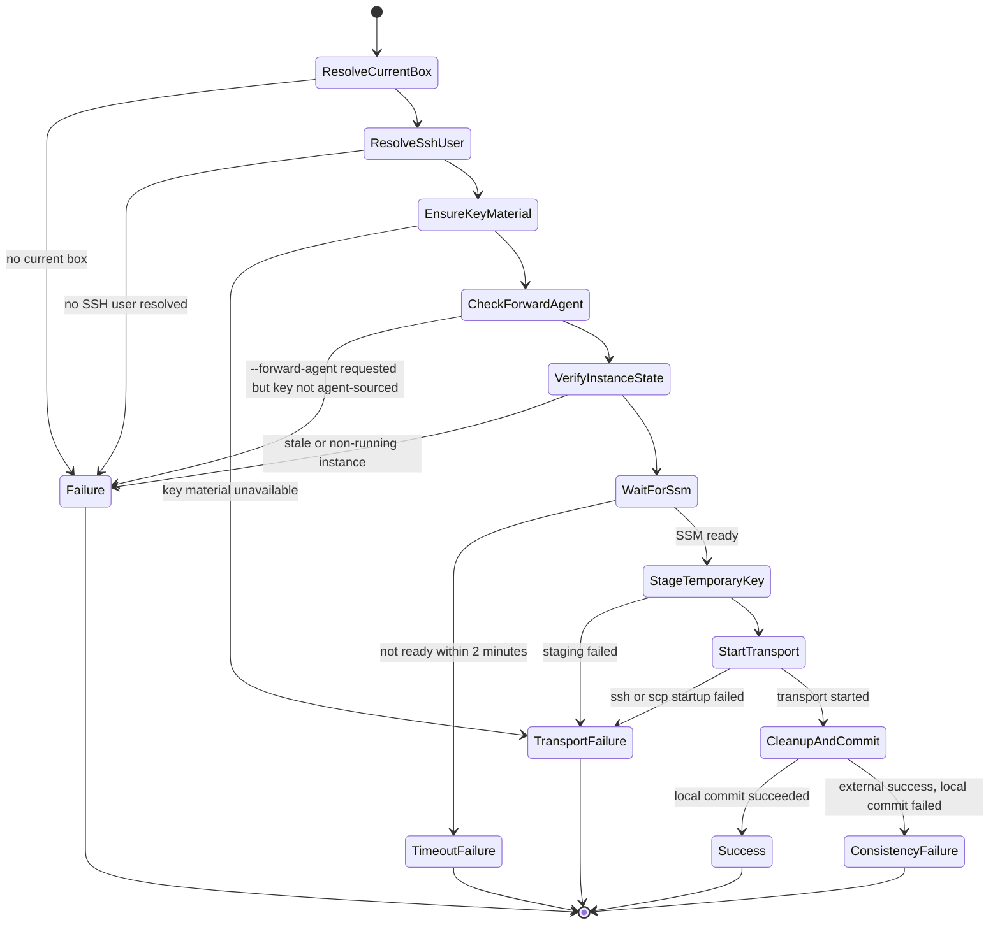
```mermaid
stateDiagram-v2
    [*] --> ResolveCurrentBox
    ResolveCurrentBox --> Failure: no current box
    ResolveCurrentBox --> ResolveSshUser
    ResolveSshUser --> Failure: no SSH user resolved
    ResolveSshUser --> EnsureKeyMaterial
    EnsureKeyMaterial --> TransportFailure: key material unavailable
    EnsureKeyMaterial --> CheckForwardAgent
    CheckForwardAgent --> Failure: --forward-agent requested but key not agent-sourced
    CheckForwardAgent --> VerifyInstanceState
    VerifyInstanceState --> Failure: stale or non-running instance
    VerifyInstanceState --> WaitForSsm
    WaitForSsm --> TimeoutFailure: not ready within 2 minutes
    WaitForSsm --> StageTemporaryKey: SSM ready
    StageTemporaryKey --> TransportFailure: staging failed
    StageTemporaryKey --> StartTransport
    StartTransport --> TransportFailure: ssh or scp startup failed
    StartTransport --> CleanupAndCommit: transport started
    CleanupAndCommit --> Success: local commit succeeded
    CleanupAndCommit --> ConsistencyFailure: external success, local commit failed
    Success --> [*]
    Failure --> [*]
    TimeoutFailure --> [*]
    TransportFailure --> [*]
    ConsistencyFailure --> [*]
```

Key-material resolution (`EnsureKeyMaterial`) runs before any AWS or SSM
interaction. This ordering exists so that an unsatisfiable agent-forwarding
request (`CheckForwardAgent`) fails with `ValidationError` before any instance
describe, SSM wait, or key staging occurs. The forwarding gate applies to
`connect --forward-agent` only; `cp` never requests forwarding and passes
through `CheckForwardAgent` unconditionally.

#### Decision Table

| Gate | Requirement | Failure |
|---|---|---|
| current box | `current` resolves to a tracked alias | validation failure |
| SSH user | resolved from invocation override, then box override, then defaults | validation failure |
| key material | local SSH key material is available (agent key preferred, else generated) | `TransportError` |
| agent forwarding | if `--forward-agent`, resolved key material came from a local agent | `ValidationError` (before any AWS/SSM call) |
| instance state | AWS describe returns `running` instance in active context | `NotFoundError` or `InstanceStateError` |
| SSM readiness | becomes `Online` within 2 minutes | `TimeoutError` |
| key staging | temporary authorization staged successfully | `TransportError` |

#### Forbidden Transitions

These transitions are invalid because they would bypass required validation gates:

- `ResolveCurrentBox -> StartTransport` -- bypasses all gates
- `ResolveSshUser -> StartTransport` -- bypasses state verification
- `EnsureKeyMaterial -> VerifyInstanceState` when `--forward-agent` was requested but the key is not agent-sourced -- bypasses the forwarding gate (must fail before any AWS/SSM call)
- `VerifyInstanceState -> StartTransport` -- bypasses SSM readiness and key staging
- `WaitForSsm -> StartTransport` -- bypasses key staging

#### SSH User Resolution Precedence

1. invocation override (`--ssh-user`)
2. per-box `sshUser` override
3. `defaults.sshUser`

#### Invariants

| Invariant | Meaning |
|---|---|
| RA-1 | no transport starts before the target is running, SSM-ready, and staged for temporary access |
| RA-2 | missing SSH user fails before any staging or transport begins |
| RA-3 | `lastConnectAt` is updated only after external success and local commit success |
| RA-4 | key-material resolution occurs before any AWS/SSM interaction, so an unsatisfiable `--forward-agent` request fails with `ValidationError` before any instance describe, SSM wait, or key staging |
| RA-5 | agent forwarding is opt-in per invocation, never persisted or inferred, and does not change which key authenticates the SSM-tunneled hop |

#### Safety and Liveness

- Safety: unsafe or incomplete precondition chains never reach SSH or SCP transport.
- Safety: staging failure blocks all transport.
- Safety: a `--forward-agent` request that cannot be honored (no agent-sourced key) never reaches AWS describe, SSM wait, key staging, or transport.
- Liveness: remote access proceeds if the target is running and becomes SSM-ready within `SSM_WAIT_TIMEOUT_MS`.

**Spec reference:** [`remote-access`](../openspec/specs/remote-access/spec.md) -- see `[REMOTE-CLI-FORWARDAGENT]`, `[REMOTE-DOMAIN-FORWARDAGENT]`, `[REMOTE-ADAPTER-FORWARDAGENT]`.

### 6.8 `cp` Transfer and Finalization

**Goal:** Preserve final-path safety by uploading to a temporary path and finalizing only after successful transfer.

Relevant specs: [`remote-access`](../openspec/specs/remote-access/spec.md)

Relevant code: [`src/cli/commands/cp.ts`](../src/cli/commands/cp.ts), [`src/domain/remote-path.ts`](../src/domain/remote-path.ts), [`src/adapters/ssh-cli.ts`](../src/adapters/ssh-cli.ts)

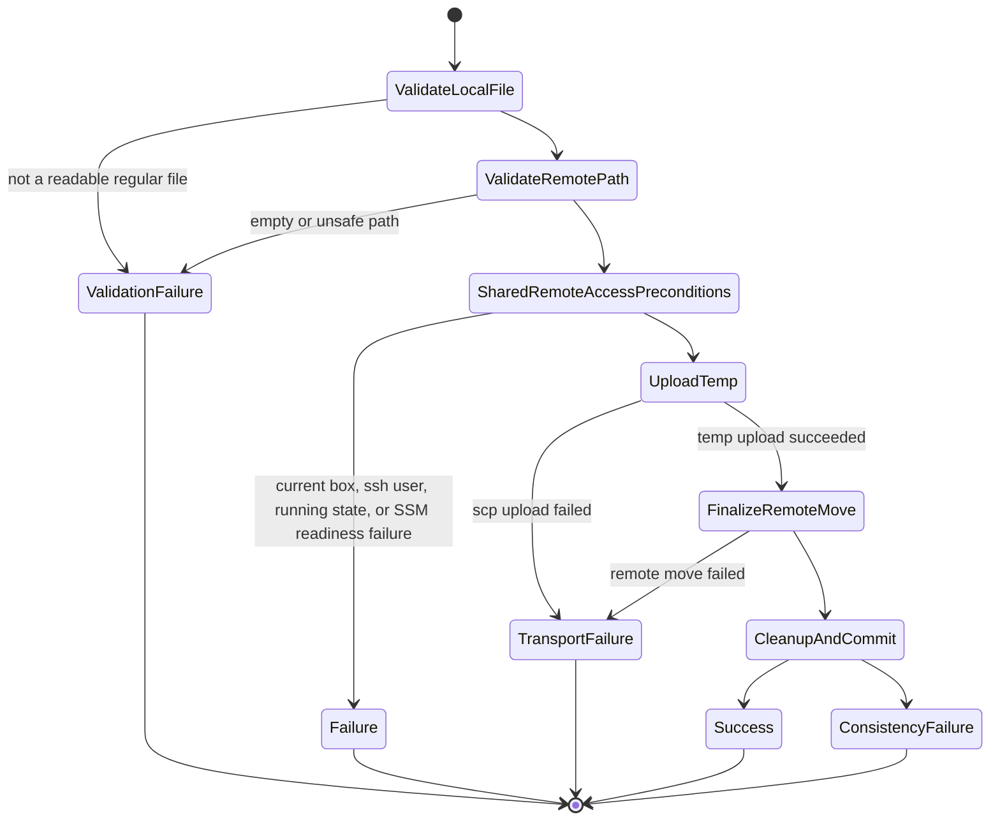
```mermaid
stateDiagram-v2
    [*] --> ValidateLocalFile
    ValidateLocalFile --> ValidationFailure: not a readable regular file
    ValidateLocalFile --> ValidateRemotePath
    ValidateRemotePath --> ValidationFailure: empty or unsafe path
    ValidateRemotePath --> SharedRemoteAccessPreconditions
    SharedRemoteAccessPreconditions --> Failure: current box, ssh user, running state, or SSM readiness failure
    SharedRemoteAccessPreconditions --> UploadTemp
    UploadTemp --> TransportFailure: scp upload failed
    UploadTemp --> FinalizeRemoteMove: temp upload succeeded
    FinalizeRemoteMove --> TransportFailure: remote move failed
    FinalizeRemoteMove --> CleanupAndCommit
    CleanupAndCommit --> Success
    CleanupAndCommit --> ConsistencyFailure
    Success --> [*]
    ValidationFailure --> [*]
    Failure --> [*]
    TransportFailure --> [*]
    ConsistencyFailure --> [*]
```

#### Decision Table

| Step | Success Condition | Failure Contract |
|---|---|---|
| local file validation | readable regular file | `ValidationError` |
| remote path validation | non-empty after trim; no ASCII control chars or null bytes | `ValidationError` |
| temp upload | `scp` to generated temp path succeeds | `TransportError` |
| finalization | remote `mv` succeeds | `TransportError` |
| metadata commit | `lastConnectAt` commit succeeds after remote success | `ConsistencyError` on failure |

#### Invariants

| Invariant | Meaning |
|---|---|
| CP-1 | final destination is not touched until temporary upload succeeds |
| CP-2 | failed transfers do not partially overwrite the final destination path |
| CP-3 | no artificial file-size limit is enforced by the CLI |

#### Safety and Liveness

- Safety: unsafe remote paths never reach a remote shell.
- Safety: final destination is updated only after successful temp upload and remote move.
- Liveness: when shared remote-access preconditions hold and transport succeeds, `cp` completes in one bounded session.

**Spec reference:** [`remote-access`](../openspec/specs/remote-access/spec.md)

---

## 7. Interaction Protocols

### 7.1 Command Dispatch Flow

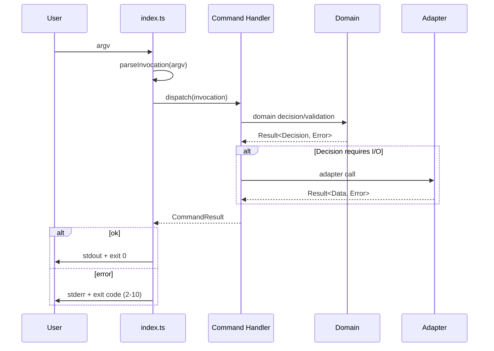
```mermaid
sequenceDiagram
    participant U as User
    participant E as index.ts
    participant C as Command Handler
    participant D as Domain
    participant A as Adapter

    U->>E: argv
    E->>E: parseInvocation(argv)
    E->>C: dispatch(invocation)
    C->>D: domain decision/validation
    D-->>C: Result<Decision, Error>
    alt Decision requires I/O
        C->>A: adapter call
        A-->>C: Result<Data, Error>
    end
    C-->>E: CommandResult
    alt ok
        E->>U: stdout + exit 0
    else error
        E->>U: stderr + exit code (2-10)
    end
```

This is the general shape of every command. The key pattern is: parse -> domain decision -> optional adapter call -> result rendering. No command handler directly performs I/O without going through an adapter.

### 7.2 `init` Sequence

Relevant specs: [`box-registry`](../openspec/specs/box-registry/spec.md)

Relevant code: [`src/cli/commands/init.ts`](../src/cli/commands/init.ts), [`src/domain/init-mapper.ts`](../src/domain/init-mapper.ts), [`src/adapters/aws-cli.ts`](../src/adapters/aws-cli.ts), [`src/adapters/config-store.ts`](../src/adapters/config-store.ts)

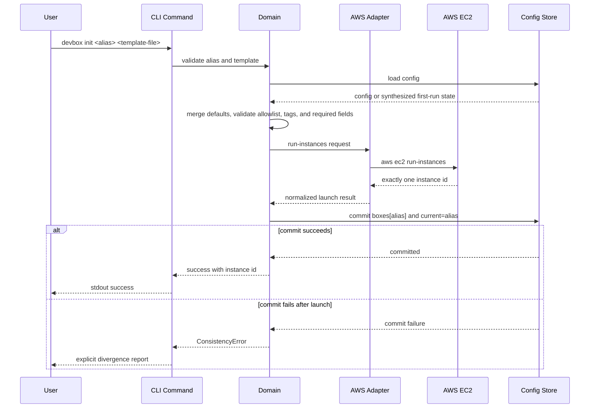
```mermaid
sequenceDiagram
    participant U as User
    participant C as CLI Command
    participant D as Domain
    participant A as AWS Adapter
    participant EC2 as AWS EC2
    participant S as Config Store

    U->>C: devbox init <alias> <template-file>
    C->>D: validate alias and template
    D->>S: load config
    S-->>D: config or synthesized first-run state
    D->>D: merge defaults, validate allowlist, tags, and required fields
    D->>A: run-instances request
    A->>EC2: aws ec2 run-instances
    EC2-->>A: exactly one instance id
    A-->>D: normalized launch result
    D->>S: commit boxes[alias] and current=alias
    alt commit succeeds
        S-->>D: committed
        D-->>C: success with instance id
        C-->>U: stdout success
    else commit fails after launch
        S-->>D: commit failure
        D-->>C: ConsistencyError
        C-->>U: explicit divergence report
    end
```

Protocol rules:

- validation occurs before AWS mutation
- local tracking is committed only after AWS returns a successful launch result
- the post-launch local-commit failure boundary is explicit and user-visible

### 7.3 `rm --terminate` Sequence

Relevant specs: [`box-registry`](../openspec/specs/box-registry/spec.md)

Relevant code: [`src/cli/commands/rm.ts`](../src/cli/commands/rm.ts), [`src/adapters/aws-cli.ts`](../src/adapters/aws-cli.ts), [`src/adapters/config-store.ts`](../src/adapters/config-store.ts)

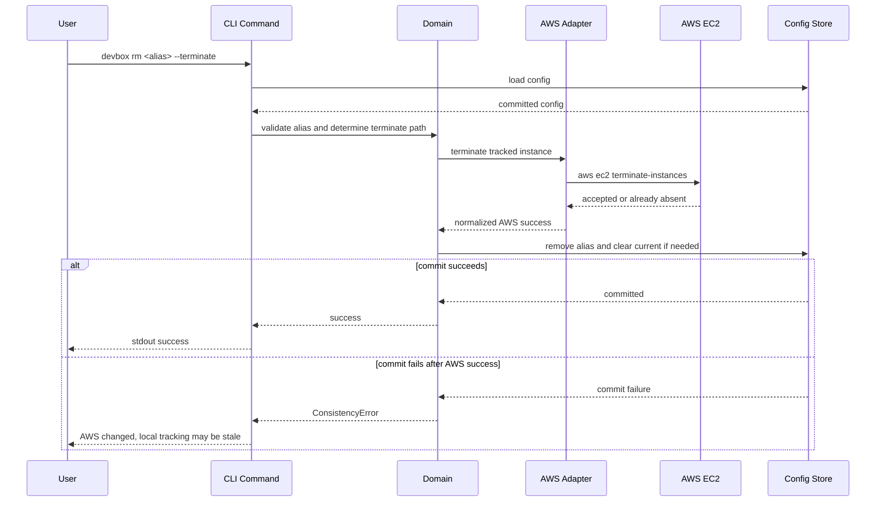
```mermaid
sequenceDiagram
    participant U as User
    participant C as CLI Command
    participant D as Domain
    participant A as AWS Adapter
    participant EC2 as AWS EC2
    participant S as Config Store

    U->>C: devbox rm <alias> --terminate
    C->>S: load config
    S-->>C: committed config
    C->>D: validate alias and determine terminate path
    D->>A: terminate tracked instance
    A->>EC2: aws ec2 terminate-instances
    EC2-->>A: accepted or already absent
    A-->>D: normalized AWS success
    D->>S: remove alias and clear current if needed
    alt commit succeeds
        S-->>D: committed
        D-->>C: success
        C-->>U: stdout success
    else commit fails after AWS success
        S-->>D: commit failure
        D-->>C: ConsistencyError
        C-->>U: AWS changed, local tracking may be stale
    end
```

Protocol rules:

- local tracking is not removed before AWS accepts termination or reports the target already absent
- external success plus failed local commit is surfaced as divergence, not a generic local failure

### 7.4 Lifecycle Polling Activity

Relevant specs: [`instance-lifecycle`](../openspec/specs/instance-lifecycle/spec.md)

Relevant code: [`src/domain/ec2-wait.ts`](../src/domain/ec2-wait.ts), [`src/domain/wait-policy.ts`](../src/domain/wait-policy.ts)

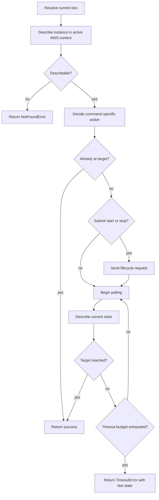
```mermaid
flowchart TD
    Start[Resolve current box] --> Describe[Describe instance in active AWS context]
    Describe --> Missing{Describable?}
    Missing -- no --> NotFound[Return NotFoundError]
    Missing -- yes --> Decide[Decide command-specific action]
    Decide --> Immediate{Already at target?}
    Immediate -- yes --> Success[Return success]
    Immediate -- no --> Request{Submit start or stop?}
    Request -- yes --> Submit[Send lifecycle request]
    Request -- no --> Poll[Begin polling]
    Submit --> Poll
    Poll --> Observe[Describe current state]
    Observe --> Reached{Target reached?}
    Reached -- yes --> Success
    Reached -- no --> Budget{Timeout budget exhausted?}
    Budget -- yes --> Timeout[Return TimeoutError with last state]
    Budget -- no --> Poll
```

Protocol rules:

- the target instance is always resolved in the active AWS account and region
- invalid transitions are rejected before any lifecycle request is sent
- bounded waits use explicit timeout budgets instead of indefinite polling

### 7.5 `connect` Sequence

This command is similar to the technique used by [ssh-over-ssm](https://github.com/elpy1/ssh-over-ssm).

Relevant specs: [`remote-access`](../openspec/specs/remote-access/spec.md)

Relevant code: [`src/cli/commands/connect.ts`](../src/cli/commands/connect.ts), [`src/cli/remote-access.ts`](../src/cli/remote-access.ts), [`src/adapters/ssh-cli.ts`](../src/adapters/ssh-cli.ts), [`src/adapters/config-store.ts`](../src/adapters/config-store.ts)

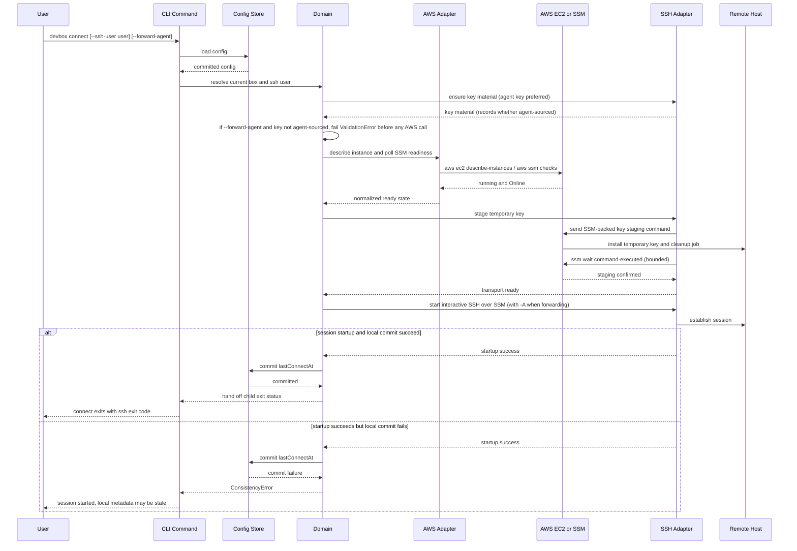
```mermaid
sequenceDiagram
    participant U as User
    participant C as CLI Command
    participant S as Config Store
    participant D as Domain
    participant A as AWS Adapter
    participant EC2 as AWS EC2 or SSM
    participant SSH as SSH Adapter
    participant H as Remote Host

    U->>C: devbox connect [--ssh-user user] [--forward-agent]
    C->>S: load config
    S-->>C: committed config
    C->>D: resolve current box and ssh user
    D->>SSH: ensure key material (agent key preferred)
    SSH-->>D: key material (records whether agent-sourced)
    D->>D: if --forward-agent and key not agent-sourced, fail ValidationError before any AWS call
    D->>A: describe instance and poll SSM readiness
    A->>EC2: aws ec2 describe-instances / aws ssm checks
    EC2-->>A: running and Online
    A-->>D: normalized ready state
    D->>SSH: stage temporary key
    SSH->>EC2: send SSM-backed key staging command
    EC2->>H: install temporary key and cleanup job
    SSH->>EC2: ssm wait command-executed (bounded)
    EC2-->>SSH: staging confirmed
    SSH-->>D: transport ready
    D->>SSH: start interactive SSH over SSM (with -A when forwarding)
    SSH->>H: establish session
    alt session startup and local commit succeed
        SSH-->>D: startup success
        D->>S: commit lastConnectAt
        S-->>D: committed
        D-->>C: hand off child exit status
        C-->>U: connect exits with ssh exit code
    else startup succeeds but local commit fails
        SSH-->>D: startup success
        D->>S: commit lastConnectAt
        S-->>D: commit failure
        D-->>C: ConsistencyError
        C-->>U: session started, local metadata may be stale
    end
```

Protocol rules:

- every boundary crossing is gated by explicit preconditions and normalized results
- local SSH key material is resolved before any AWS/SSM call, so an unsatisfiable `--forward-agent` request fails before remote-access setup begins
- agent forwarding (`ssh -A`) is enabled on the interactive session only when explicitly requested and its precondition holds
- the SSH session exit code is propagated rather than hidden behind unconditional success
- temporary authorization is staged before transport and bounded for cleanup

### 7.6 `cp` Sequence

Relevant specs: [`remote-access`](../openspec/specs/remote-access/spec.md)

Relevant code: [`src/cli/commands/cp.ts`](../src/cli/commands/cp.ts), [`src/cli/remote-access.ts`](../src/cli/remote-access.ts), [`src/domain/remote-path.ts`](../src/domain/remote-path.ts), [`src/adapters/ssh-cli.ts`](../src/adapters/ssh-cli.ts), [`src/adapters/config-store.ts`](../src/adapters/config-store.ts)

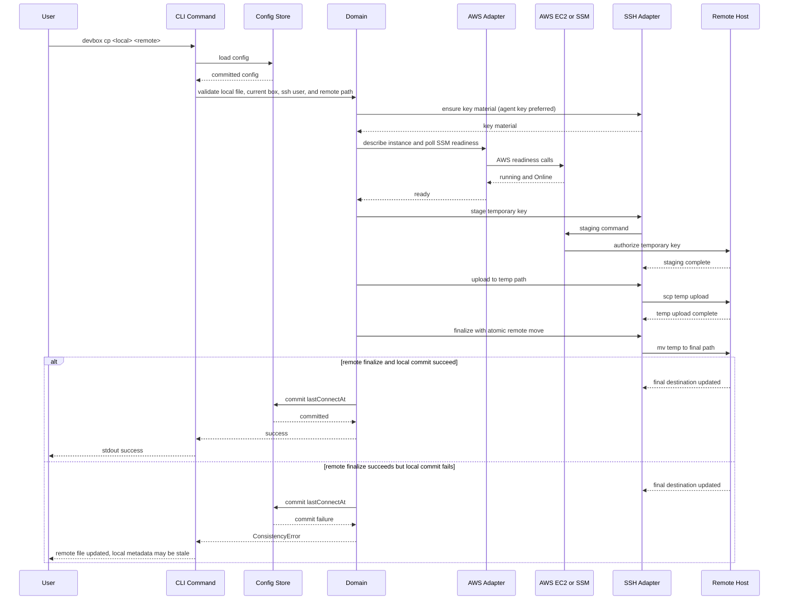
```mermaid
sequenceDiagram
    participant U as User
    participant C as CLI Command
    participant S as Config Store
    participant D as Domain
    participant A as AWS Adapter
    participant EC2 as AWS EC2 or SSM
    participant SSH as SSH Adapter
    participant H as Remote Host

    U->>C: devbox cp <local> <remote>
    C->>S: load config
    S-->>C: committed config
    C->>D: validate local file, current box, ssh user, and remote path
    D->>SSH: ensure key material (agent key preferred)
    SSH-->>D: key material
    D->>A: describe instance and poll SSM readiness
    A->>EC2: AWS readiness calls
    EC2-->>A: running and Online
    A-->>D: ready
    D->>SSH: stage temporary key
    SSH->>EC2: staging command
    EC2->>H: authorize temporary key
    H-->>SSH: staging complete
    D->>SSH: upload to temp path
    SSH->>H: scp temp upload
    H-->>SSH: temp upload complete
    D->>SSH: finalize with atomic remote move
    SSH->>H: mv temp to final path
    alt remote finalize and local commit succeed
        H-->>SSH: final destination updated
        D->>S: commit lastConnectAt
        S-->>D: committed
        D-->>C: success
        C-->>U: stdout success
    else remote finalize succeeds but local commit fails
        H-->>SSH: final destination updated
        D->>S: commit lastConnectAt
        S-->>D: commit failure
        D-->>C: ConsistencyError
        C-->>U: remote file updated, local metadata may be stale
    end
```

Protocol rules:

- the final destination path is not touched until the temporary upload is complete
- remote success followed by failed local metadata commit is treated as explicit divergence
- local source files are validated before any remote transport setup begins
- `cp` never enables SSH agent forwarding; its upload and finalize transport is unaffected by the forwarding option

---

## 8. Failure Modes and Error Model

### 8.1 Error Categories and Exit Codes

Relevant code: [`src/domain/errors.ts`](../src/domain/errors.ts)

| Exit Code | Category | Meaning |
|---|---|---|
| 0 | Success | command completed successfully |
| 1 | -- | unexpected/unhandled failure (never intentionally produced) |
| 2 | ValidationError | invalid input, alias, template, or remote path |
| 3 | ConfigError | invalid config, unreadable config, or lock conflict |
| 4 | DependencyError | required local executable or dependency missing |
| 5 | AwsCliError | AWS CLI reported failure |
| 6 | NotFoundError | target instance not describable in active context |
| 7 | InstanceStateError | invalid live state for requested lifecycle or access path |
| 8 | TimeoutError | bounded wait expired |
| 9 | ConsistencyError | external success followed by local commit failure |
| 10 | TransportError | SSH, SCP, or key-staging failure |

**Invariant:** Exit code 0 = success; exit code 1 = unexpected/unhandled failure; codes 2-10 are stable across versions.

### 8.2 Failure Mode Analysis

| Failure Mode | Detection | Impact | Mitigation |
|--------------|-----------|--------|------------|
| **AWS unreachable** | `aws` CLI returns non-zero | Cannot verify state or issue commands | `AwsCliError` with stderr details |
| **Stale instance state** | describeInstance returns unexpected state | Command may target wrong lifecycle phase | Re-describe before every action; no caching |
| **Config file corruption** | `JSON.parse` throws or `parseConfig` rejects | Cannot load registry | `ConfigError`; user can delete and re-init |
| **Lock contention** | `O_CREAT|O_EXCL` returns EEXIST for live PID | Concurrent write blocked | Stale-lock recovery; clear error message |
| **SSH key staging race** | Key expires (15s window) before session starts | Connection refused | Error propagated; user retries |
| **PID recycling (stale lock)** | Lock age exceeds 5min ceiling | Lock wrongly appears live | Age-based staleness overrides PID check |
| **Power loss during write** | N/A (detected on next load) | Config file might be old | Atomic rename ensures either old or new; never partial |
| **Signal during polling** | SIGINT/SIGTERM handlers fire | Incomplete operation | Cleanup handlers release resources; polling aborts cleanly |
| **Remote path injection** | Validation before any remote command | Malicious path could execute code | Reject paths with control chars/null bytes before crossing shell boundary |
| **Template with unknown fields** | Allowlist validation | Unintended AWS behavior | Reject unknown fields before any AWS call |
| **External success + local failure** | Config commit returns error after AWS accepted mutation | Registry diverges from AWS | Report `ConsistencyError` explicitly |
| **Concurrent local mutations** | Lock acquisition fails (EEXIST, live PID) | Second writer blocked | Single-writer semantics; user retries |

### 8.3 Failure Taxonomy

**Unsafe inputs:**
- invalid aliases
- malformed config or template JSON
- unsupported source file type for `cp`
- unsafe remote paths

**Fragile formats:**
- UTF-8 JSON config parsing
- AWS JSON parsing and normalization
- subprocess stderr propagation without losing normalized summaries

**Inadequate control actions:**
- repeated lifecycle requests when a transition is already in progress
- removing local tracking before AWS accepted termination
- starting transport before staging temporary authorization

**Process-model flaws:**
- local registry diverges from active AWS context
- AWS or remote side succeeded while local config commit failed
- persisted metadata is mistaken for live truth

**Coordination failures:**
- concurrent local mutation attempts
- stale or orphaned lock files
- cleanup failure after transport failure
- bounded waits that expire before target state is observed

### 8.4 Control and Recovery

- Reject invalid input before crossing effect boundaries.
- Keep all long waits bounded and return explicit timeout diagnostics.
- Recover stale locks with best-effort detection (three criteria) and one retry.
- Preserve the prior committed config on failed local mutation.
- Degrade `list` gracefully when AWS enrichment fails.
- Perform best-effort cleanup for temporary authorization and temp files.
- Report `ConsistencyError` when external success is already visible but local metadata could not be committed.
- No automatic retry policy: the CLI is designed for interactive use where the user can re-run on transient failures.

### 8.5 Result Type Contract

```typescript
type Result<T, E> =
  | { readonly ok: true; readonly value: T }
  | { readonly ok: false; readonly error: E };
```

**Domain rule:** No exceptions are thrown in domain code. All error paths are expressed as `Result` values with typed error unions. Adapter code catches system exceptions and wraps them into `Result` before returning to the CLI layer.

**Spec reference:** [`remote-access`](../openspec/specs/remote-access/spec.md) -- see `[CONNECT-ERROR-EXIT-CODE]`, `[CP-ERROR-EXIT-CODE]`.

---

## 9. Safety and Liveness Claims

### 9.1 Safety Properties

| Claim | Mechanism | Verification |
|-------|-----------|--------------|
| **No false success** (lifecycle) | Success reported only after observing target state | Alloy assertion `noFalseSuccess`; unit / contract tests |
| **No invalid transition** | `decideUpAction`/`decideDownAction` reject terminal/incompatible states | Alloy assertions `noInvalidUpDecision`, `noInvalidDownDecision`; exhaustive switch + `assertNever`; property tests |
| **No data loss on crash** | Atomic write protocol (temp -> fsync -> rename -> dir-fsync) | Integration tests with crash simulation |
| **No shell injection** | All subprocess calls use argv arrays via `execFile` | `process.ts` enforces this; no `exec` in codebase |
| **No partial config state visible** | Readers see old or new config; never intermediate | `rename(2)` atomicity guarantee |
| **No resource leak on signal** | SIGINT/SIGTERM handlers + `finally` blocks | Integration tests with signal injection |
| **Alias uniqueness preserved** | Object key uniqueness + validation on write | Property tests (fast-check) |
| **Destructive behavior never implicit** | `rm --terminate` is opt-in; no auto-termination | Unit / contract tests for `rm` without flag |
| **Unsafe remote paths never reach shell** | Validation rejects before any SSH/SCP command | Property tests for path validation |
| **Failed cp does not overwrite destination** | Upload to temp path; atomic remote move | Integration tests for partial-failure paths |
| **Failed access does not update lastConnectAt** | Two-phase success gate (external + local) | Unit / contract tests for failure paths |
| **Persisted state never authoritative for live AWS** | Re-describe before every action | Architectural invariant; integration tests |
| **rm --terminate does not remove local tracking before AWS acceptance** | Sequence ordering in remove flow | Registry integration tests |

### 9.2 Liveness Properties

| Claim | Mechanism | Bound |
|-------|-----------|-------|
| **EC2 polling terminates** | `EC2_WAIT_TIMEOUT_MS` ceiling + elapsed check | 5 minutes |
| **SSM polling terminates** | `SSM_WAIT_TIMEOUT_MS` ceiling + elapsed check | 2 minutes |
| **Stale locks are recoverable** | Age-based + PID-based staleness detection | 5 minutes (lock age threshold) |
| **Signal handlers fire cleanup** | Process-level SIGINT/SIGTERM listeners | Immediate (kernel delivery) |
| **Lock is always released** | `finally` block in `commitConfig` | On every exit path (success or error) |
| **list succeeds without AWS** | Graceful degradation when enrichment fails | Local visibility preserved |
| **rm --terminate completes** | Local tracking removed after accepted AWS termination | ConsistencyError if local commit fails |
| **Staged authorization cleaned up** | Remote cleanup job removes key entry after 15 seconds | Bounded; no long-lived authorization |

### 9.3 Formal Model

The EC2 lifecycle state machines are formally specified in an **Alloy 6** model embedded in [`instance-lifecycle` spec](../openspec/specs/instance-lifecycle/spec.md). The model verifies:

- **Safety assertions:** `noFalseSuccess`, `noInvalidUpDecision`, `noInvalidDownDecision`
- **Bounded liveness:** `pollingAlwaysTerminates`
- **State coverage:** All reachable states have defined transitions or explicit rejections

The Alloy model serves as the authoritative behavioral specification; the TypeScript implementation mirrors its structure (see `src/domain/instance-state.ts`).

---

## 10. Quality Attributes

| Attribute | Target | How Achieved |
|-----------|--------|--------------|
| **Determinism** | Domain functions produce identical output for identical input | Pure functions; injectable `Clock`; no ambient state |
| **Testability** | All business logic testable without AWS or filesystem | Domain/adapter separation; injected dependencies |
| **Correctness** | Implementations match formal specifications | Alloy models; spec traceability markers; property tests |
| **Operational simplicity** | Single config file, no background daemon, no database | Flat JSON file with atomic writes |
| **Bounded latency** | No unbounded waits or infinite loops | All polling has explicit time ceilings |
| **Safe defaults** | Destructive actions require explicit confirmation | `rm --terminate` is opt-in; no auto-termination |
| **Observability** | Structured stderr output for all failures | `[devbox] Category: message` format; detail lines indented |
| **Portability** | Runs anywhere Node >= 20 is available | Single ESM bundle; no native dependencies |

---

## 11. Verification Strategy

The project follows the **verification pyramid** from [docs/lfm.md](lfm.md):

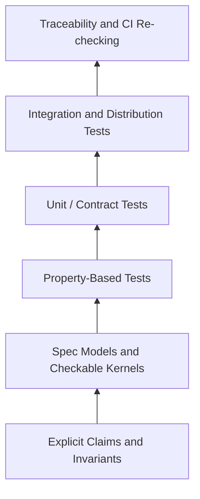
```mermaid
graph BT
    Claims[Explicit Claims and Invariants] --> Models[Spec Models and Checkable Kernels]
    Models --> PBT[Property-Based Tests]
    PBT --> CT[Unit / Contract Tests]
    CT --> IT[Integration and Distribution Tests]
    IT --> Trace[Traceability and CI Re-checking]
```

### Claims and Evidence Sources

| Layer | Focus | Primary Sources |
|---|---|---|
| capability requirements | normative behavior | [`openspec/specs/`](../openspec/specs/) |
| design claims | architecture, sequencing, invariants, safety, liveness | this document |
| implementation structure | where behavior lives and architectural boundaries | [`ARCHITECTURE.md`](../ARCHITECTURE.md) |
| executable evidence | tests and traceability runs | `test/contract/`, `test/property/`, `test/integration/` |

### Evidence Layers

| Layer | Coverage Focus |
|---|---|
| **Formal models** | State machine correctness, safety/liveness (Alloy 6) |
| **Property-based tests** | Invariants over generated inputs (alias tracking, config round-trip, EC2 lifecycle, remote-path acceptance) |
| **Unit / contract tests** | Spec requirement traceability (`[SPEC-ID]` markers), stdout, stderr, exit codes, config parsing, output contracts |
| **Integration tests** | End-to-end command flows, adapter behavior, polling, cleanup paths, consistency-error handling |
| **Distribution checks** | Package and bundle parity |
| **Traceability checks** | Canonical spec identifier validation and full-catalog coverage |
| **Regression discipline** | Each discovered counterexample becomes a permanent test |

**Spec traceability:** Every testable requirement in `openspec/specs/` carries a bracketed identifier (e.g., `[ALIAS-FORMAT]`). Contract and unit tests reference these identifiers via `traceSpec(...)`, and the traceability tooling validates coverage.

The key design claim is not that the system is fully proved. The key claim is that its critical transitions, invariants, failure boundaries, and safety properties are explicit, checkable, and re-checked as the system evolves.

**Spec reference:** [`spec-traceability`](../openspec/specs/spec-traceability/spec.md)

---

## 12. Distribution and Packaging

Relevant specs: [`distribution`](../openspec/specs/distribution/spec.md)

| Artifact | Format | Target |
|----------|--------|--------|
| npm package | Standard npm tarball | `npm install -g` |
| `dist/devbox.js` | Single-file ESM bundle (esbuild) | Node >= 20 |

**Build invariants:**
- The bundle is a single `.js` file with no external dependencies at runtime.
- `#!/usr/bin/env node` shebang is prepended.
- Source maps are excluded from the distribution artifact.
- The bundled artifact passes the same integration tests as the source tree.
- Both distribution forms preserve the same help/version surface, output contracts, and exit-code behavior.

**Parity requirement:** help/version behavior, outputs, exit codes, and command contracts match across supported forms.

---

## 13. Security and Trust Boundaries

| Concern | Design Constraint |
|---|---|
| subprocess invocation | argv-based execution rather than shell-interpolated command strings |
| remote path handling | validation occurs before any shell quoting boundary is crossed |
| SSH authorization | temporary staged access rather than long-lived hidden authorization state |
| local secrets scope | the tool does not manage AWS credentials, profiles, or regions |
| temporary key handling | agent keys are preferred; generated keys are cleaned up locally; remote entries are bounded for cleanup |
| staged-key lifetime | remote cleanup job removes the authorized-key entry after 15 seconds |
| SSH agent forwarding | opt-in per `connect` invocation only; never persisted or inferred; excluded from `cp` |
| forwarded-agent trust boundary | during a forwarded session a malicious process on the remote host can request signatures from the local agent for the session's duration; private key material never leaves the local machine |
| forwarding preconditions | `--forward-agent` requires a local agent with a loaded identity and fails fast (`ValidationError`) before any AWS/SSM call otherwise |
| error rendering | normalized summaries do not expose secrets as part of the first-line message |
| polling bounds | EC2: 5 minutes / 5s intervals; SSM: 2 minutes / 5s intervals |
| signal handling | aborts waits without rolling back already-submitted AWS state transitions |

---

## 14. Operational Concerns

### 14.1 Observability

| Concern | Design Choice |
|---|---|
| user-visible failures | normalized first-line stderr in the form `[devbox] <Category>: <message>` |
| boundary details | indented subprocess stderr lines when useful for diagnosis |
| verification visibility | traced tests tie behavior back to canonical spec identifiers |
| command output stability | stdout and stderr contracts are treated as part of the product surface |

### 14.2 Deployment and Rollout

| Concern | Design Choice |
|---|---|
| primary release path | standard `npm` package installation |
| additional artifact | bundled `dist/devbox.js` |
| release gate | distribution parity verification is part of the product contract |
| rollback model | ordinary package-version rollback; no persistent service migration required |

### 14.3 Capacity and Scaling

`devbox` is a single-user local CLI, so scaling concerns are mostly bounded-work and subprocess-behavior concerns rather than server-side throughput concerns.

| Concern | Design Choice |
|---|---|
| long waits | explicit timeout budgets and polling cadence constants |
| subprocess output | bounded capture in the process adapter (10 MiB) |
| local contention | single-writer config semantics over concurrent merge behavior |

---

## 15. Forward Evolution

### 15.1 Evolution Paths

- the config model can later add explicit CLI support for per-box SSH-user editing without changing the precedence model
- additional strict modes or listing formats can be added without widening the core source-of-truth model
- the state-machine-oriented design makes it practical to deepen the formal evidence for selected kernels over time
- packaging can evolve without changing command semantics, provided parity is preserved

### 15.2 Risks and Mitigations

| Risk | Mitigation |
|---|---|
| active AWS account or region changes can make a tracked box appear stale | treat stale-resource handling as a first-class behavior and avoid guessed alternate contexts |
| AWS CLI and local tool dependence varies across environments | model missing executables and boundary failures explicitly |
| remote cleanup may fail after transport problems | keep cleanup best effort, bound temporary authorization lifetime, and report transport failures clearly |
| atomic config semantics rely on local filesystem behavior | localize the write protocol in one adapter and test crash-like sequences |

### 15.3 Alternatives Considered

| Alternative | Why Rejected |
|---|---|
| AWS SDK instead of AWS CLI | the product is intentionally a thin AWS CLI wrapper with a smaller trust surface |
| persisting account and region per box | widens the domain model into context management that the product intentionally leaves to the user |
| long-lived SSH configuration or static key assumptions | violates the requirement for short-lived staged authorization with bounded cleanup |
| best-effort local writes without locking or atomic replace | would violate core safety and reliability claims |

---

## 16. Command and Interaction Summary

| Command Family | Commands | Main Boundaries Crossed | Primary Specs |
|---|---|---|---|
| Informational | `--help`, `--version`, bare `devbox` dispatch | local process only | [`box-registry`](../openspec/specs/box-registry/spec.md), [`distribution`](../openspec/specs/distribution/spec.md) |
| Box Registry | `list`, `init`, `add`, `rm`, `switch` | config store, optional AWS | [`box-registry`](../openspec/specs/box-registry/spec.md) |
| Instance Lifecycle | `up`, `down` | config store, AWS | [`instance-lifecycle`](../openspec/specs/instance-lifecycle/spec.md) |
| Remote Access | `connect` (optional agent forwarding), `cp` | config store, AWS, SSM, SSH/SCP, remote host | [`remote-access`](../openspec/specs/remote-access/spec.md) |
| Distribution | `npm` install, `dist/devbox.js` | packaging and runtime contract | [`distribution`](../openspec/specs/distribution/spec.md) |
| Spec Traceability | `traceSpec(...)`, `test:trace` | spec catalog, test harness | [`spec-traceability`](../openspec/specs/spec-traceability/spec.md) |

---

## 17. Relationship to Other Documents

- [`ARCHITECTURE.md`](../ARCHITECTURE.md) explains where behavior lives in code and which layer boundaries should be preserved.
- [`openspec/specs/`](../openspec/specs/) defines the normative behavior for each capability.
- The archived core change under [`openspec/changes/archive/2026-06-05-devbox-core/`](../openspec/changes/archive/2026-06-05-devbox-core/) is historical source material for the initial design baseline.
- [`lfm.md`](lfm.md) explains the assurance posture and evidence model.
- [`typescript_style.md`](typescript_style.md) and [`state_machines.md`](state_machines.md) explain how the implementation should embody the design.

---

## 18. Maintenance Rules

This is a living document.

Update it when:

- command semantics change
- state machines change
- persistence or encoding rules change
- invariants or source-of-truth boundaries change
- failure contracts change
- safety or liveness guarantees change
- verification expectations change

Maintenance guidance:

- Summarize durable design intent rather than copying every requirement from the specs verbatim.
- Keep capability-specific sections linked to the relevant OpenSpec specs.
- Preserve the separation between design intent here and code location in `ARCHITECTURE.md`.
- Prefer stable module links over line-number-heavy implementation commentary.
- Ensure new code, tests, and specs continue to support the claims made in this document.
- Keep the numbered section structure when adding new sections.
