# Design

This document is the living design description for `devbox`. It captures durable technical intent for the project and is updated alongside the OpenSpec artifacts, code, and tests. It complements the repository codemap in [`ARCHITECTURE.md`](../ARCHITECTURE.md), the lightweight formal methods guidance in [`lfm.md`](lfm.md), and the normative capability specs under [`openspec/specs/`](../openspec/specs/).

The most relevant capability specs are:

- [`box-registry`](../openspec/specs/box-registry/spec.md)
- [`instance-lifecycle`](../openspec/specs/instance-lifecycle/spec.md)
- [`remote-access`](../openspec/specs/remote-access/spec.md)
- [`distribution`](../openspec/specs/distribution/spec.md)

## Purpose and Role

`devbox` is a small TypeScript CLI for creating, tracking, starting, stopping, connecting to, and uploading files to AWS EC2 development machines. It exists to provide a dependable, explicit workflow for common development-box operations without forcing users to manually compose raw `aws`, `ssh`, `scp`, and SSM-backed access commands each time.

This document focuses on what the system is, why it exists, the important design constraints, the data model, the state machines, the interaction protocols, the failure model, and the safety and liveness claims that define the project. It is not a codemap; for file-level orientation, use [`ARCHITECTURE.md`](../ARCHITECTURE.md).

## Scope and System Boundaries

In scope:

- top-level informational behavior for `--help` and `--version`
- local box-registry behavior for `list`, `init`, `add`, `rm`, and `switch`
- lifecycle control for `up` and `down`
- remote access for `connect` and upload-only `cp`
- packaging and runtime parity between `npm` installation and `dist/devbox.js`
- traceability infrastructure that keeps specs, tests, and evidence connected

Out of scope:

- AWS profile, credential, or region management inside `devbox`
- replacing AWS CLI with the AWS SDK
- download, sync, directory copy, or general SSH orchestration beyond the documented command set
- tracking multiple AWS execution contexts in one local registry
- a background daemon, service, or distributed lock manager

Source-of-truth boundaries:

- local config is the source of truth for tracked aliases and current selection
- AWS is the source of truth for live instance existence and instance state in the active account and region
- remote-host state is observed only through bounded remote-access interactions and is never treated as durable registry truth

Thin-wrapper boundaries:

- AWS effects are performed through `aws`
- remote transport is performed through `ssh` and `scp`
- local persistence is performed through one config-store boundary that owns locking and atomic replacement

## Lightweight Formal Methods Perspective

This project follows the lightweight formal methods posture described in [`lfm.md`](lfm.md): identify the critical properties, express them explicitly, keep the deterministic core small enough to reason about, and maintain live evidence that the implementation still preserves those properties.

The design is therefore centered on:

- preconditions for every command family and boundary crossing
- postconditions that describe the observable outcome after success or failure
- invariants over config shape, alias integrity, source-of-truth boundaries, and cross-system sequencing
- failure modes that are explicit rather than hidden behind generic exceptions
- safety properties that forbid bad things from happening
- liveness properties that describe when bounded progress is expected

The goal is not a proof of the whole system. The goal is justified confidence: the design claims are explicit, mechanically checkable, and traceable into code and tests.

## Context

`devbox` is intentionally narrow. It is a CLI, not a control plane. Its core challenge is not feature breadth; it is preserving trust across three kinds of state:

- local registry state in `~/.config/devbox.json`
- live AWS state in the active account and region
- temporary remote-host state created during SSM-backed SSH access

The design therefore emphasizes:

- deterministic domain logic
- explicit state transitions
- bounded waits
- conservative subprocess boundaries
- atomic local mutation
- explicit visibility of cross-system divergence
- packaging as part of the product contract rather than as a release afterthought

## High-Level Architecture

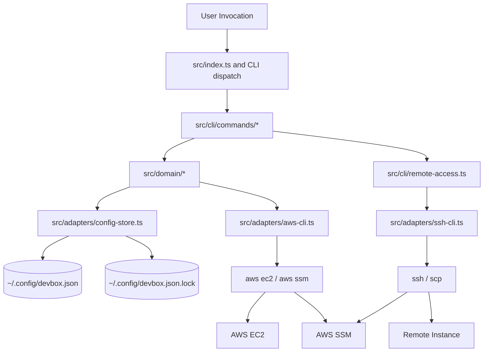

The architecture is layered.

- The CLI layer parses invocation shape, chooses a command handler, and renders normalized stdout and stderr.
- The domain layer owns deterministic reasoning: validation, state-transition decisions, merge rules, wait policies, and invariants.
- The adapter layer owns side effects: config persistence, subprocess execution, AWS normalization, SSH/SCP transport, and cleanup.

This split matters for assurance. The more the decision logic is isolated from the side-effecting mechanics, the easier it is to express invariants, encode state machines, and mechanically test the behavior that matters.

## Design Principles

- Make important invariants explicit.
- Keep the core deterministic and push nondeterminism to the edges.
- Treat local config and AWS live state as distinct sources of truth.
- Reject invalid input before crossing AWS, filesystem, or remote-shell boundaries.
- Bound all waits and surface timeouts explicitly.
- Keep destructive behavior opt-in and explicit.
- Surface cross-system divergence rather than collapsing it into a local-only error.
- Keep packaging and traceability in the product contract.

## Domain Model

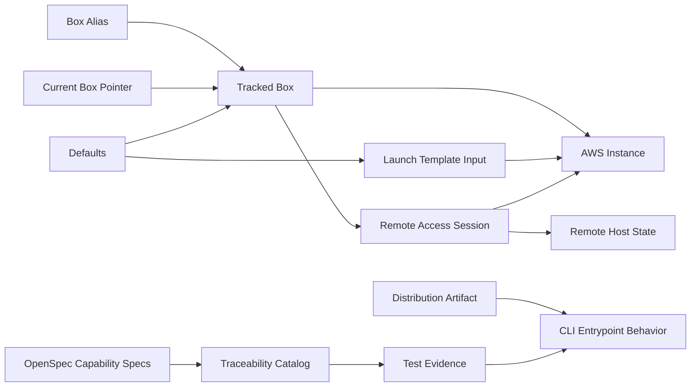

Primary domain entities:

- **Box Alias**: a stable local name chosen by the user.
- **Tracked Box**: the durable local record for one alias. It binds an alias to an EC2 instance ID and optional metadata such as `sshUser` and `lastConnectAt`.
- **Current Box**: the optional pointer used by commands that operate without an explicit alias parameter.
- **Defaults**: shared config values, including required tags and optional launch or SSH-user defaults.
- **Launch Template Input**: a launch-template-style JSON document used by `init` to create exactly one EC2 instance.
- **AWS Instance**: the live resource observed through the active AWS account and region.
- **Remote Access Session**: a bounded interaction that verifies state, stages temporary access, starts transport, and cleans up.
- **Distribution Artifact**: either the `npm`-installed CLI or the bundled `dist/devbox.js` artifact.
- **Traceability Catalog**: the set of canonical spec identifiers discovered from active OpenSpec specs and checked against traced tests.

Authority boundaries:

- Alias membership and current selection come from the committed local config only.
- Instance existence and lifecycle state come from AWS describes at command time only.
- Resolved SSH user is derived from invocation override, per-box override, then defaults.
- `lastConnectAt` is local metadata about successful remote access, not proof of live reachability.

## Data Design

### Persistent Config Model

The durable local registry is stored at `~/.config/devbox.json`. The advisory lock file is stored at `~/.config/devbox.json.lock`.

Top-level config shape:

| Field | Meaning | Constraints |
|---|---|---|
| `boxes` | alias-keyed tracked-box map | required; keys are unique aliases |
| `current` | current alias pointer | optional; if present, must name an existing alias |
| `defaults.tags` | required default tags | required; must contain the required tag keys |
| `defaults.ImageId` | default AMI | optional; must exist after merge for `init` |
| `defaults.IamInstanceProfile` | default instance profile | optional; must exist after merge for `init` |
| `defaults.sshUser` | default SSH user | optional |

Per-box shape:

| Field | Meaning | Constraints |
|---|---|---|
| `instanceId` | tracked EC2 instance ID | required |
| `sshUser` | per-box SSH user override | optional |
| `lastConnectAt` | last successful remote-access timestamp | optional; ISO-8601 UTC string |

### Encoding and Storage Constraints

- config encoding is UTF-8 JSON
- a leading BOM is invalid and treated as a config error
- config file mode is `0600`
- lock file mode is `0600`
- lock file contents are the holder PID encoded as a decimal ASCII string
- config writes use temp-file write, file `fsync`, atomic rename, and directory sync
- if the process dies between temp-file write and atomic rename, the committed config remains intact and the temp file is orphaned

### Config Invariants

- alias keys are unique by map construction and must also be syntactically valid aliases
- `current` is absent or references an existing alias
- every committed config is schema-valid
- per-box `sshUser` and `lastConnectAt` are only defined for tracked aliases
- failed local mutations do not partially commit JSON or leave an ambiguous merged state

### Locking and Concurrency Constraints

- all config mutations flow through one adapter path
- mutation requires exclusive advisory lock acquisition
- a live, recent lock holder is never preempted
- stale lock detection uses PID validity, PID liveness, and lock mtime older than 5 minutes
- stale-lock recovery is best effort and retried once
- single-writer semantics are preferred over concurrent merge behavior

### Launch Template and Tag Constraints

`init` accepts only the documented allowlist of launch-template-style top-level fields from the [`box-registry` spec](../openspec/specs/box-registry/spec.md). Unknown fields and `InstanceRequirements` are rejected before any AWS call.

Required values after merge:

- `ImageId` must be present
- `IamInstanceProfile` must be present
- required tags must be present and valid

Required tag constraints:

- `env` must be one of `prod`, `preprod`, `staging`, `dev`
- `service` must equal `devbox`
- `version` must be 7 to 40 characters, with `0000000` allowed as the built-in placeholder default
- `customer-data` must be one of `true`, `false`
- `team` must be a non-empty short identifier

Tag merge precedence for `init`:

1. built-in required tag defaults
2. `config.defaults.tags`
3. template instance `TagSpecifications`
4. forced `Name=<alias>` override
5. required-tag validation

Additional tag rules:

- `devbox` emits exactly one merged instance `TagSpecification`
- non-instance `TagSpecifications` pass through unchanged
- a template `Name` tag is ignored and replaced with the alias
- `UserData` passes through unchanged, including `file:` values

### Remote Path and File Constraints

- `cp` accepts exactly one regular local file
- no artificial file size limit is imposed by `devbox`
- remote path must be non-empty after trimming
- remote path must not contain ASCII control characters or null bytes
- unsafe remote paths are rejected before any SSH, SCP, or AWS transport command is executed

## Global Preconditions, Postconditions, and Invariants

### Global Preconditions

- the process can access the user's home directory and config path when local state is needed
- config, if present and required, is valid according to the config model
- AWS-dependent commands run with credentials, account, and region established outside `devbox`
- remote-access commands require the relevant local executables and SSM prerequisites

### Global Postconditions

- successful mutating local commands leave a schema-valid committed config
- successful external mutation followed by failed local commit is reported explicitly as divergence
- supported distribution forms preserve the same user-visible command contracts

### Global Invariants

- local config is the source of truth for tracked aliases and `current`
- AWS is the source of truth for live instance existence and state
- `current` is absent or valid
- alias keys are unique
- destructive AWS effects occur only on explicit command paths
- failed local mutations do not partially commit config state
- `lastConnectAt` updates only after external success and local commit success

## Capability Design

### Informational Commands

Specs: [`box-registry`](../openspec/specs/box-registry/spec.md), [`distribution`](../openspec/specs/distribution/spec.md)

Commands:

- `devbox --version`
- `devbox --help`
- bare `devbox` as default dispatch to `list`

Key properties:

- help and version are pure local output paths
- they do not read config, contact AWS, or stage remote access
- no-argument invocation is defined as the `list` command contract

### Box Registry

Specs: [`box-registry`](../openspec/specs/box-registry/spec.md)

Commands:

- `list`
- `init <alias> <template-file>`
- `add <instance-id> <alias>`
- `rm <alias> [--terminate]`
- `switch <alias>`

Key properties:

- local config is the durable registry of aliases
- `list` is read-only and degrades gracefully when AWS enrichment is unavailable
- `init` creates exactly one instance on success and then tracks it locally
- `add` tracks an already-existing instance and does not mutate AWS
- `rm` is local-only unless `--terminate` is explicit
- removing the current alias clears `current` rather than reassigning it
- `switch` updates only the current pointer and has no AWS dependency

### Instance Lifecycle

Specs: [`instance-lifecycle`](../openspec/specs/instance-lifecycle/spec.md)

Commands:

- `up`
- `down`

Key properties:

- both commands operate only on the current tracked box
- the instance must be describable in the active AWS account and region
- legal starting states are explicit and command-specific
- waits are bounded to 5 minutes with 5-second polling
- stale resources fail with `NotFoundError`
- invalid starting states fail with `InstanceStateError`

### Remote Access

Specs: [`remote-access`](../openspec/specs/remote-access/spec.md), [`box-registry`](../openspec/specs/box-registry/spec.md)

Commands:

- `connect`
- `cp <local> <remote>`

Key properties:

- both commands operate only on the current tracked box
- SSH user resolution precedence is invocation override, per-box override, then defaults
- the instance must be `running` and become SSM-ready within 2 minutes
- temporary key staging must complete before transport starts
- `connect` updates `lastConnectAt` only after session startup and local commit succeed
- `cp` uploads to a temp path first and finalizes via atomic remote move
- failed transfers must not partially overwrite the final remote destination path

### Distribution

Specs: [`distribution`](../openspec/specs/distribution/spec.md)

Key properties:

- standard `npm` installation is the primary distribution path
- `dist/devbox.js` is the bundled single-file artifact
- both distribution forms preserve the same help/version surface, output contracts, and exit-code behavior
- the bundled artifact runs under Node.js 20+ without requiring the TypeScript source tree at runtime

### Spec Traceability

Specs: [`spec-traceability`](../openspec/specs/spec-traceability/spec.md)

Key properties:

- canonical identifiers come from active OpenSpec specs, not archived changes
- traced tests declare explicit identifiers through `traceSpec(...)`
- ordinary runs validate traced identifiers without requiring full coverage
- dedicated full-suite coverage mode enforces complete identifier coverage
- diagnostics include provenance so uncovered or duplicate identifiers are actionable

## State Machines

### Top-Level Invocation

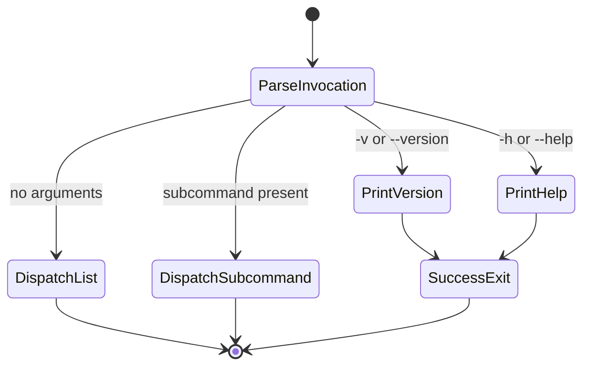

This state machine captures the pure informational fast paths and the no-argument default to `list`. The key invariant is that help and version do not cross config, AWS, or remote-access boundaries.

### Config-Store Mutation

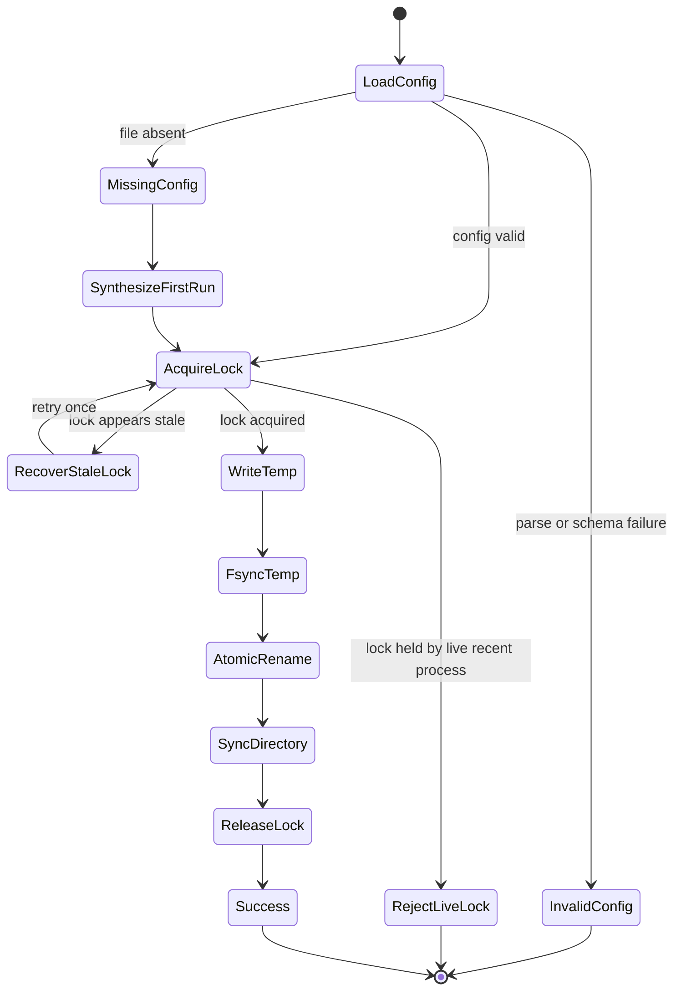

This machine expresses the single-writer mutation contract. The safety claim is that no mutation can leave partially committed config state. The liveness claim is bounded progress when the lock is free or stale rather than live and contended.

### Registry Mutation

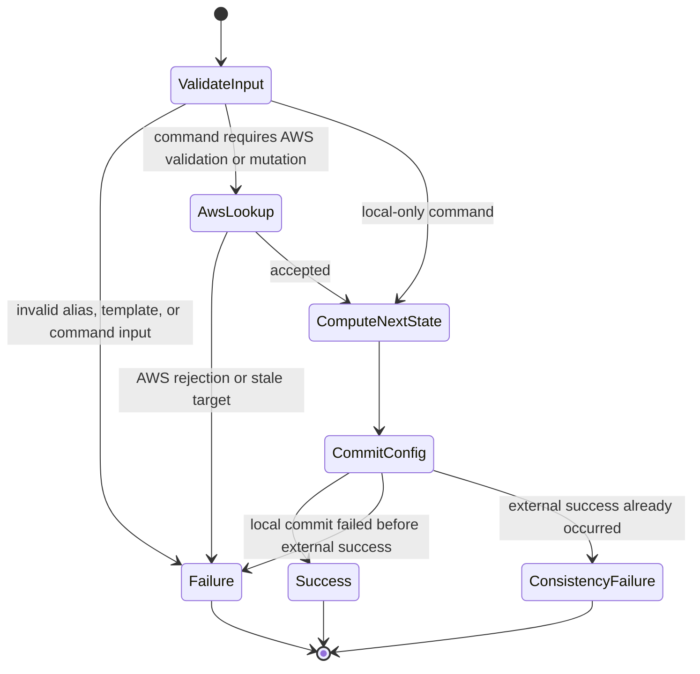

This machine covers `init`, `add`, `rm`, and `switch`. The critical distinction is between ordinary failure before any external success and explicit divergence after AWS success plus local commit failure.

### `up`

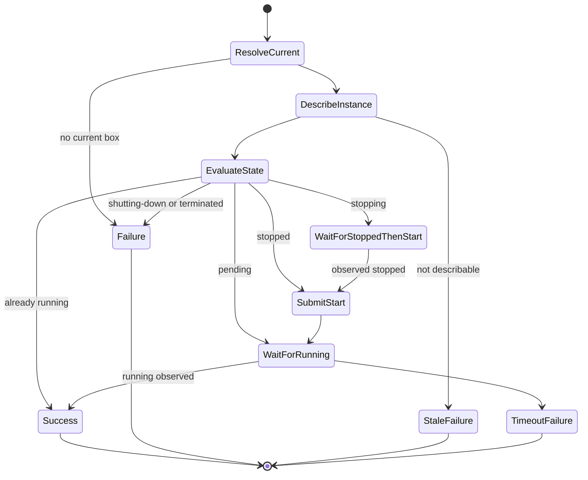

`up` accepts `running`, `pending`, `stopped`, and `stopping` as legal starting states. It rejects `shutting-down` and `terminated`. A redundant start request is never sent when the instance is already `pending`, and the 5-minute budget applies to the full path, including `stopping -> stopped -> start -> running`.

### `down`

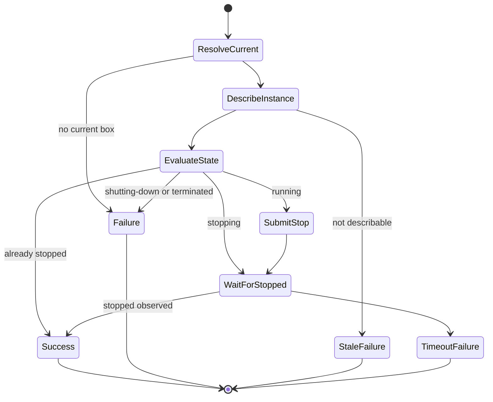

`down` accepts `running`, `stopping`, and `stopped` as legal starting states. It rejects `shutting-down` and `terminated`. A redundant stop request is never sent when the instance is already `stopping`.

### Remote Access

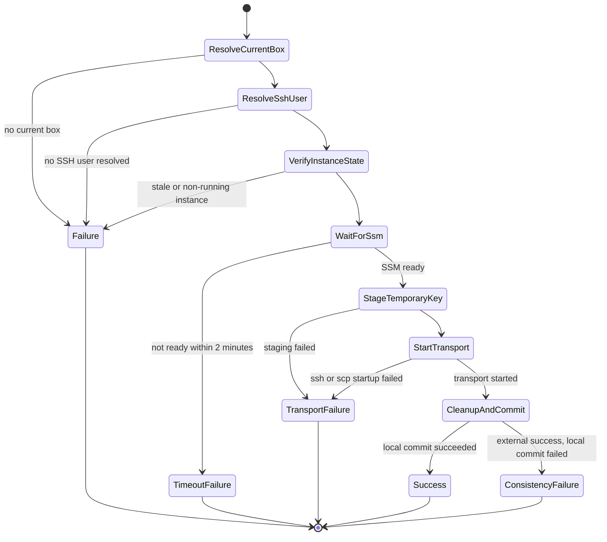

This machine captures the shared precondition chain for `connect` and `cp`. The central safety rule is that no transport starts until the target is running, SSM-ready, and temporary authorization is staged. The forbidden transitions are equally important: `ResolveCurrentBox -> StartTransport`, `ResolveSshUser -> StartTransport`, `VerifyInstanceState -> StartTransport`, and `WaitForSsm -> StartTransport` are all invalid because they would bypass required validation gates.

### `cp` Transfer and Finalization

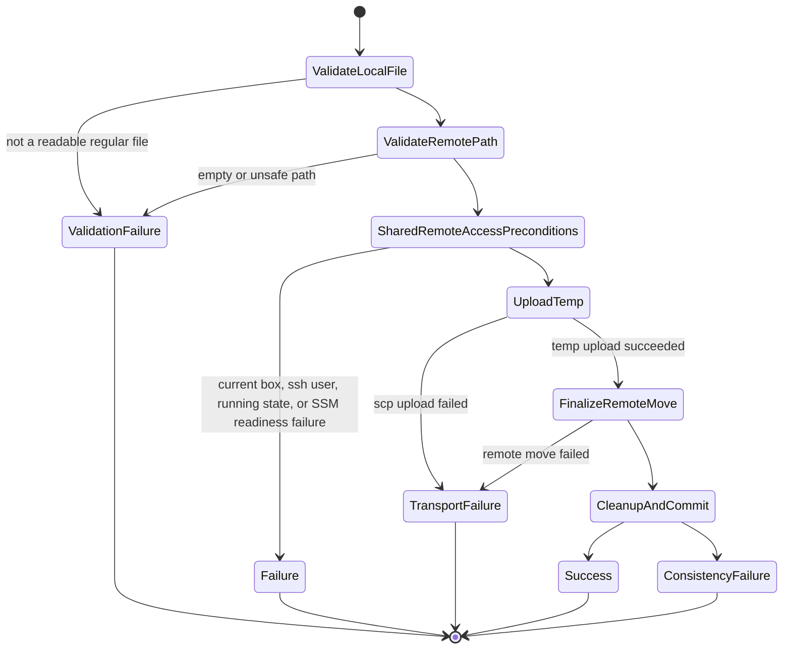

The safety property here is stronger than ordinary transport success: the final destination path is only replaced after successful upload to a temporary path and successful remote finalization.

## Interaction Protocols

### `init` Sequence

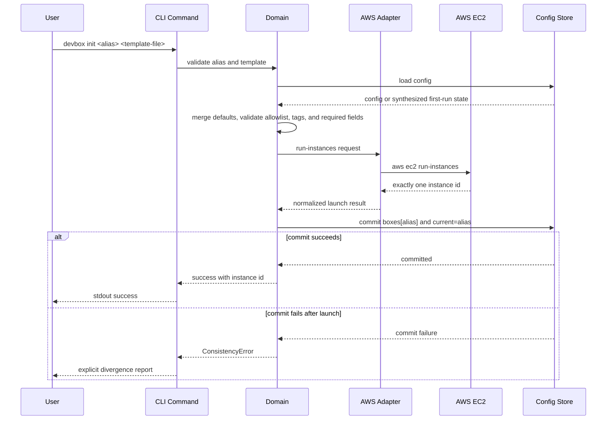

The ordering guarantee is strict: validation occurs before AWS mutation, and local tracking is committed only after AWS returns a successful launch result.

### `rm --terminate` Sequence

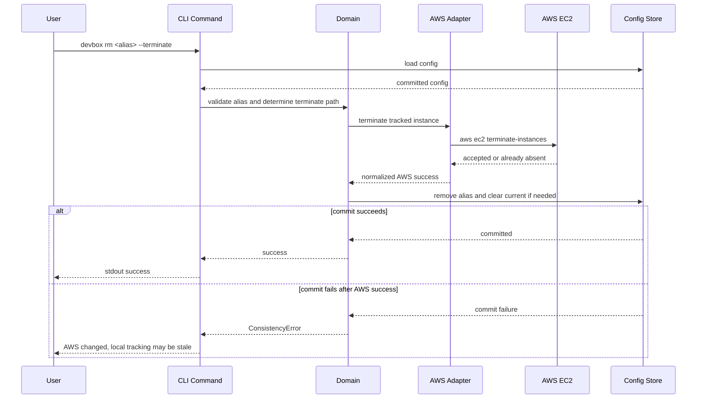

The safety rule is that local tracking is not removed before AWS accepts termination or reports the instance already absent.

### Lifecycle Polling Activity

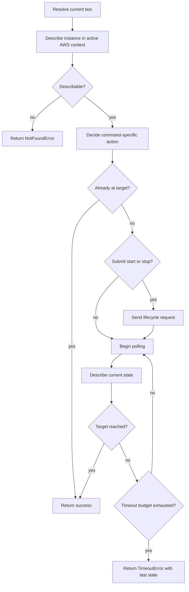

This activity applies to both `up` and `down`. The key liveness condition is eventual success when the target state appears before the timeout bound. The key safety condition is that invalid transitions are rejected before any lifecycle request is sent.

### `connect` Sequence

```mermaid
sequenceDiagram
    participant U as User
    participant C as CLI Command
    participant S as Config Store
    participant D as Domain
    participant A as AWS Adapter
    participant EC2 as AWS EC2 or SSM
    participant SSH as SSH Adapter
    participant H as Remote Host

    U->>C: devbox connect [--ssh-user user]
    C->>S: load config
    S-->>C: committed config
    C->>D: resolve current box and ssh user
    D->>A: describe instance and poll SSM readiness
    A->>EC2: aws ec2 describe-instances / aws ssm checks
    EC2-->>A: running and Online
    A-->>D: normalized ready state
    D->>SSH: ensure key material and stage temporary key
    SSH->>EC2: send SSM-backed key staging command
    EC2->>H: install temporary key and cleanup job
    H-->>SSH: staging complete
    SSH-->>D: transport ready
    D->>SSH: start interactive SSH over SSM
    SSH->>H: establish session
    alt session startup and local commit succeed
        SSH-->>D: startup success
        D->>S: commit lastConnectAt
        S-->>D: committed
        D-->>C: hand off child exit status
        C-->>U: connect exits with ssh exit code
    else startup succeeds but local commit fails
        SSH-->>D: startup success
        D->>S: commit lastConnectAt
        S-->>D: commit failure
        D-->>C: ConsistencyError
        C-->>U: session started; local metadata may be stale
    end
```

This sequence spans the most trust boundaries in the product. The important design rule is that the command does not self-certify: every boundary crossing is gated by explicit preconditions and normalized results.

### `cp` Sequence

```mermaid
sequenceDiagram
    participant U as User
    participant C as CLI Command
    participant S as Config Store
    participant D as Domain
    participant A as AWS Adapter
    participant EC2 as AWS EC2 or SSM
    participant SSH as SSH Adapter
    participant H as Remote Host

    U->>C: devbox cp <local> <remote>
    C->>S: load config
    S-->>C: committed config
    C->>D: validate local file, current box, ssh user, and remote path
    D->>A: describe instance and poll SSM readiness
    A->>EC2: AWS readiness calls
    EC2-->>A: running and Online
    A-->>D: ready
    D->>SSH: ensure key material and stage temporary key
    SSH->>EC2: staging command
    EC2->>H: authorize temporary key
    H-->>SSH: staging complete
    D->>SSH: upload to temp path
    SSH->>H: scp temp upload
    H-->>SSH: temp upload complete
    D->>SSH: finalize with atomic remote move
    SSH->>H: mv temp to final path
    alt remote finalize and local commit succeed
        H-->>SSH: final destination updated
        D->>S: commit lastConnectAt
        S-->>D: committed
        D-->>C: success
        C-->>U: stdout success
    else remote finalize succeeds but local commit fails
        H-->>SSH: final destination updated
        D->>S: commit lastConnectAt
        S-->>D: commit failure
        D-->>C: ConsistencyError
        C-->>U: remote file updated; local metadata may be stale
    end
```

The critical safety rule here is that the final destination path is not touched until the temporary upload is complete.

## Command and Interaction Summaries

| Command Family | Commands | Main Boundaries Crossed |
|---|---|---|
| Informational | `--help`, `--version` | local process only |
| Registry local-only | `switch`, `rm` without `--terminate` | config store |
| Registry with AWS | `list`, `init`, `add`, `rm --terminate` | config store, AWS |
| Lifecycle | `up`, `down` | config store, AWS |
| Remote access | `connect`, `cp` | config store, AWS, SSM, SSH/SCP, remote host |
| Distribution | `npm` install, `dist/devbox.js` | packaging and runtime contract |
| Traceability | `traceSpec(...)`, `test:trace` | spec catalog, test harness |

## Failure Modes and Recovery Model

### Error Categories

| Exit Code | Category | Meaning |
|---|---|---|
| 0 | Success | command completed successfully |
| 2 | ValidationError | invalid input, alias, template, or remote path |
| 3 | ConfigError | invalid config, unreadable config, or lock conflict |
| 4 | DependencyError | required local executable or dependency missing |
| 5 | AwsCliError | AWS CLI reported failure |
| 6 | NotFoundError | target instance not describable in active context |
| 7 | InstanceStateError | invalid live state for requested lifecycle or access path |
| 8 | TimeoutError | bounded wait expired |
| 9 | ConsistencyError | external success followed by local commit failure |
| 10 | TransportError | SSH, SCP, or key-staging failure |

### Failure Analysis

Unsafe inputs:

- invalid aliases
- malformed config or template JSON
- unsupported source file type for `cp`
- unsafe remote paths

Fragile formats:

- UTF-8 JSON config parsing
- AWS JSON parsing and normalization
- subprocess stderr propagation without losing normalized summaries

Inadequate control actions:

- repeated lifecycle requests when a transition is already in progress
- removing local tracking before AWS accepted termination
- starting transport before staging temporary authorization

Process-model flaws:

- local registry diverges from active AWS context
- AWS or remote side succeeded while local config commit failed
- persisted metadata is mistaken for live truth

Coordination failures:

- concurrent local mutation attempts
- stale or orphaned lock files
- cleanup failure after transport failure
- bounded waits that expire before target state is observed

### Control and Recovery

- reject invalid input before crossing effect boundaries
- keep all long waits bounded and return explicit timeout diagnostics
- recover stale locks with best-effort detection and one retry
- preserve the prior committed config on failed local mutation
- degrade `list` gracefully when AWS enrichment fails
- perform best-effort cleanup for temporary authorization and temp files
- report `ConsistencyError` when external success is already visible but local metadata could not be committed

## Safety and Liveness Guarantees

### Safety Guarantees

- config writes are atomic and single-writer
- every committed config remains schema-valid
- alias uniqueness and `current` integrity are preserved across successful mutations
- invalid lifecycle starting states never trigger AWS start or stop requests
- destructive AWS behavior is never implicit
- `rm --terminate` does not remove local tracking before AWS accepts termination or reports the target already absent
- unsafe remote paths never reach a remote shell
- failed `cp` does not partially overwrite the final destination path
- failed remote access does not update `lastConnectAt`
- persisted state is never treated as authoritative for live AWS state

### Liveness Guarantees

- `list` still succeeds when AWS enrichment is unavailable, preserving local visibility
- `up` succeeds if the instance reaches `running` within the configured timeout bound
- `down` succeeds if the instance reaches `stopped` within the configured timeout bound
- remote access proceeds if the target is running and becomes SSM-ready within the configured timeout bound
- staged temporary authorization is eventually scheduled for cleanup when setup succeeds
- `rm --terminate` removes local tracking after accepted AWS termination unless the local commit fails, in which case divergence is surfaced explicitly rather than hidden

## Operational and Security Constraints

- subprocesses are invoked with argv arrays rather than shell-interpolated command strings
- remote-path validation occurs before any shell quoting boundary is crossed
- `connect` and `cp` use temporary SSH authorization rather than silently permanent access state
- the SSH adapter prefers agent keys when available and otherwise falls back to `~/.ssh/ssm-ssh-tmp` and `~/.ssh/ssm-ssh-tmp.pub`
- remote staged-key cleanup is bounded; the staged cleanup job removes the authorized-key entry after 15 seconds, and the overall design does not permit unmanaged long-lived authorization
- EC2 polling is bounded to 5 minutes with 5-second intervals
- SSM readiness polling is bounded to 2 minutes with 5-second intervals
- signal handling aborts waits without rolling back already-submitted AWS state transitions
- error rendering is normalized and does not expose secrets as part of the first-line summary
- distribution targets preserve the same CLI semantics across `npm` and `dist/devbox.js`

## Verification Strategy and Evidence

The verification strategy follows the evidence pyramid described in [`lfm.md`](lfm.md): explicit claims first, then executable checks that keep the claims live.

Claims and evidence sources:

- capability requirements are defined in [`../openspec/specs/`](../openspec/specs/)
- architecture and state-machine design claims are described here
- implementation structure is mapped in [`../ARCHITECTURE.md`](../ARCHITECTURE.md)
- test evidence lives under `test/contract/`, `test/property/`, and `test/integration/`

Evidence layers:

- contract tests for stdout, stderr, exit codes, config parsing, output contracts, and command-specific rules
- property-based tests for alias/current integrity, lifecycle state machines, remote-path acceptance, and other invariants
- integration tests for command flows, adapter boundaries, polling behavior, cleanup paths, and consistency-error handling
- distribution checks for package and bundle parity
- traceability checks for spec identifier validation and full-catalog coverage in dedicated mode
- regression discipline so each discovered counterexample becomes a permanent test

The key design claim is not that the system is fully proved. The key claim is that its critical transitions, invariants, failure boundaries, and safety properties are explicit, checkable, and re-checked as the system evolves.

## Relationship to Other Documents

- [`ARCHITECTURE.md`](../ARCHITECTURE.md) explains where behavior lives in code and which layer boundaries should be preserved.
- [`openspec/specs/`](../openspec/specs/) defines the normative behavior for each capability.
- the archived core change under `../openspec/changes/archive/2026-06-05-devbox-core/` is historical source material for the initial design baseline.
- [`lfm.md`](lfm.md) explains the assurance posture and evidence model.
- [`typescript_style.md`](typescript_style.md) and [`state_machines.md`](state_machines.md) explain how the implementation should embody the design.

## Editorial and Maintenance Rules

This is a living document.

Update it when:

- command semantics change
- state machines change
- persistence or encoding rules change
- invariants or source-of-truth boundaries change
- failure contracts change
- safety or liveness guarantees change
- verification expectations change

Maintenance guidance:

- summarize durable design intent rather than copying every requirement from the specs verbatim
- keep capability-specific sections linked to the relevant OpenSpec specs
- preserve the separation between design intent here and code location in `ARCHITECTURE.md`
- ensure new code, tests, and specs continue to support the claims made in this document
