# Design

This document is the living design description for `devbox`. It captures durable technical intent for the project and is intended to evolve alongside the OpenSpec artifacts, code, and tests. It complements the repository codemap in [`ARCHITECTURE.md`](../ARCHITECTURE.md), the lightweight formal methods guidance in [`lfm.md`](lfm.md), and the normative capability specs under [`openspec/specs/`](../openspec/specs/).

The most relevant capability specs are:

| Capability | Purpose |
|---|---|
| [`box-registry`](../openspec/specs/box-registry/spec.md) | local tracking, alias management, config-store invariants, `init`/`add`/`rm`/`switch` |
| [`instance-lifecycle`](../openspec/specs/instance-lifecycle/spec.md) | `up`/`down`, EC2 state transitions, bounded polling |
| [`remote-access`](../openspec/specs/remote-access/spec.md) | `connect`, `cp`, SSH-user resolution, SSM readiness, temp-key staging |
| [`distribution`](../openspec/specs/distribution/spec.md) | `npm` distribution and `dist/devbox.js` parity |

## Purpose and Role

`devbox` is a small TypeScript CLI for creating, tracking, starting, stopping, connecting to, and uploading files to AWS EC2 development machines. It exists to provide a dependable, explicit workflow for common development-box operations without requiring users to manually compose raw `aws`, `ssh`, `scp`, and SSM-backed access commands for each action.

This document focuses on what the system is, why it exists, the important design constraints, the domain model, the state machines, the interaction protocols, the failure model, and the safety and liveness claims that define the project. It is not the repository codemap; for file-level orientation and implementation boundaries, use [`ARCHITECTURE.md`](../ARCHITECTURE.md).

## Context and Boundaries

`devbox` is intentionally narrow. It is a CLI, not a control plane. Its core challenge is preserving trust across three kinds of state:

- local registry state in `~/.config/devbox.json`
- live AWS state in the active account and region
- temporary remote-host state created during SSM-backed SSH access

This design therefore emphasizes deterministic domain logic, explicit state transitions, bounded waits, conservative subprocess boundaries, atomic local mutation, explicit visibility of cross-system divergence, and packaging as part of the product contract rather than a release afterthought.

### Scope

In scope:

- top-level informational behavior for `--help` and `--version`
- local box-registry behavior for `list`, `init`, `add`, `rm`, and `switch`
- lifecycle control for `up` and `down`
- remote access for `connect` and upload-only `cp`
- packaging and runtime parity between `npm` installation and `dist/devbox.js`
- traceability infrastructure that keeps specs, tests, and evidence connected

Out of scope:

- AWS profile, credential, or region management inside `devbox`
- replacing AWS CLI with the AWS SDK
- download, sync, directory copy, or general SSH orchestration beyond the documented command set
- tracking multiple AWS execution contexts in one local registry
- a background daemon, service, or distributed lock manager

### Source-of-Truth Boundaries

| Concern | Authoritative Source | Consequence |
|---|---|---|
| tracked aliases and current selection | committed local config | registry commands must not invent aliases or recover missing local state from AWS |
| instance existence and lifecycle state | AWS in the active account and region | lifecycle and remote-access commands must query AWS at command time |
| remote authorization and transfer state | bounded remote-access session | remote-host state is never treated as durable registry truth |
| resolved SSH user | invocation override, then per-box override, then defaults | remote access must not guess a user |

### Thin-Wrapper Boundaries

- AWS effects are performed through `aws`
- remote transport is performed through `ssh` and `scp`
- local persistence is performed through one config-store boundary that owns locking and atomic replacement

## Goals and Non-Goals

### Goals

- provide a layered CLI architecture that isolates deterministic domain logic from subprocess execution and filesystem effects
- preserve the key invariants of alias uniqueness, valid `current` selection, source-of-truth separation, explicit destructive behavior, and atomic local mutation
- make lifecycle and remote-access flows explicit enough to reason about as state machines
- normalize errors and output contracts so the CLI is predictable across validation failure, dependency failure, timeout, stale-resource, and post-external consistency failure cases
- preserve the same user-visible behavior across supported distribution forms

### Non-Goals

- hiding AWS execution context management inside the tool
- widening the product into a general-purpose SSH orchestration framework
- building a separate always-on service or persistent agent
- collapsing remote-host state into durable local truth

## Lightweight Formal Methods Posture

This project follows the lightweight formal methods posture described in [`lfm.md`](lfm.md): identify the critical properties, express them explicitly, keep the deterministic core small enough to reason about, and maintain live evidence that the implementation still preserves those properties.

The design is therefore centered on:

- preconditions for every command family and boundary crossing
- postconditions that describe the observable outcome after success or failure
- invariants over config shape, alias integrity, source-of-truth boundaries, and cross-system sequencing
- failure modes that are explicit rather than hidden behind generic exceptions
- safety properties that forbid bad things from happening
- liveness properties that describe when bounded progress is expected

The goal is not a proof of the whole system. The goal is justified confidence: the design claims are explicit, mechanically checkable, traceable into the capability specs, and re-checked in tests as the system evolves.

## High-Level Architecture

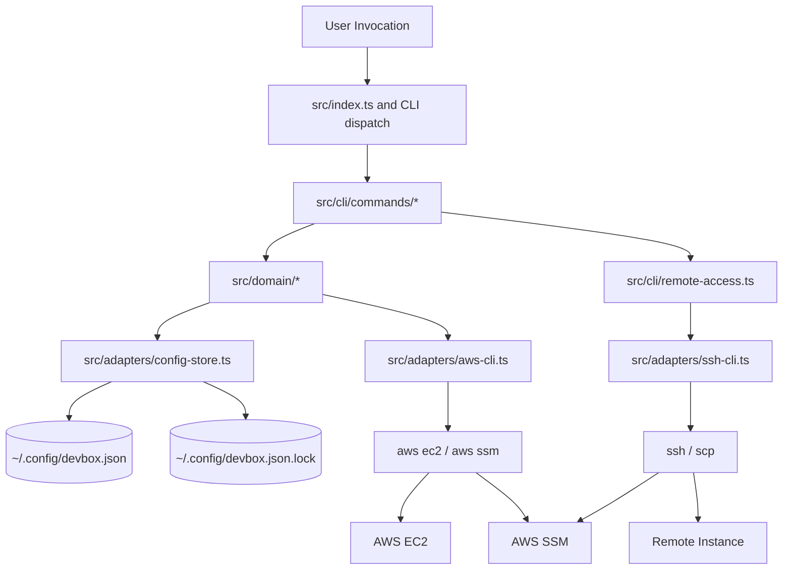

The architecture is layered.

- The CLI layer parses invocation shape, chooses a command handler, and renders normalized stdout and stderr.
- The domain layer owns deterministic reasoning: validation, state-transition decisions, merge rules, wait policies, and invariants.
- The adapter layer owns side effects: config persistence, subprocess execution, AWS normalization, SSH/SCP transport, and cleanup.

This split matters for assurance. The more the decision logic is isolated from the side-effecting mechanics, the easier it is to express invariants, encode state machines, and mechanically test the behavior that matters.

### Component Responsibilities

| Component | Responsibility | Key Invariant |
|---|---|---|
| CLI entrypoint and dispatch | parse argv, route commands, render outputs, map errors to exit codes | help/version remain pure local fast paths |
| Command handlers | compose domain decisions with adapter calls | each command preserves documented sequencing across boundaries |
| Domain core | validation, state reasoning, merge rules, polling policy, output contracts | domain logic remains deterministic and explicit |
| Config store | local config read/write, lock acquisition, stale-lock recovery, atomic replace | no failed mutation leaves partially committed config |
| AWS adapter | invoke `aws`, normalize EC2 and SSM results | live instance truth comes only from AWS describe calls |
| SSH adapter | key material, temporary staging, SSH/SCP transport, local cleanup | transport never starts before staging completes |
| Distribution tooling | package and bundle the CLI | supported distribution forms preserve the same CLI contract |

### Design Principles

- Make important invariants explicit.
- Keep the core deterministic and push nondeterminism to the edges.
- Treat local config and AWS live state as distinct sources of truth.
- Reject invalid input before crossing AWS, filesystem, or remote-shell boundaries.
- Bound all waits and surface timeouts explicitly.
- Keep destructive behavior opt-in and explicit.
- Surface cross-system divergence rather than collapsing it into a local-only error.
- Keep packaging and traceability in the product contract.

## Domain Model

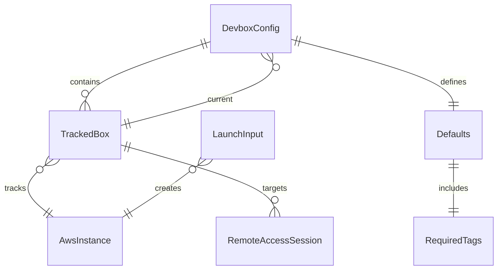

### Primary Entities

| Entity | Meaning | Authority | Key Invariants |
|---|---|---|---|
| Box Alias | stable local name chosen by the user | local config | syntactically valid and unique |
| Tracked Box | durable local record for one alias | local config | contains a non-empty `instanceId`; optional `sshUser` and `lastConnectAt` belong only to tracked aliases |
| Current Box | optional pointer used by current-box commands | local config | absent or references an existing alias |
| Defaults | shared config values for tags, launch defaults, and default SSH user | local config | required tags are always present and valid |
| Launch Input | launch-template-style JSON for `init` | invocation plus defaults | only documented allowlisted fields are accepted |
| AWS Instance | live EC2 machine in the active account and region | AWS | lifecycle and existence are checked at command time |
| Remote Access Session | bounded interaction for `connect` or `cp` | command runtime | transport is gated on running state, SSM readiness, and staged authorization |
| Distribution Artifact | `npm` CLI or bundled `dist/devbox.js` | build and package output | preserves the same command contract |
| Spec Catalog and Trace Evidence | active OpenSpec identifiers and traced tests | active specs and test harness | identifiers come from active specs, not archived changes |

### Authority Rules

| Rule | Reason |
|---|---|
| alias membership and current selection come only from committed local config | the registry is the durable local source of truth |
| instance existence and lifecycle state come only from AWS describes at command time | persisted live-state guesses become stale and unsafe |
| `lastConnectAt` is local metadata, not proof of live reachability | remote access is bounded and transient |
| resolved SSH user is derived from invocation override, then per-box override, then defaults | remote access must stay explicit and predictable |

## Data Design

### Persistent Config Model

The durable local registry is stored at `~/.config/devbox.json`. The advisory lock file is stored at `~/.config/devbox.json.lock`.

#### Top-Level Shape

| Field | Meaning | Constraints |
|---|---|---|
| `boxes` | alias-keyed tracked-box map | required; keys are unique aliases |
| `current` | current alias pointer | optional; if present, must name an existing alias |
| `defaults.tags` | required default tags | required; must contain the required tag keys |
| `defaults.ImageId` | default AMI or SSM parameter expression | optional; must exist after merge for `init` |
| `defaults.IamInstanceProfile` | default instance profile | optional; must exist after merge for `init` |
| `defaults.sshUser` | default SSH user | optional |

#### Per-Box Shape

| Field | Meaning | Constraints |
|---|---|---|
| `instanceId` | tracked EC2 instance ID | required; non-empty string |
| `sshUser` | per-box SSH user override | optional |
| `lastConnectAt` | last successful remote-access timestamp | optional; ISO-8601 UTC string |

### Encoding and Storage Constraints

| Constraint | Rule |
|---|---|
| config encoding | UTF-8 JSON |
| BOM handling | a leading BOM is invalid and treated as a config error |
| config file mode | `0600` |
| lock file mode | `0600` |
| lock file content | holder PID encoded as a decimal ASCII string |
| config writes | temp-file write, file `fsync`, atomic rename, and directory sync |
| crash during write | the committed config remains intact; temp files may be orphaned |

### Config Invariants

| Invariant | Why It Matters | Relevant Code |
|---|---|---|
| alias keys are unique and syntactically valid | preserves stable local addressing | [`alias.ts`](../src/domain/alias.ts), [`config-schema.ts`](../src/domain/config-schema.ts) |
| `current` is absent or references an existing alias | preserves current-box command integrity | [`config-schema.ts`](../src/domain/config-schema.ts) |
| every committed config is schema-valid | preserves trust in the registry | [`config-schema.ts`](../src/domain/config-schema.ts), [`config-store.ts`](../src/adapters/config-store.ts) |
| failed local mutations do not partially commit JSON | prevents ambiguous or corrupt state | [`config-store.ts`](../src/adapters/config-store.ts) |
| per-box `sshUser` and `lastConnectAt` are defined only for tracked aliases | prevents dangling metadata | [`config-schema.ts`](../src/domain/config-schema.ts) |

### Locking and Concurrency Constraints

| Constraint | Rule |
|---|---|
| mutation path | all config mutations flow through one adapter path |
| writer policy | mutation requires exclusive advisory lock acquisition |
| live lock behavior | a live, recent lock holder is never preempted |
| stale detection | PID validity, PID liveness, and lock mtime older than 5 minutes |
| stale recovery | best effort and retried once |
| concurrency model | single-writer semantics are preferred over concurrent merge behavior |

### Launch Template and Tag Constraints

Specs: [`box-registry`](../openspec/specs/box-registry/spec.md)

`init` accepts a launch-template-style JSON object. The supported top-level keys are:

```json
{
  "BlockDeviceMappings": [ BlockDeviceMapping, ... ],
  "CapacityReservationSpecification": CapacityReservationSpecification,
  "CpuOptions": CpuOptions,
  "CreditSpecification": CreditSpecification,
  "DisableApiStop": Boolean,
  "DisableApiTermination": Boolean,
  "EbsOptimized": Boolean,
  "EnclaveOptions": EnclaveOptions,
  "HibernationOptions": HibernationOptions,
  "IamInstanceProfile": IamInstanceProfile,
  "ImageId": String,
  "InstanceInitiatedShutdownBehavior": String,
  "InstanceMarketOptions": InstanceMarketOptions,
  "InstanceType": String,
  "KernelId": String,
  "KeyName": String,
  "LicenseSpecifications": [ LicenseSpecification, ... ],
  "MaintenanceOptions": MaintenanceOptions,
  "MetadataOptions": MetadataOptions,
  "Monitoring": Monitoring,
  "NetworkInterfaces": [ NetworkInterface, ... ],
  "Placement": Placement,
  "PrivateDnsNameOptions": PrivateDnsNameOptions,
  "RamDiskId": String,
  "SecurityGroupIds": [ String, ... ],
  "SecurityGroups": [ String, ... ],
  "TagSpecifications": [ TagSpecification, ... ],
  "UserData": String
}
```

This is a top-level allowlist, not a complete nested schema. Nested object shapes and valid field values follow the AWS EC2 launch template and instance launch documentation:

- [Create launch templates for Amazon EC2 instances](https://docs.aws.amazon.com/AWSEC2/latest/UserGuide/create-launch-template.html)
- [AWS::EC2::LaunchTemplate LaunchTemplateData reference](https://docs.aws.amazon.com/AWSCloudFormation/latest/TemplateReference/aws-properties-ec2-launchtemplate-launchtemplatedata.html)
- [EC2 RunInstances API reference](https://docs.aws.amazon.com/AWSEC2/latest/APIReference/API_RunInstances.html)

Unknown fields and `InstanceRequirements` are rejected before any AWS call.

#### Required Values After Merge

| Field | Requirement |
|---|---|
| `ImageId` | must be present |
| `IamInstanceProfile` | must be present |
| required tags | must be present and valid |
| `MinCount` and `MaxCount` | always set to `1` |

#### Structural Conflict Rules

| Condition | Rule |
|---|---|
| template contains `NetworkInterfaces` | reject top-level `SecurityGroupIds` and `SecurityGroups` |
| template uses top-level `SecurityGroups` without `NetworkInterfaces` | allow and surface any AWS rejection clearly |
| template contains `UserData` | pass through unchanged, including `file:` values |

#### Required Tag Constraints

| Tag | Constraint |
|---|---|
| `env` | one of `prod`, `preprod`, `staging`, `dev` |
| `service` | exactly `devbox` |
| `version` | 7 to 40 characters, with `0000000` allowed as the built-in placeholder default |
| `customer-data` | one of `true`, `false` |
| `team` | non-empty short identifier |

#### Tag Merge Precedence

1. built-in required tag defaults
2. `config.defaults.tags`
3. template instance `TagSpecifications`
4. forced `Name=<alias>` override
5. required-tag validation

#### Additional Tag Rules

| Rule | Purpose |
|---|---|
| `devbox` emits exactly one merged instance `TagSpecification` | avoids duplicate instance-tag blocks |
| non-instance `TagSpecifications` pass through unchanged | preserves AWS request shape outside the instance resource |
| template `Name` is ignored and replaced with the alias | preserves stable user-facing naming |

### Remote File and Path Constraints

Specs: [`remote-access`](../openspec/specs/remote-access/spec.md)

| Input | Constraint |
|---|---|
| local file for `cp` | exactly one readable regular local file |
| file size | no artificial size limit is imposed by `devbox` |
| remote path | must be non-empty after trimming |
| remote path characters | must not contain ASCII control characters or null bytes |
| transport gating | unsafe remote paths are rejected before any SSH, SCP, or AWS transport command is executed |

## Global Preconditions, Postconditions, and Invariants

### Global Preconditions

- the process can access the user's home directory and config path when local state is needed
- config, if present and required, is valid according to the config model
- AWS-dependent commands run with credentials, account, and region established outside `devbox`
- remote-access commands require the relevant local executables and SSM prerequisites

### Global Postconditions

- successful mutating local commands leave a schema-valid committed config
- successful external mutation followed by failed local commit is reported explicitly as divergence
- supported distribution forms preserve the same user-visible command contracts

### Global Invariants

| ID | Invariant | How Maintained |
|---|---|---|
| G-1 | local config is the source of truth for tracked aliases and `current` | config validation and atomic local mutation |
| G-2 | AWS is the source of truth for live instance existence and state | describe calls at command time |
| G-3 | `current` is absent or valid | config schema validation and registry mutations |
| G-4 | destructive AWS effects occur only on explicit command paths | command dispatch and separate terminate/lifecycle flows |
| G-5 | failed local mutations do not partially commit config state | write, `fsync`, rename, directory sync protocol |
| G-6 | `lastConnectAt` updates only after external success and local commit success | remote-access sequencing and explicit consistency handling |

## Capability Design

### Command-Family Summary

| Capability | Commands | Main Boundaries Crossed | Primary Specs |
|---|---|---|---|
| Informational | `--help`, `--version`, bare `devbox` dispatch | local process only | [`box-registry`](../openspec/specs/box-registry/spec.md), [`distribution`](../openspec/specs/distribution/spec.md) |
| Box Registry | `list`, `init`, `add`, `rm`, `switch` | config store, optional AWS | [`box-registry`](../openspec/specs/box-registry/spec.md) |
| Instance Lifecycle | `up`, `down` | config store, AWS | [`instance-lifecycle`](../openspec/specs/instance-lifecycle/spec.md) |
| Remote Access | `connect`, `cp` | config store, AWS, SSM, SSH/SCP, remote host | [`remote-access`](../openspec/specs/remote-access/spec.md), [`box-registry`](../openspec/specs/box-registry/spec.md) |
| Distribution | `npm` install, `dist/devbox.js` | packaging and runtime contract | [`distribution`](../openspec/specs/distribution/spec.md) |
| Spec Traceability | `traceSpec(...)`, `test:trace` | spec catalog, test harness | [`spec-traceability`](../openspec/specs/spec-traceability/spec.md) |

### Informational Commands

Specs: [`box-registry`](../openspec/specs/box-registry/spec.md), [`distribution`](../openspec/specs/distribution/spec.md)

| Command | Preconditions | Postconditions | Key Invariants |
|---|---|---|---|
| `devbox --version` | none beyond CLI execution | prints version and exits successfully | no config read, AWS call, or remote-access setup |
| `devbox --help` | none beyond CLI execution | prints help and version and exits successfully | no config read, AWS call, or remote-access setup |
| bare `devbox` | none | follows `list` command contract | no-argument invocation is defined as dispatch to `list` |

### Box Registry

Specs: [`box-registry`](../openspec/specs/box-registry/spec.md)

| Command | Preconditions | Postconditions | Key Design Rules |
|---|---|---|---|
| `list` | config loadable or missing | reports tracked aliases and optionally enriched live state | read-only; degrades gracefully when AWS enrichment fails |
| `init <alias> <template-file>` | valid alias, valid template, required launch values after merge | launches exactly one instance, tracks it locally, sets `current` | validation occurs before AWS mutation; post-launch commit failure becomes `ConsistencyError` |
| `add <instance-id> <alias>` | valid alias and describable instance | tracks existing instance and sets `current` | AWS describe is authoritative; malformed-looking instance IDs may warn but not reject by themselves |
| `rm <alias>` | alias exists | removes alias locally, clears `current` if needed | local-only unless `--terminate` is explicit |
| `rm <alias> --terminate` | alias exists and AWS termination can be attempted | requests termination, then removes alias locally | local tracking is not removed before AWS accepts or reports already absent |
| `switch <alias>` | alias exists | updates `current` only | no AWS dependency |

### Instance Lifecycle

Specs: [`instance-lifecycle`](../openspec/specs/instance-lifecycle/spec.md)

| Command | Preconditions | Postconditions | Key Design Rules |
|---|---|---|---|
| `up` | current box exists and instance is describable | instance reaches `running` or fails explicitly | accepts `running`, `pending`, `stopped`, `stopping`; rejects `shutting-down`, `terminated`, `unknown`; waits bounded to 5 minutes with 5-second polling |
| `down` | current box exists and instance is describable | instance reaches `stopped` or fails explicitly | accepts `running`, `stopping`, `stopped`; rejects `pending`, `shutting-down`, `terminated`, `unknown`; waits bounded to 5 minutes with 5-second polling |

### Remote Access

Specs: [`remote-access`](../openspec/specs/remote-access/spec.md), [`box-registry`](../openspec/specs/box-registry/spec.md)

| Command | Preconditions | Postconditions | Key Design Rules |
|---|---|---|---|
| `connect` | current box, resolved SSH user, running instance, SSM readiness, local dependencies | interactive SSH session established; exit code follows SSH child | `lastConnectAt` updates only after session startup and local commit succeed |
| `cp <local> <remote>` | shared remote-access preconditions plus valid local file and remote path | file uploaded to temp path, finalized remotely, metadata updated only after local commit succeeds | failed transfers must not partially overwrite the final destination |

### Distribution

Specs: [`distribution`](../openspec/specs/distribution/spec.md)

| Artifact | Contract |
|---|---|
| `npm` package | primary installation path |
| `dist/devbox.js` | bundled single-file artifact for Node.js 20+ |
| parity requirement | help/version behavior, outputs, exit codes, and command contracts match across supported forms |

## State Machines

The design uses explicit state-machine reasoning for the command paths that preserve the most important safety and liveness properties. This follows the implementation style described in [`state_machines.md`](state_machines.md), while keeping the design document focused on command contracts and system behavior rather than line-by-line code structure.

### State-Machine Coverage

| Command Family | State Machine |
|---|---|
| top-level CLI entry | invocation dispatch machine |
| config mutation | config-store mutation machine |
| registry commands | registry mutation machine |
| lifecycle commands | `up` and `down` machines |
| remote access | shared remote-access precondition machine |
| upload transfer | `cp` transfer and finalization machine |

### Top-Level Invocation

Goal: route CLI invocations while preserving pure informational fast paths.

Relevant specs: [`box-registry`](../openspec/specs/box-registry/spec.md), [`distribution`](../openspec/specs/distribution/spec.md)

Relevant code: [`src/index.ts`](../src/index.ts)

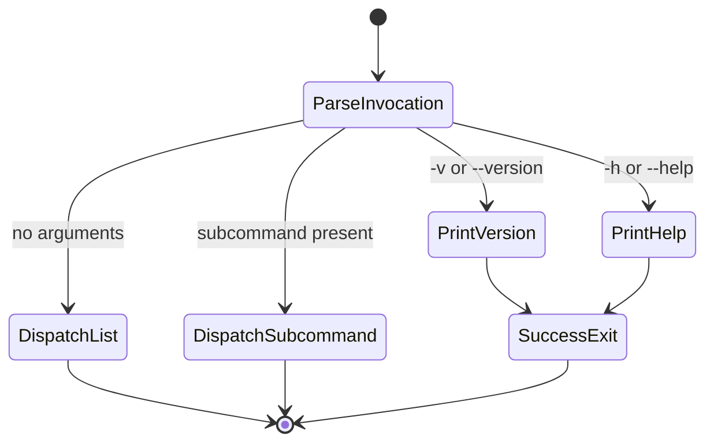

#### Decision Table

| Invocation Shape | Action | Side Effects |
|---|---|---|
| `-v`, `--version` | print version | none |
| `-h`, `--help` | print help and version | none |
| no args | dispatch `list` | same as `list` contract |
| subcommand | dispatch command handler | command-specific |

#### Invariants

| Invariant | Meaning |
|---|---|
| I-INV-1 | help and version do not read config |
| I-INV-2 | help and version do not contact AWS or remote-access adapters |
| I-INV-3 | bare invocation is not a hidden special case; it is defined as `list` |

#### Safety and Liveness

- Safety: informational commands never cross config, AWS, or remote-access boundaries.
- Liveness: informational commands terminate immediately on local process success paths.

### Config-Store Mutation

Goal: preserve single-writer local mutation with crash-safe atomic replacement.

Relevant specs: [`box-registry`](../openspec/specs/box-registry/spec.md)

Relevant code: [`src/adapters/config-store.ts`](../src/adapters/config-store.ts), [`src/domain/config-schema.ts`](../src/domain/config-schema.ts), [`src/domain/wait-policy.ts`](../src/domain/wait-policy.ts)

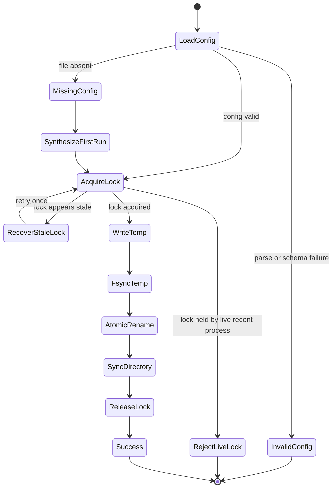

#### Decision Table

| Condition | Result |
|---|---|
| config missing on mutation path | synthesize first-run state, then proceed |
| config invalid | fail with `ConfigError` |
| lock absent | acquire and continue |
| lock live and recent | reject mutation |
| lock stale by PID validity, PID liveness, or age > 5 minutes | remove and retry once |

#### Invariants

| Invariant | Meaning |
|---|---|
| C-1 | all config mutations flow through one adapter path |
| C-2 | write protocol is write temp -> `fsync` temp -> atomic rename -> directory `fsync` |
| C-3 | lock release happens on every exit path |
| C-4 | readers see either old or new config, never a partial write |

#### Safety and Liveness

- Safety: no mutation can leave partially committed config state.
- Safety: a live, recent lock holder is never preempted.
- Liveness: bounded progress is expected when the lock is free or stale rather than live and contended.

### Registry Mutation

Goal: preserve alias integrity and explicit AWS/local sequencing for `init`, `add`, `rm`, and `switch`.

Relevant specs: [`box-registry`](../openspec/specs/box-registry/spec.md)

Relevant code: [`src/cli/commands/init.ts`](../src/cli/commands/init.ts), [`src/cli/commands/add.ts`](../src/cli/commands/add.ts), [`src/cli/commands/rm.ts`](../src/cli/commands/rm.ts), [`src/cli/commands/switch.ts`](../src/cli/commands/switch.ts), [`src/domain/alias.ts`](../src/domain/alias.ts), [`src/domain/init-mapper.ts`](../src/domain/init-mapper.ts)

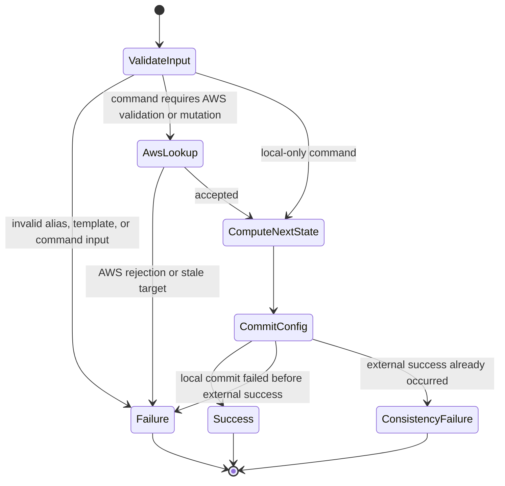

#### Decision Table

| Command | AWS Interaction | Commit Order | Divergence Risk |
|---|---|---|---|
| `switch` | none | local commit only | none beyond local config failure |
| `rm` | none unless `--terminate` | local commit only | none beyond local config failure |
| `add` | AWS describe only | commit after describe success | no AWS mutation, so no post-external divergence |
| `init` | AWS launch | commit after launch success | yes; failed local commit after launch becomes `ConsistencyError` |
| `rm --terminate` | AWS termination | commit after accepted termination or already-absent result | yes; failed local commit after accepted termination becomes `ConsistencyError` |

#### Invariants

| Invariant | Meaning |
|---|---|
| R-1 | invalid aliases and invalid template shapes fail before any AWS mutation |
| R-2 | removing the current alias clears `current` rather than reassigning it |
| R-3 | `rm` without `--terminate` is local-only, even for stale instances |
| R-4 | AWS describe is authoritative for `add` and `init` validation involving live state |

#### Safety and Liveness

- Safety: destructive AWS behavior is never implicit.
- Safety: external success followed by failed local commit is surfaced explicitly as `ConsistencyError`.
- Liveness: local-only registry operations complete once lock acquisition succeeds.

### `up`

Goal: bring the current tracked instance to `running` from any legal starting state.

Relevant specs: [`instance-lifecycle`](../openspec/specs/instance-lifecycle/spec.md)

Relevant code: [`src/domain/instance-state.ts`](../src/domain/instance-state.ts), [`src/domain/ec2-wait.ts`](../src/domain/ec2-wait.ts), [`src/cli/commands/up.ts`](../src/cli/commands/up.ts)

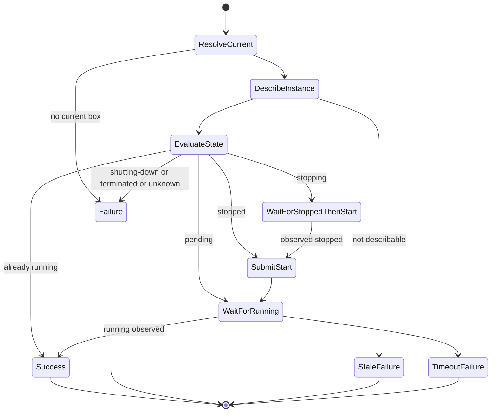

#### Decision Table

| Current State | `submitStart` | `wait` | `waitForStoppedBeforeStart` | Outcome |
|---|:---:|:---:|:---:|---|
| `running` | no | no | no | already at target |
| `pending` | no | yes | no | wait for `running` |
| `stopped` | yes | yes | no | start, then wait |
| `stopping` | no | yes | yes | wait for `stopped`, then start, then wait for `running` |
| `shutting-down` | no | no | no | `InstanceStateError` |
| `terminated` | no | no | no | `InstanceStateError` |
| `unknown` | no | no | no | `InstanceStateError` |

#### Invariants

| Invariant | Meaning |
|---|---|
| U-1 | only the current tracked instance is targeted |
| U-2 | AWS describe in the active context is authoritative |
| U-3 | a redundant start request is never sent when the instance is already `pending` |
| U-4 | the 5-minute budget covers the whole path, including `stopping -> stopped -> start -> running` |

#### Safety and Liveness

- Safety: `shutting-down`, `terminated`, and `unknown` never trigger a start request.
- Safety: success is reported only after observing `running`.
- Liveness: `up` succeeds if the instance reaches `running` within `EC2_WAIT_TIMEOUT_MS` with 5-second polling.

### `down`

Goal: bring the current tracked instance to `stopped` from any legal starting state.

Relevant specs: [`instance-lifecycle`](../openspec/specs/instance-lifecycle/spec.md)

Relevant code: [`src/domain/instance-state.ts`](../src/domain/instance-state.ts), [`src/domain/ec2-wait.ts`](../src/domain/ec2-wait.ts), [`src/cli/commands/down.ts`](../src/cli/commands/down.ts)

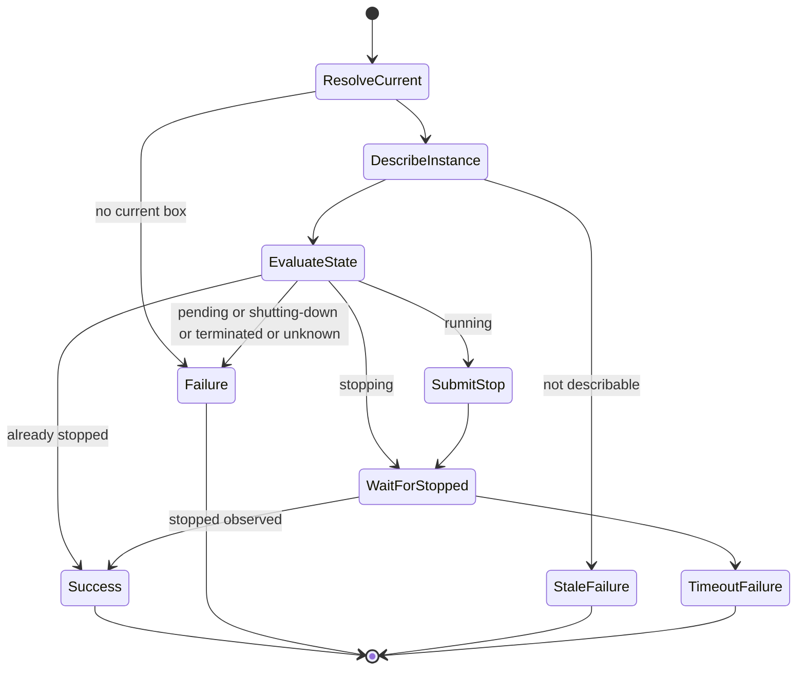

#### Decision Table

| Current State | `submitStop` | `wait` | Outcome |
|---|:---:|:---:|---|
| `stopped` | no | no | already at target |
| `stopping` | no | yes | wait for `stopped` |
| `running` | yes | yes | stop, then wait |
| `pending` | no | no | `InstanceStateError` |
| `shutting-down` | no | no | `InstanceStateError` |
| `terminated` | no | no | `InstanceStateError` |
| `unknown` | no | no | `InstanceStateError` |

#### Invariants

| Invariant | Meaning |
|---|---|
| D-1 | only the current tracked instance is targeted |
| D-2 | a redundant stop request is never sent when the instance is already `stopping` |
| D-3 | stale tracked instances fail with `NotFoundError` rather than guessed alternate-context behavior |

#### Safety and Liveness

- Safety: `pending`, `shutting-down`, `terminated`, and `unknown` never trigger a stop request.
- Safety: success is reported only after observing `stopped`.
- Liveness: `down` succeeds if the instance reaches `stopped` within `EC2_WAIT_TIMEOUT_MS` with 5-second polling.

### Remote-Access Preconditions

Goal: gate `connect` and `cp` on an explicit chain of validated preconditions.

Relevant specs: [`remote-access`](../openspec/specs/remote-access/spec.md)

Relevant code: [`src/cli/remote-access.ts`](../src/cli/remote-access.ts), [`src/domain/ec2-wait.ts`](../src/domain/ec2-wait.ts), [`src/domain/remote-path.ts`](../src/domain/remote-path.ts), [`src/adapters/ssh-cli.ts`](../src/adapters/ssh-cli.ts)

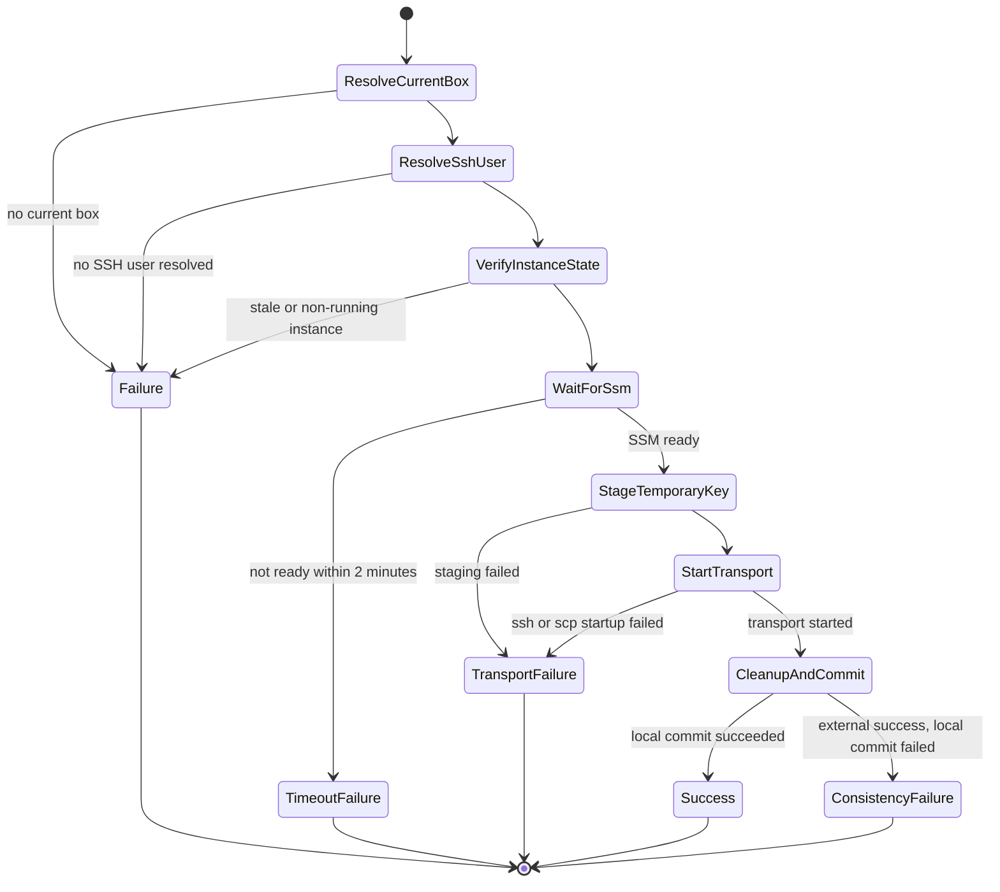

#### Decision Table

| Gate | Requirement | Failure |
|---|---|---|
| current box | `current` resolves to a tracked alias | validation failure |
| SSH user | resolved from invocation override, then box override, then defaults | validation failure |
| instance state | AWS describe returns `running` instance in active context | `NotFoundError` or `InstanceStateError` |
| SSM readiness | becomes `Online` within 2 minutes | `TimeoutError` |
| key staging | temporary authorization staged successfully | `TransportError` |

#### Forbidden Shortcuts

- `ResolveCurrentBox -> StartTransport`
- `ResolveSshUser -> StartTransport`
- `VerifyInstanceState -> StartTransport`
- `WaitForSsm -> StartTransport`

These transitions are invalid because they would bypass required validation gates.

#### Invariants

| Invariant | Meaning |
|---|---|
| RA-1 | no transport starts before the target is running, SSM-ready, and staged for temporary access |
| RA-2 | missing SSH user fails before any staging or transport begins |
| RA-3 | `lastConnectAt` is updated only after external success and local commit success |

#### Safety and Liveness

- Safety: unsafe or incomplete precondition chains never reach SSH or SCP transport.
- Safety: staging failure blocks all transport.
- Liveness: remote access proceeds if the target is running and becomes SSM-ready within `SSM_WAIT_TIMEOUT_MS`.

### `cp` Transfer and Finalization

Goal: preserve final-path safety by uploading to a temporary path and finalizing only after successful transfer.

Relevant specs: [`remote-access`](../openspec/specs/remote-access/spec.md)

Relevant code: [`src/cli/commands/cp.ts`](../src/cli/commands/cp.ts), [`src/domain/remote-path.ts`](../src/domain/remote-path.ts), [`src/adapters/ssh-cli.ts`](../src/adapters/ssh-cli.ts)

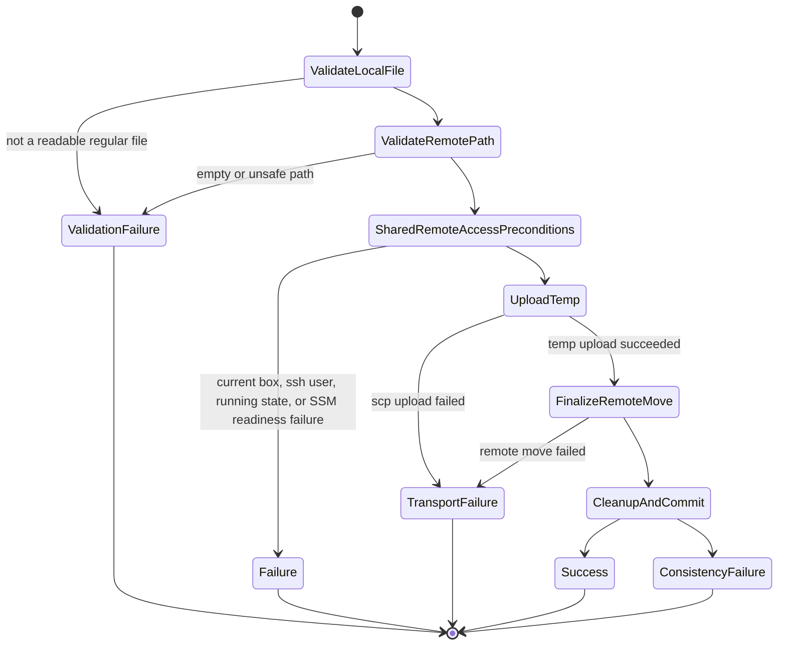

#### Decision Table

| Step | Success Condition | Failure Contract |
|---|---|---|
| local file validation | readable regular file | `ValidationError` |
| remote path validation | non-empty after trim; no ASCII control chars or null bytes | `ValidationError` |
| temp upload | `scp` to generated temp path succeeds | `TransportError` |
| finalization | remote `mv` succeeds | `TransportError` |
| metadata commit | `lastConnectAt` commit succeeds after remote success | `ConsistencyError` on failure |

#### Invariants

| Invariant | Meaning |
|---|---|
| CP-1 | final destination is not touched until temporary upload succeeds |
| CP-2 | failed transfers do not partially overwrite the final destination path |
| CP-3 | no artificial file-size limit is enforced by the CLI |

#### Safety and Liveness

- Safety: unsafe remote paths never reach a remote shell.
- Safety: final destination is updated only after successful temp upload and remote move.
- Liveness: when shared remote-access preconditions hold and transport succeeds, `cp` completes in one bounded session.

## Interaction Protocols

### `init` Sequence

Specs: [`box-registry`](../openspec/specs/box-registry/spec.md)

Relevant code: [`src/cli/commands/init.ts`](../src/cli/commands/init.ts), [`src/domain/init-mapper.ts`](../src/domain/init-mapper.ts), [`src/adapters/aws-cli.ts`](../src/adapters/aws-cli.ts), [`src/adapters/config-store.ts`](../src/adapters/config-store.ts)

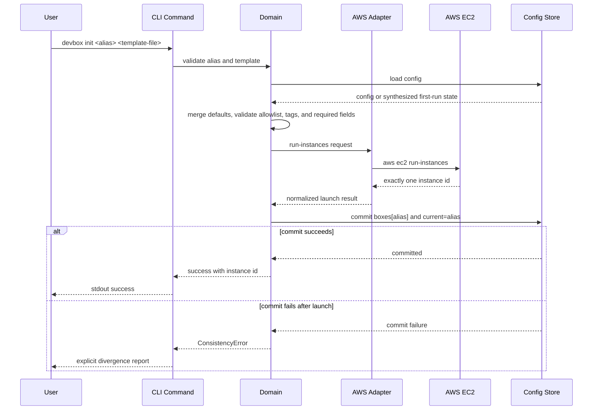

Protocol rules:

- validation occurs before AWS mutation
- local tracking is committed only after AWS returns a successful launch result
- the post-launch local-commit failure boundary is explicit and user-visible

### `rm --terminate` Sequence

Specs: [`box-registry`](../openspec/specs/box-registry/spec.md)

Relevant code: [`src/cli/commands/rm.ts`](../src/cli/commands/rm.ts), [`src/adapters/aws-cli.ts`](../src/adapters/aws-cli.ts), [`src/adapters/config-store.ts`](../src/adapters/config-store.ts)

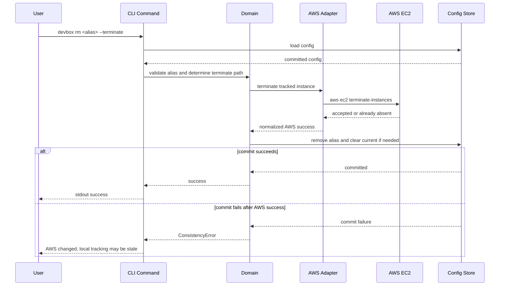

Protocol rules:

- local tracking is not removed before AWS accepts termination or reports the target already absent
- external success plus failed local commit is surfaced as divergence, not a generic local failure

### Lifecycle Polling Activity

Specs: [`instance-lifecycle`](../openspec/specs/instance-lifecycle/spec.md)

Relevant code: [`src/domain/ec2-wait.ts`](../src/domain/ec2-wait.ts), [`src/domain/wait-policy.ts`](../src/domain/wait-policy.ts)

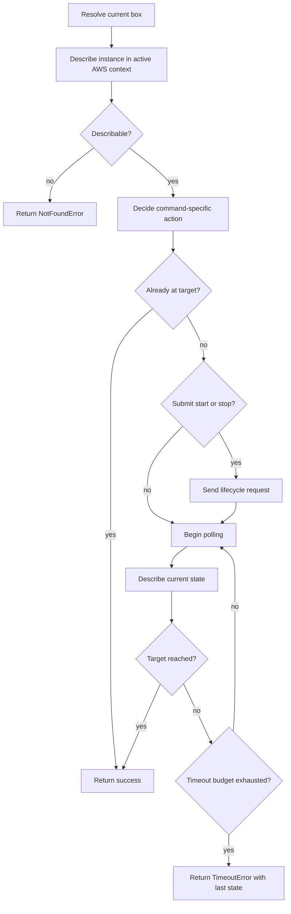

Protocol rules:

- the target instance is always resolved in the active AWS account and region
- invalid transitions are rejected before any lifecycle request is sent
- bounded waits use explicit timeout budgets instead of indefinite polling

### `connect` Sequence

Specs: [`remote-access`](../openspec/specs/remote-access/spec.md)

Relevant code: [`src/cli/commands/connect.ts`](../src/cli/commands/connect.ts), [`src/cli/remote-access.ts`](../src/cli/remote-access.ts), [`src/adapters/ssh-cli.ts`](../src/adapters/ssh-cli.ts), [`src/adapters/config-store.ts`](../src/adapters/config-store.ts)

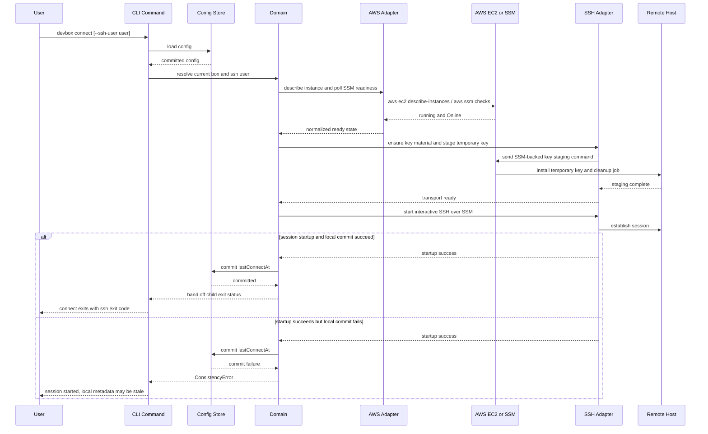

Protocol rules:

- every boundary crossing is gated by explicit preconditions and normalized results
- the SSH session exit code is propagated rather than hidden behind unconditional success
- temporary authorization is staged before transport and bounded for cleanup

### `cp` Sequence

Specs: [`remote-access`](../openspec/specs/remote-access/spec.md)

Relevant code: [`src/cli/commands/cp.ts`](../src/cli/commands/cp.ts), [`src/cli/remote-access.ts`](../src/cli/remote-access.ts), [`src/domain/remote-path.ts`](../src/domain/remote-path.ts), [`src/adapters/ssh-cli.ts`](../src/adapters/ssh-cli.ts), [`src/adapters/config-store.ts`](../src/adapters/config-store.ts)

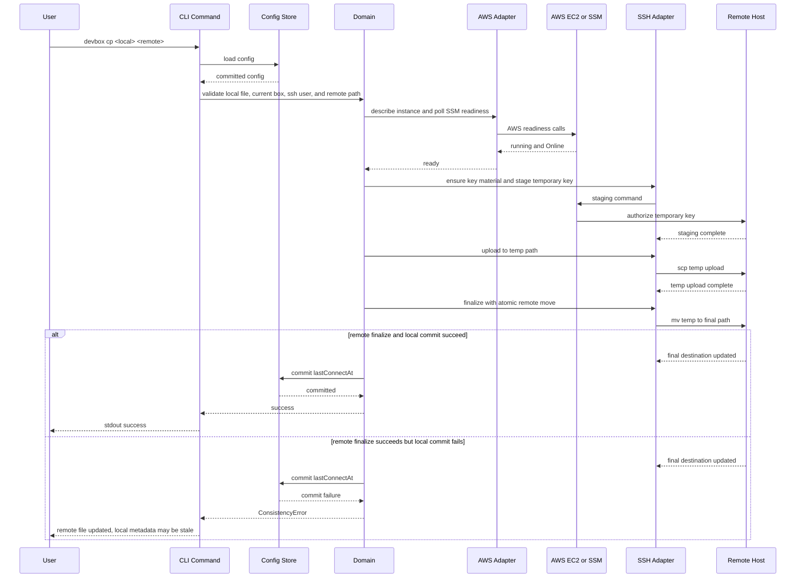

Protocol rules:

- the final destination path is not touched until the temporary upload is complete
- remote success followed by failed local metadata commit is treated as explicit divergence
- local source files are validated before any remote transport setup begins

## Failure and Reliability

### Error Categories and Exit Codes

Relevant code: [`src/domain/errors.ts`](../src/domain/errors.ts)

| Exit Code | Category | Meaning |
|---|---|---|
| 0 | Success | command completed successfully |
| 2 | ValidationError | invalid input, alias, template, or remote path |
| 3 | ConfigError | invalid config, unreadable config, or lock conflict |
| 4 | DependencyError | required local executable or dependency missing |
| 5 | AwsCliError | AWS CLI reported failure |
| 6 | NotFoundError | target instance not describable in active context |
| 7 | InstanceStateError | invalid live state for requested lifecycle or access path |
| 8 | TimeoutError | bounded wait expired |
| 9 | ConsistencyError | external success followed by local commit failure |
| 10 | TransportError | SSH, SCP, or key-staging failure |

### Failure Mode Analysis

| Failure Class | Example | Control |
|---|---|---|
| unsafe inputs | invalid aliases, malformed config or template JSON, unsupported local file type, unsafe remote paths | reject before crossing effect boundaries |
| fragile formats | UTF-8 JSON parsing, AWS JSON normalization, subprocess stderr propagation | normalize failures near the boundary and preserve useful details |
| inadequate control actions | repeated lifecycle requests, removing local tracking before accepted termination, starting transport before staging | explicit state machines and sequencing rules |
| process-model flaws | local registry diverges from active AWS context; remote/AWS success occurs before local commit | treat divergence as a first-class visible state |
| coordination failures | concurrent config mutation, stale locks, timeout expiry, cleanup failure after transport problems | single-writer semantics, stale-lock recovery, bounded waits, best-effort cleanup |

### Control and Recovery

- reject invalid input before filesystem, AWS, or remote-shell effects begin
- keep all long waits bounded and return explicit timeout diagnostics
- recover stale locks with best-effort detection and one retry
- preserve the prior committed config on failed local mutation
- degrade `list` gracefully when AWS enrichment fails
- perform best-effort cleanup for temporary authorization and temporary files
- report `ConsistencyError` when external success is already visible but local metadata could not be committed

## Safety and Liveness Claims

### Safety Claims

| Claim | Mechanism | Evidence Sources |
|---|---|---|
| config writes are atomic and single-writer | lock plus write/`fsync`/rename/dir-`fsync` protocol | [`box-registry` spec](../openspec/specs/box-registry/spec.md), config-store tests |
| every committed config remains schema-valid | config schema validation and full-object commits | config-schema unit / contract tests, config-store integration tests |
| alias uniqueness and `current` integrity are preserved | alias validation and config invariants | registry tests, property tests |
| invalid lifecycle starting states never trigger AWS lifecycle requests | explicit `up` and `down` decision functions | [`instance-lifecycle` spec](../openspec/specs/instance-lifecycle/spec.md), lifecycle tests |
| destructive AWS behavior is never implicit | separate terminate path and explicit lifecycle commands | registry and lifecycle integration tests |
| `rm --terminate` does not remove local tracking before AWS acceptance | sequence ordering in remove flow | registry integration tests |
| unsafe remote paths never reach a remote shell | path validation before transport | remote-path property tests and remote-access unit / contract tests |
| failed `cp` does not partially overwrite the final destination path | temp upload plus remote finalization | remote command integration tests |
| failed remote access does not update `lastConnectAt` | update occurs only after external success and local commit success | connect/cp integration tests |
| persisted state is never treated as authoritative for live AWS state | describe calls at command time | lifecycle and remote-access flows |

### Liveness Claims

| Claim | Mechanism | Bound |
|---|---|---|
| `list` still succeeds when AWS enrichment is unavailable | local-first rendering path | immediate local completion |
| `up` succeeds if the instance reaches `running` before the timeout bound | bounded EC2 polling | 5 minutes, 5-second cadence |
| `down` succeeds if the instance reaches `stopped` before the timeout bound | bounded EC2 polling | 5 minutes, 5-second cadence |
| remote access proceeds if the target is running and becomes SSM-ready before timeout | bounded SSM readiness polling | 2 minutes, 5-second cadence |
| staged temporary authorization is eventually scheduled for cleanup when setup succeeds | remote cleanup job and best-effort local cleanup | bounded session lifetime |
| `rm --terminate` removes local tracking after accepted termination unless local commit fails | ordered AWS-then-local sequencing | visible `ConsistencyError` on divergence |

## Operational Concerns

### Observability

| Concern | Design Choice |
|---|---|
| user-visible failures | normalized first-line stderr in the form `[devbox] <Category>: <message>` |
| boundary details | indented subprocess stderr lines when useful for diagnosis |
| verification visibility | traced tests tie behavior back to canonical spec identifiers |
| command output stability | stdout and stderr contracts are treated as part of the product surface |

### Deployment and Rollout

| Concern | Design Choice |
|---|---|
| primary release path | standard `npm` package installation |
| additional artifact | bundled `dist/devbox.js` |
| release gate | distribution parity verification is part of the product contract |
| rollback model | ordinary package-version rollback; no persistent service migration required |

### Capacity and Scaling

`devbox` is a single-user local CLI, so scaling concerns are mostly bounded-work and subprocess-behavior concerns rather than server-side throughput concerns.

| Concern | Design Choice |
|---|---|
| long waits | explicit timeout budgets and polling cadence constants |
| subprocess output | bounded capture in the process adapter |
| local contention | single-writer config semantics over concurrent merge behavior |

## Security and Trust Boundaries

| Concern | Design Constraint |
|---|---|
| subprocess invocation | argv-based execution rather than shell-interpolated command strings |
| remote path handling | validation occurs before any shell quoting boundary is crossed |
| SSH authorization | temporary staged access rather than long-lived hidden authorization state |
| local secrets scope | the tool does not manage AWS credentials, profiles, or regions |
| temporary key handling | agent keys are preferred; generated keys are cleaned up locally; remote entries are bounded for cleanup |
| error rendering | normalized summaries should not expose secrets as part of the first-line message |

## Forward Evolution and Trade-Offs

### Forward Evolution

- the config model can later add explicit CLI support for per-box SSH-user editing without changing the precedence model
- additional strict modes or listing formats can be added without widening the core source-of-truth model
- the state-machine-oriented design makes it practical to deepen the formal evidence for selected kernels over time
- packaging can evolve without changing command semantics, provided parity is preserved

### Risks and Mitigations

| Risk | Mitigation |
|---|---|
| active AWS account or region changes can make a tracked box appear stale | treat stale-resource handling as a first-class behavior and avoid guessed alternate contexts |
| AWS CLI and local tool dependence varies across environments | model missing executables and boundary failures explicitly |
| remote cleanup may fail after transport problems | keep cleanup best effort, bound temporary authorization lifetime, and report transport failures clearly |
| atomic config semantics rely on local filesystem behavior | localize the write protocol in one adapter and test crash-like sequences |

### Alternatives Considered

| Alternative | Why Rejected |
|---|---|
| AWS SDK instead of AWS CLI | the product is intentionally a thin AWS CLI wrapper with a smaller trust surface |
| persisting account and region per box | widens the domain model into context management that the product intentionally leaves to the user |
| long-lived SSH configuration or static key assumptions | violates the requirement for short-lived staged authorization with bounded cleanup |
| best-effort local writes without locking or atomic replace | would violate core safety and reliability claims |

## Verification Strategy and Evidence

The verification strategy follows the evidence pyramid described in [`lfm.md`](lfm.md): explicit claims first, then executable checks that keep the claims live.

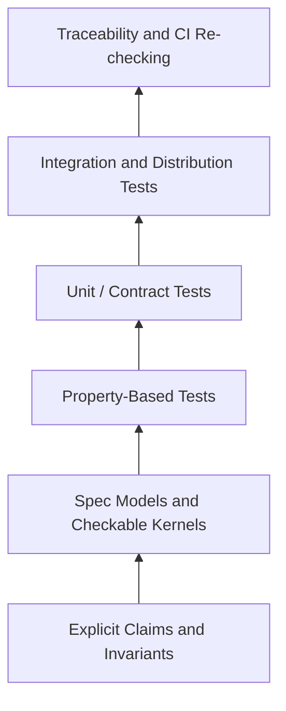

### Claims and Evidence Sources

| Layer | Focus | Primary Sources |
|---|---|---|
| capability requirements | normative behavior | [`openspec/specs/`](../openspec/specs/) |
| design claims | architecture, sequencing, invariants, safety, liveness | this document |
| implementation structure | where behavior lives and architectural boundaries | [`../ARCHITECTURE.md`](../ARCHITECTURE.md) |
| executable evidence | tests and traceability runs | `test/contract/`, `test/property/`, `test/integration/` |

### Evidence Layers

| Layer | Coverage Focus |
|---|---|
| spec models and checkable kernels | state-machine obligations encoded in the capability specs, including Alloy models for selected tractable cores |
| unit / contract tests | stdout, stderr, exit codes, config parsing, output contracts, and command-specific rules |
| property-based tests | alias/current integrity, lifecycle decisions, remote-path acceptance, SSH-user precedence, and other invariants |
| integration tests | command flows, adapter boundaries, polling behavior, cleanup paths, and consistency-error handling |
| distribution checks | package and bundle parity |
| traceability checks | canonical spec identifier validation and dedicated full-catalog coverage mode |
| regression discipline | each discovered counterexample becomes a permanent test |

The key design claim is not that the system is fully proved. The key claim is that its critical transitions, invariants, failure boundaries, and safety properties are explicit, checkable, and re-checked as the system evolves.

## Relationship to Other Documents

- [`ARCHITECTURE.md`](../ARCHITECTURE.md) explains where behavior lives in code and which layer boundaries should be preserved.
- [`openspec/specs/`](../openspec/specs/) defines the normative behavior for each capability.
- the archived core change under [`openspec/changes/archive/2026-06-05-devbox-core/`](../openspec/changes/archive/2026-06-05-devbox-core/) is historical source material for the initial design baseline.
- [`lfm.md`](lfm.md) explains the assurance posture and evidence model.
- [`state_machines.md`](state_machines.md) explains the implementation style used to make states, transitions, and invariants explicit.

## Maintenance Rules

This is a living document.

Update it when:

- command semantics change
- state machines change
- persistence or encoding rules change
- invariants or source-of-truth boundaries change
- failure contracts change
- safety or liveness guarantees change
- verification expectations change

Maintenance guidance:

- summarize durable design intent rather than copying every requirement from the specs verbatim
- keep capability sections linked to the relevant OpenSpec specs
- preserve the separation between design intent here and code location in `ARCHITECTURE.md`
- prefer stable module links over line-number-heavy implementation commentary
- ensure new code, tests, and specs continue to support the claims made in this document
