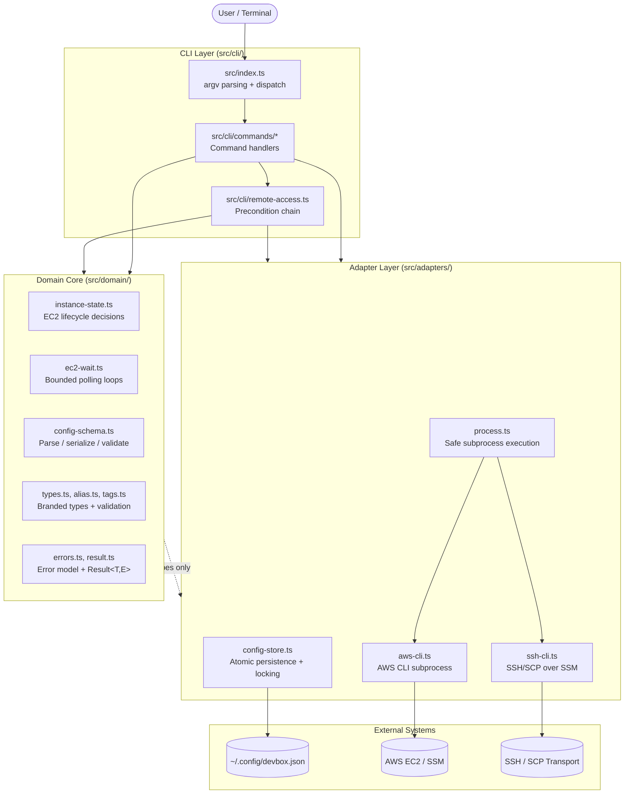
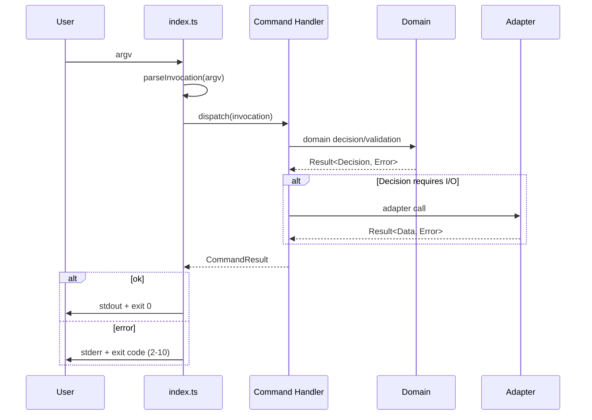
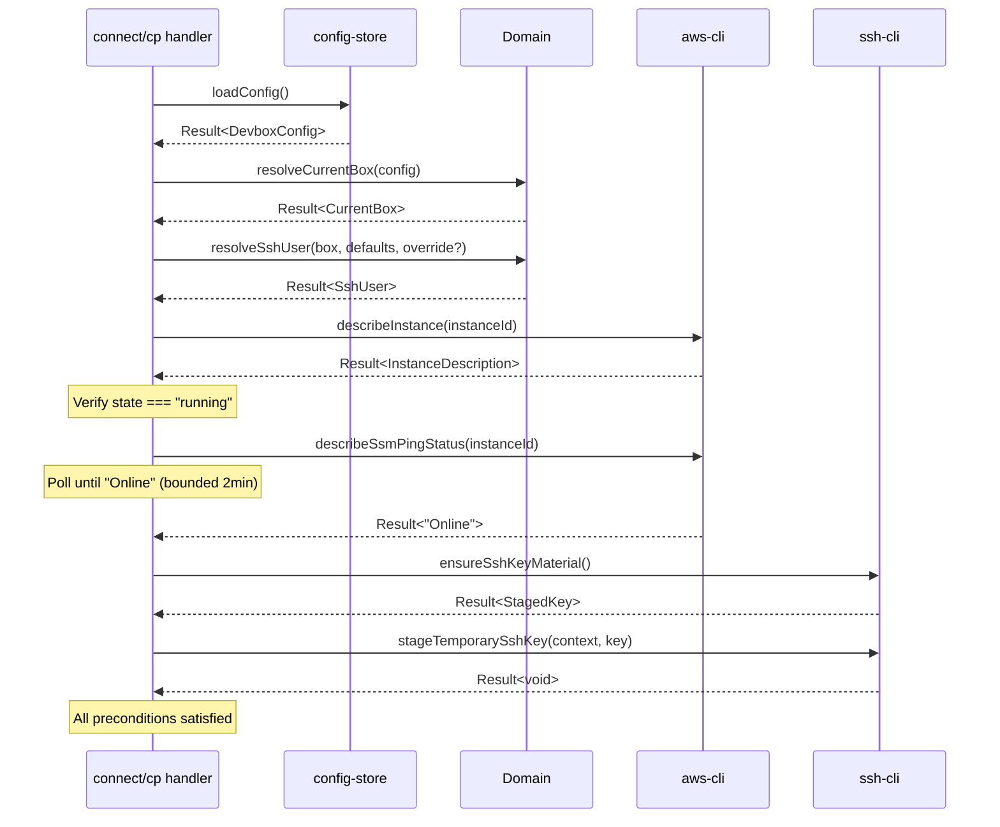
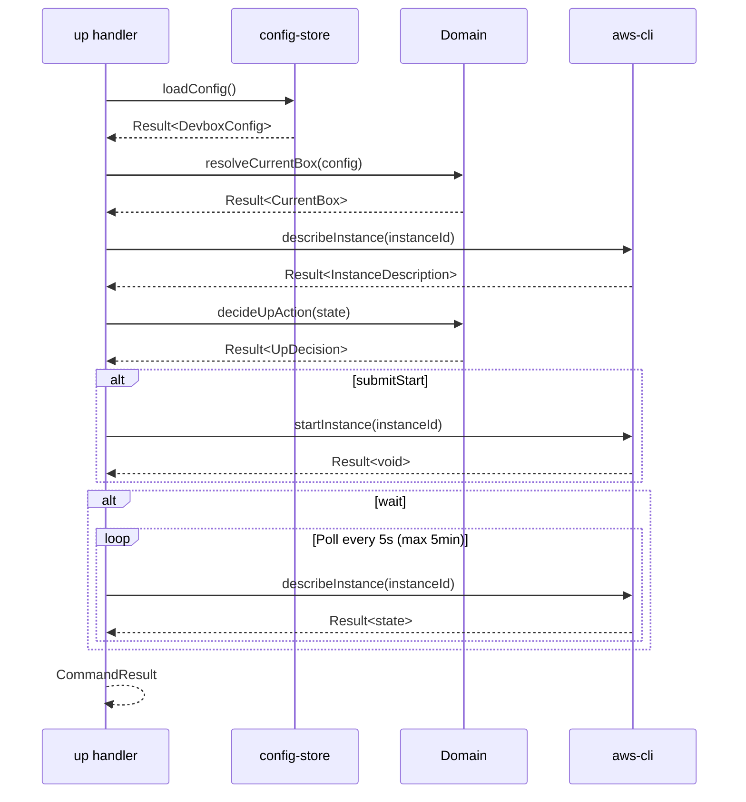
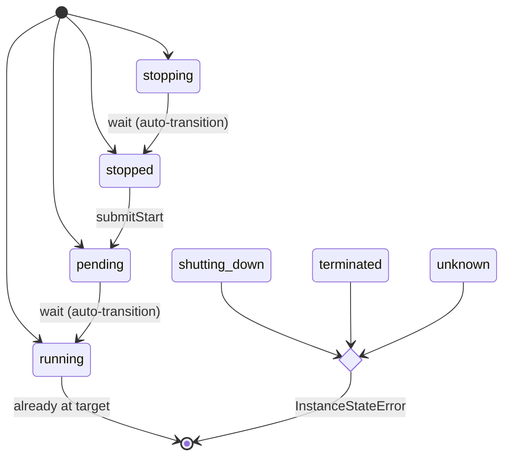
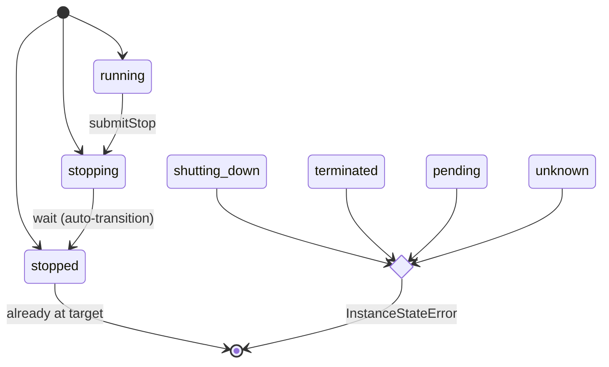
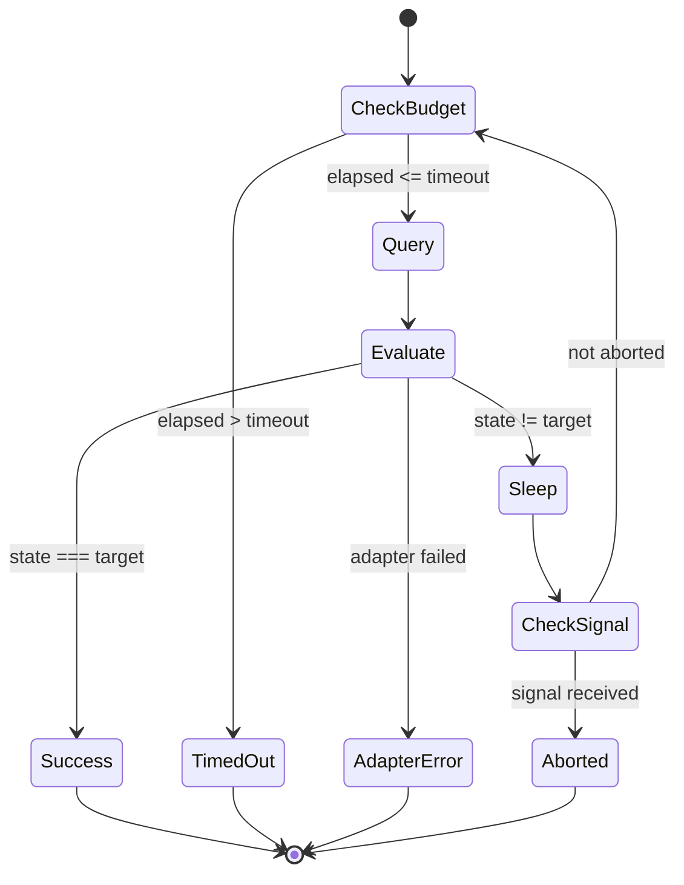
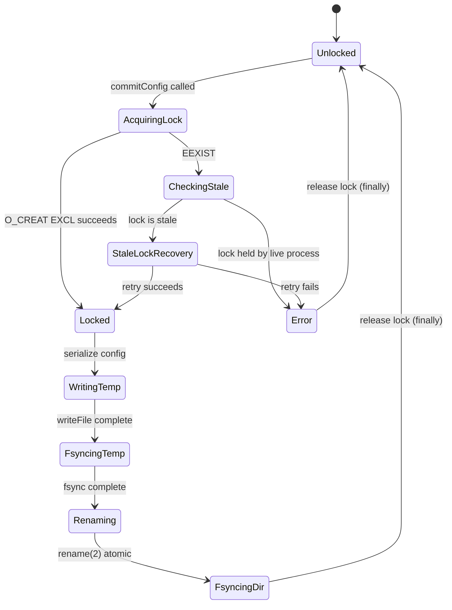
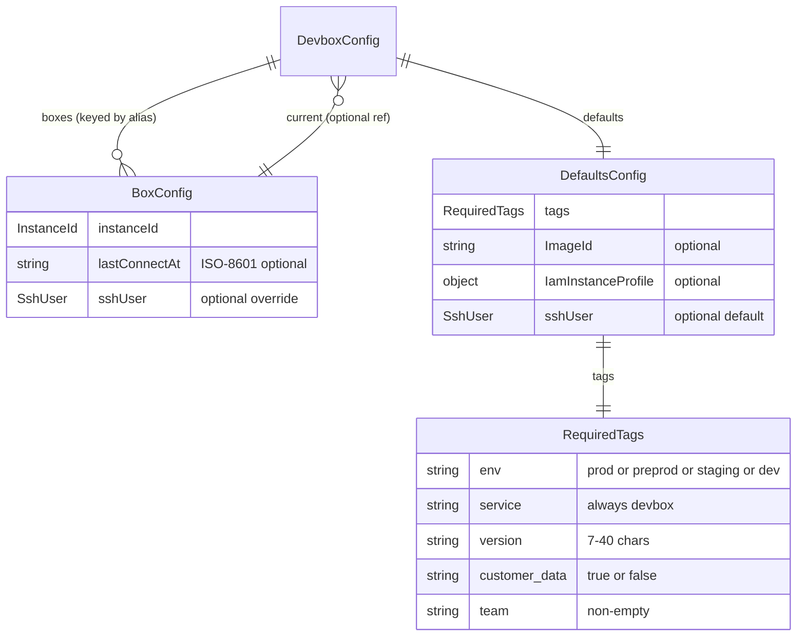
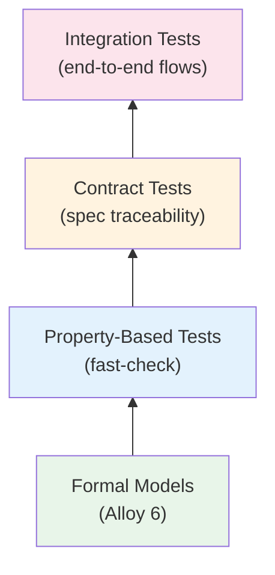

# Devbox -- Technical Design

> **Living document** -- maintained alongside specs, code, and tests.
> Last meaningful update corresponds to the current state of `openspec/specs/` and source code.

---

## 1. Overview

**Devbox** is a single-user CLI tool for managing personal AWS EC2 development instances.
It provides lifecycle control (start/stop), remote access (SSH/SCP via SSM), and local
registry tracking -- all backed by a durable local configuration file.

### Why it exists

Cloud-based development boxes require repetitive, error-prone AWS CLI commands.
Devbox wraps the most common workflows (launch, connect, copy files, teardown) into
safe, bounded operations with clear failure semantics and no ambient shell risk.

### Design philosophy

This project applies **lightweight formal methods** ([docs/lfm.md](docs/lfm.md)):
state machines are modeled in Alloy before implementation, critical properties are
expressed as preconditions/postconditions/invariants in code, and the verification
pyramid (formal models, property-based tests, contract tests, integration tests)
provides layered assurance.

For the code-level map and directory layout, see [ARCHITECTURE.md](ARCHITECTURE.md).

---

## 2. Architecture

### 2.1 High-Level Architecture



### 2.2 Component Descriptions

| Component | Responsibility | Key Invariant |
|-----------|---------------|---------------|
| **Entry point** (`src/index.ts`) | Parse argv into typed `Invocation`, dispatch to command handler, write stdout/stderr, set exit code | No business logic; only routing and I/O |
| **Command handlers** (`src/cli/commands/`) | Compose domain decisions with adapter calls; produce `CommandResult` | Each handler is a single async function with a `Result` return |
| **Remote-access chain** (`src/cli/remote-access.ts`) | Sequential precondition resolution for SSH-dependent commands | Short-circuits on first failure; no partial side effects |
| **Domain core** (`src/domain/`) | Pure, deterministic functions -- state decisions, parsing, validation | Zero I/O; injectable `Clock` for time; fully testable in isolation |
| **Config store** (`src/adapters/config-store.ts`) | Atomic config persistence with advisory locking | Write protocol: write-temp -> fsync -> rename -> dir-fsync |
| **AWS CLI adapter** (`src/adapters/aws-cli.ts`) | Subprocess calls to `aws ec2` / `aws ssm` | argv-only execution; 10 MiB buffer cap; no shell interpolation |
| **SSH adapter** (`src/adapters/ssh-cli.ts`) | Key material management, SSM-backed SSH sessions, SCP uploads | Ephemeral keys with signal-safe cleanup |
| **Process adapter** (`src/adapters/process.ts`) | Safe `child_process.execFile` wrapper | ENOENT -> `DependencyError`; non-zero exit -> `TransportError` |

### 2.3 Interaction Protocols

#### Command Dispatch Flow



#### Remote-Access Precondition Chain (connect / cp)



#### Lifecycle Command Flow (up)



**Spec references:**
- [openspec/specs/instance-lifecycle/spec.md](openspec/specs/instance-lifecycle/spec.md)
- [openspec/specs/remote-access/spec.md](openspec/specs/remote-access/spec.md)
- [openspec/specs/box-registry/spec.md](openspec/specs/box-registry/spec.md)

---

## 3. State Machines

All state machines are implemented using discriminated unions with exhaustive switch
statements and `assertNever` guards. The pattern is documented in [docs/state_machines.md](docs/state_machines.md).

### 3.1 EC2 Instance Lifecycle -- Up

**Goal:** Bring the current instance to `running` state from any valid starting state.



**Decision table** (`decideUpAction` at `src/domain/instance-state.ts:76`):

| Current State | `submitStart` | `wait` | `waitForStoppedBeforeStart` | Outcome |
|---------------|:---:|:---:|:---:|---------|
| `running` | - | - | - | Already at target |
| `pending` | - | yes | - | Wait for running |
| `stopped` | yes | yes | - | Start then wait |
| `stopping` | - | yes | yes | Wait for stopped, then start, then wait for running |
| `shutting-down` | | | | **InstanceStateError** |
| `terminated` | | | | **InstanceStateError** |
| `unknown` | | | | **InstanceStateError** |

**Safety properties:**
- **No false success:** The command only reports success after observing `state === "running"`.
- **No start from terminal states:** `shutting-down`, `terminated`, and `unknown` are rejected immediately.
- **No start while stopping:** The machine waits for `stopped` before issuing `StartInstances`.

**Liveness properties:**
- **Bounded polling:** All waits terminate within `EC2_WAIT_TIMEOUT_MS` (5 minutes).
- **Signal responsiveness:** SIGINT/SIGTERM abort polling immediately.

### 3.2 EC2 Instance Lifecycle -- Down

**Goal:** Bring the current instance to `stopped` state.



**Decision table** (`decideDownAction` at `src/domain/instance-state.ts:122`):

| Current State | `submitStop` | `wait` | Outcome |
|---------------|:---:|:---:|---------|
| `stopped` | - | - | Already at target |
| `stopping` | - | yes | Wait for stopped |
| `running` | yes | yes | Stop then wait |
| `shutting-down` | | | **InstanceStateError** |
| `terminated` | | | **InstanceStateError** |
| `pending` | | | **InstanceStateError** |
| `unknown` | | | **InstanceStateError** |

**Safety:** No stop from `pending` (instance may not have finished launching -- AWS would reject or produce undefined behavior).

**Liveness:** Same bounded polling as Up (5 minutes, signal-abortable).

### 3.3 EC2 Polling Loop

Both `waitForEc2TargetState` and `waitForSsmOnline` (at `src/domain/ec2-wait.ts`) follow the same bounded polling structure:



**Parameters:**

| Loop | Poll Interval | Timeout | Target |
|------|:---:|:---:|--------|
| EC2 state | 5 s | 5 min | `"running"` or `"stopped"` |
| SSM readiness | 5 s | 2 min | `"Online"` |

**Invariants:**
- `elapsed` is monotonically non-decreasing (injectable `Clock`).
- Signal handlers are always cleaned up in `finally` blocks.
- Each iteration awaits the previous describe call before sleeping (no concurrent polls).

### 3.4 Config Mutation (Atomic Persistence)



**Durability guarantee:** After successful `commitConfig`, the new config survives power loss
because both data (via temp fsync) and directory metadata (via dir fsync) are hardened before
the lock is released.

**Stale-lock recovery:** A lock is stale if:
1. Age exceeds `CONFIG_LOCK_STALE_AFTER_MS` (5 minutes), OR
2. PID content is unparseable (corrupted), OR
3. Referenced PID is dead (`kill(pid, 0)` fails with ESRCH).

**Spec reference:** [openspec/specs/box-registry/spec.md](openspec/specs/box-registry/spec.md) -- see requirements `[CONFIG-ATOMIC-WRITE]`, `[CONFIG-LOCK-ADVISORY]`, `[CONFIG-LOCK-STALE-RECOVERY]`.

---

## 4. Domain Model

### 4.1 Entity-Relationship Diagram



### 4.2 Branded Types and Encoding Constraints

The domain uses **phantom-branded string types** to prevent accidental interchange of
semantically distinct identifiers at compile time:

| Type | Brand | Validation Rule | Construction |
|------|-------|----------------|--------------|
| `BoxAlias` | `"BoxAlias"` | `^[A-Za-z0-9][A-Za-z0-9_-]{0,63}$` | `parseAlias()` |
| `InstanceId` | `"InstanceId"` | Non-empty trimmed string | `parseInstanceId()` in config-schema |
| `SshUser` | `"SshUser"` | `^[^\s\x00-\x1f\x7f]+$` (no whitespace/control chars) | `parseSshUser()` in config-schema |
| `RemotePath` | `"RemotePath"` | Starts with `/` or `~/`; no null bytes | `parseRemotePath()` |

**Encoding:** The config file is UTF-8 encoded JSON with 2-space indentation and a trailing newline.
Serialization is deterministic (`JSON.stringify` with stable key order).

### 4.3 Data Invariants

| Invariant | Enforced By | Failure Mode |
|-----------|-------------|--------------|
| `current` references an existing key in `boxes` | `parseConfig()` validation | `ConfigError` |
| All alias keys satisfy `BoxAlias` pattern | `parseConfig()` iteration | `ConfigError` |
| Each `BoxConfig.instanceId` is non-empty | `parseBoxConfig()` | `ConfigError` |
| `defaults.tags` satisfies all `RequiredTags` constraints | `validateRequiredTags()` | `ConfigError` |
| `lastConnectAt` is valid ISO-8601 when present | `parseLastConnectAt()` | `ConfigError` |
| Config file permissions are `0o600` | `commitConfig()` write mode | OS-level enforcement |
| Round-trip: `parseConfig(JSON.parse(serializeConfig(c))) === c` | Module-level invariant | Property tests |

**Spec reference:** [openspec/specs/box-registry/spec.md](openspec/specs/box-registry/spec.md) -- see `[ALIAS-FORMAT]`, `[CONFIG-CURRENT-VALID]`, `[TAG-DEFAULTS-SCHEMA]`.

---

## 5. Preconditions, Postconditions, and Invariants

### 5.1 System-Wide Invariants

| ID | Invariant | How Maintained |
|----|-----------|----------------|
| **I-1** | Config consistency: `current` always references an existing `boxes` key | Validated on load; enforced on every mutation |
| **I-2** | Alias uniqueness: no two boxes share an alias within the registry | Map keying (object keys are unique) |
| **I-3** | No shell interpolation: all subprocess calls use argv arrays | `process.ts` uses `execFile`, never `exec` |
| **I-4** | Bounded work: every polling loop has a finite timeout ceiling | `EC2_WAIT_TIMEOUT_MS`, `SSM_WAIT_TIMEOUT_MS` constants |
| **I-5** | Signal-safe cleanup: SIGINT/SIGTERM always trigger resource release | `finally` blocks + explicit signal handlers |
| **I-6** | Deterministic domain: all domain functions are pure (given same Clock) | No I/O in `src/domain/`; Clock is injectable |
| **I-7** | Error completeness: every error path produces a typed `DevboxError` | `Result<T,E>` return types; no thrown exceptions in domain |

### 5.2 Per-Command Contracts

| Command | Preconditions | Postconditions | Error Outcomes |
|---------|---------------|----------------|----------------|
| `init` | Valid alias (not taken), valid template file, valid defaults | New box tracked, instance launched, alias is `current` | `ValidationError`, `ConfigError`, `AwsCliError` |
| `add` | Valid alias (not taken), valid instance ID | Instance tracked under alias, set as `current` | `ValidationError`, `ConfigError` |
| `rm` | Alias exists in registry | Alias removed; if `--terminate`, instance terminated | `ValidationError`, `ConfigError`, `AwsCliError` |
| `switch` | Alias exists in registry | `current` updated to target alias | `ValidationError`, `ConfigError` |
| `list` | Config loadable | Stdout lists all tracked boxes with AWS state | `ConfigError`, `AwsCliError` |
| `up` | `current` set, instance in {stopped, stopping, pending, running} | Instance in `running` state | `ConfigError`, `InstanceStateError`, `TimeoutError`, `AwsCliError` |
| `down` | `current` set, instance in {running, stopping, stopped} | Instance in `stopped` state | `ConfigError`, `InstanceStateError`, `TimeoutError`, `AwsCliError` |
| `connect` | Full remote-access precondition chain satisfied | Interactive SSH session established (exit code passthrough) | All `RemoteAccessPreconditionError` variants |
| `cp` | Full remote-access precondition chain + valid local/remote paths | File uploaded atomically to remote | All `RemoteAccessPreconditionError` + `ValidationError` |

**Spec references:**
- [openspec/specs/box-registry/spec.md](openspec/specs/box-registry/spec.md) -- registry commands
- [openspec/specs/instance-lifecycle/spec.md](openspec/specs/instance-lifecycle/spec.md) -- up/down
- [openspec/specs/remote-access/spec.md](openspec/specs/remote-access/spec.md) -- connect/cp

---

## 6. Failure Modes and Error Model

### 6.1 Error Categories and Exit Codes

| Category | Exit Code | When |
|----------|:---------:|------|
| `ValidationError` | 2 | Invalid user input (alias format, path format, SSH user) |
| `ConfigError` | 3 | Config missing, malformed, or lock contention |
| `DependencyError` | 4 | Required executable not found (`aws`, `ssh-keygen`, `ssh`) |
| `AwsCliError` | 5 | AWS CLI returned non-zero or unparseable output |
| `NotFoundError` | 6 | Instance does not exist in AWS (DescribeInstances empty) |
| `InstanceStateError` | 7 | Instance in a state incompatible with the requested operation |
| `TimeoutError` | 8 | Polling exceeded time budget without reaching target |
| `ConsistencyError` | 9 | Config or AWS state inconsistency detected |
| `TransportError` | 10 | SSH/SCP session failed or key staging failed |

**Invariant:** Exit code 0 = success; exit code 1 = unexpected/unhandled failure; codes 2-10 are stable across versions.

### 6.2 Failure Mode Analysis

| Failure Mode | Detection | Impact | Mitigation |
|--------------|-----------|--------|------------|
| **AWS unreachable** | `aws` CLI returns non-zero | Cannot verify state or issue commands | `AwsCliError` with stderr details |
| **Stale instance state** | describeInstance returns unexpected state | Command may target wrong lifecycle phase | Re-describe before every action; no caching |
| **Config file corruption** | `JSON.parse` throws or `parseConfig` rejects | Cannot load registry | `ConfigError`; user can delete and re-init |
| **Lock contention** | `O_CREAT|O_EXCL` returns EEXIST for live PID | Concurrent write blocked | Stale-lock recovery; clear error message |
| **SSH key staging race** | Key expires (15s window) before session starts | Connection refused | Error propagated; user retries |
| **PID recycling (stale lock)** | Lock age exceeds 5min ceiling | Lock wrongly appears live | Age-based staleness overrides PID check |
| **Power loss during write** | N/A (detected on next load) | Config file might be old | Atomic rename ensures either old or new; never partial |
| **Signal during polling** | SIGINT/SIGTERM handlers fire | Incomplete operation | Cleanup handlers release resources; polling aborts cleanly |

### 6.3 Control and Recovery

- **Signal-safe cleanup:** All SSH temp keys are cleaned up via `finally` blocks and explicit SIGINT/SIGTERM handlers registered in `ec2-wait.ts` and `ssh-cli.ts`.
- **Stale-lock recovery:** Advisory lock uses three detection criteria (age, PID validity, content integrity) and one recovery attempt before failing.
- **No retry policy:** Operations are not automatically retried. The CLI is designed for interactive use where the user can re-run on transient failures.
- **Atomic persistence:** The write-fsync-rename-fsync protocol ensures readers never see partial config state.

### 6.4 Result Type Contract

```typescript
type Result<T, E> =
  | { readonly ok: true; readonly value: T }
  | { readonly ok: false; readonly error: E };
```

**Domain rule:** No exceptions are thrown in domain code. All error paths are expressed as
`Result` values with typed error unions. Adapter code catches system exceptions and wraps
them into `Result` before returning to the CLI layer.

**Spec reference:** [openspec/specs/remote-access/spec.md](openspec/specs/remote-access/spec.md) -- see `[CONNECT-ERROR-EXIT-CODE]`, `[CP-ERROR-EXIT-CODE]`.

---

## 7. Safety and Liveness Claims

### 7.1 Safety Properties

| Claim | Mechanism | Verification |
|-------|-----------|--------------|
| **No false success** (lifecycle) | Success reported only after observing target state | Alloy model assertion; contract tests |
| **No invalid transition** | `decideUpAction`/`decideDownAction` reject terminal/incompatible states | Exhaustive switch + `assertNever`; property tests |
| **No data loss on crash** | Atomic write protocol (temp -> fsync -> rename -> dir-fsync) | Integration tests with crash simulation |
| **No shell injection** | All subprocess calls use argv arrays via `execFile` | `process.ts` enforces this; no `exec` in codebase |
| **No partial config state visible** | Readers see old or new config; never intermediate | `rename(2)` atomicity guarantee |
| **No resource leak on signal** | SIGINT/SIGTERM handlers + `finally` blocks | Integration tests with signal injection |
| **Alias uniqueness** | Object key uniqueness + validation on write | Property tests (fast-check) |

### 7.2 Liveness Properties

| Claim | Mechanism | Bound |
|-------|-----------|-------|
| **EC2 polling terminates** | `EC2_WAIT_TIMEOUT_MS` ceiling + elapsed check | 5 minutes |
| **SSM polling terminates** | `SSM_WAIT_TIMEOUT_MS` ceiling + elapsed check | 2 minutes |
| **Stale locks are recoverable** | Age-based + PID-based staleness detection | 5 minutes (lock age threshold) |
| **Signal handlers fire cleanup** | Process-level SIGINT/SIGTERM listeners | Immediate (kernel delivery) |
| **Lock is always released** | `finally` block in `commitConfig` | On every exit path (success or error) |

### 7.3 Formal Model

The EC2 lifecycle state machines are formally specified in an **Alloy 6** model embedded in
[openspec/specs/instance-lifecycle/spec.md](openspec/specs/instance-lifecycle/spec.md). The model verifies:

- **Safety assertions:** `noFalseSuccess`, `noInvalidUpDecision`, `noInvalidDownDecision`
- **Bounded liveness:** `pollingAlwaysTerminates`
- **State coverage:** All reachable states have defined transitions or explicit rejections

The Alloy model serves as the authoritative behavioral specification; the TypeScript
implementation mirrors its structure (see `src/domain/instance-state.ts:76`).

---

## 8. Quality Attributes

| Attribute | Target | How Achieved |
|-----------|--------|--------------|
| **Determinism** | Domain functions produce identical output for identical input | Pure functions; injectable `Clock`; no ambient state |
| **Testability** | All business logic testable without AWS or filesystem | Domain/adapter separation; injected dependencies |
| **Correctness** | Implementations match formal specifications | Alloy models; spec traceability markers; property tests |
| **Operational simplicity** | Single config file, no background daemon, no database | Flat JSON file with atomic writes |
| **Bounded latency** | No unbounded waits or infinite loops | All polling has explicit time ceilings |
| **Safe defaults** | Destructive actions require explicit confirmation | `rm --terminate` is opt-in; no auto-termination |
| **Observability** | Structured stderr output for all failures | `[devbox] Category: message` format; detail lines indented |
| **Portability** | Runs anywhere Node >= 20 is available | Single ESM bundle; no native dependencies |

---

## 9. Verification Strategy

The project follows the **verification pyramid** from [docs/lfm.md](docs/lfm.md):



| Layer | Coverage Focus | Location |
|-------|---------------|----------|
| **Formal models** | State machine correctness, safety/liveness | `openspec/specs/instance-lifecycle/spec.md` (Alloy) |
| **Property-based tests** | Invariants over generated inputs (alias tracking, config round-trip, EC2 lifecycle) | `test/property/` |
| **Contract tests** | Spec requirement traceability (`[SPEC-ID]` markers) | `test/contract/` |
| **Integration tests** | End-to-end command flows, adapter behavior, build artifacts | `test/integration/` |

**Spec traceability:** Every testable requirement in `openspec/specs/` carries a bracketed
identifier (e.g., `[ALIAS-FORMAT]`). Contract tests reference these identifiers, and the
traceability tooling validates coverage.

**Spec reference:** [openspec/specs/spec-traceability/spec.md](openspec/specs/spec-traceability/spec.md)

---

## 10. Distribution and Packaging

| Artifact | Format | Target |
|----------|--------|--------|
| `dist/devbox.js` | Single-file ESM bundle (esbuild) | Node >= 20 |
| npm package | Standard npm tarball | `npm install -g` |

**Build invariants:**
- The bundle is a single `.js` file with no external dependencies at runtime.
- `#!/usr/bin/env node` shebang is prepended.
- Source maps are excluded from the distribution artifact.
- The bundled artifact passes the same integration tests as the source tree.

**Spec reference:** [openspec/specs/distribution/spec.md](openspec/specs/distribution/spec.md)
