# Devbox -- Technical Design

> **Living document** -- maintained alongside OpenSpec artifacts, code, and tests.
> Complements [`ARCHITECTURE.md`](../ARCHITECTURE.md) (codemap), [`lfm.md`](lfm.md) (assurance posture), and the normative specs under [`openspec/specs/`](../openspec/specs/).

---

## 1. Overview

### 1.1 What Devbox Is

`devbox` is a small TypeScript CLI for creating, tracking, starting, stopping, connecting to, and uploading files to AWS EC2 development machines. It wraps the most common development-box workflows (launch, connect, copy files, teardown) into safe, bounded operations with clear failure semantics and no ambient shell risk.

### 1.2 Why It Exists

Cloud-based development boxes require repetitive, error-prone AWS CLI commands. `devbox` provides a dependable, explicit workflow for common operations without forcing users to manually compose raw `aws`, `ssh`, `scp`, and SSM-backed access commands each time.

### 1.3 Core Design Challenge

`devbox` is intentionally narrow. It is a CLI, not a control plane. Its core challenge is not feature breadth; it is preserving trust across three kinds of state:

- local registry state in `~/.config/devbox.json`
- live AWS state in the active account and region
- temporary remote-host state created during SSM-backed SSH access

### 1.4 Design Philosophy

This project applies **lightweight formal methods** ([docs/lfm.md](lfm.md)): state machines are modeled in Alloy before implementation, critical properties are expressed as preconditions/postconditions/invariants in code, and the verification pyramid (formal models, property-based tests, unit / contract tests, integration tests) provides layered assurance.

The design is centered on:

- preconditions for every command family and boundary crossing
- postconditions that describe the observable outcome after success or failure
- invariants over config shape, alias integrity, source-of-truth boundaries, and cross-system sequencing
- failure modes that are explicit rather than hidden behind generic exceptions
- safety properties that forbid bad things from happening
- liveness properties that describe when bounded progress is expected

The goal is not a proof of the whole system. The goal is justified confidence: the design claims are explicit, mechanically checkable, and traceable into code and tests.

### 1.5 Relevant Capability Specs

- [`box-registry`](../openspec/specs/box-registry/spec.md)
- [`instance-lifecycle`](../openspec/specs/instance-lifecycle/spec.md)
- [`remote-access`](../openspec/specs/remote-access/spec.md)
- [`distribution`](../openspec/specs/distribution/spec.md)

---

## 2. Scope and System Boundaries

### 2.1 In Scope

- top-level informational behavior for `--help` and `--version`
- local box-registry behavior for `list`, `init`, `add`, `rm`, and `switch`
- lifecycle control for `up` and `down`
- remote access for `connect` and upload-only `cp`
- packaging and runtime parity between `npm` installation and `dist/devbox.js`
- traceability infrastructure that keeps specs, tests, and evidence connected

### 2.2 Out of Scope

- AWS profile, credential, or region management inside `devbox`
- replacing AWS CLI with the AWS SDK
- download, sync, directory copy, or general SSH orchestration beyond the documented command set
- tracking multiple AWS execution contexts in one local registry
- a background daemon, service, or distributed lock manager

### 2.3 Source-of-Truth Boundaries

- local config is the source of truth for tracked aliases and current selection
- AWS is the source of truth for live instance existence and instance state in the active account and region
- remote-host state is observed only through bounded remote-access interactions and is never treated as durable registry truth

### 2.4 Thin-Wrapper Boundaries

- AWS effects are performed through `aws`
- remote transport is performed through `ssh` and `scp`
- local persistence is performed through one config-store boundary that owns locking and atomic replacement

---

## 3. Architecture

### 3.1 High-Level Architecture Diagram

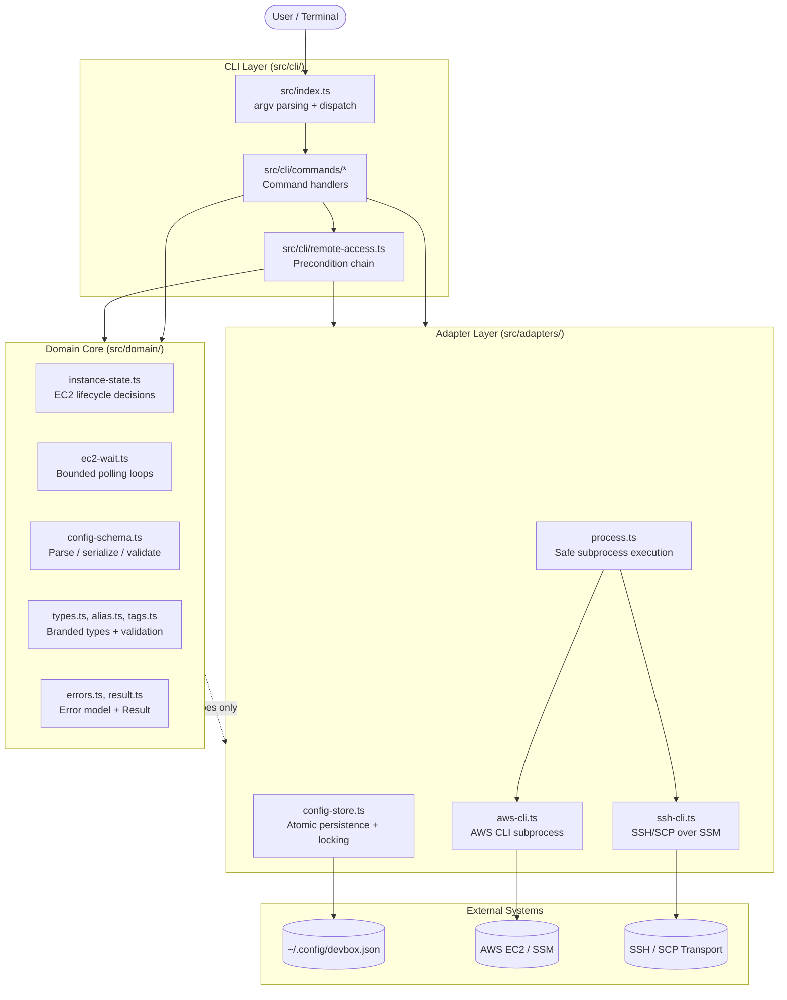
```mermaid
graph TD
    User([User / Terminal])

    subgraph CLI["CLI Layer (src/cli/)"]
        Entry["src/index.ts<br/>argv parsing + dispatch"]
        Commands["src/cli/commands/*<br/>Command handlers"]
        RemoteAccess["src/cli/remote-access.ts<br/>Precondition chain"]
    end

    subgraph Domain["Domain Core (src/domain/)"]
        StateMachine["instance-state.ts<br/>EC2 lifecycle decisions"]
        Polling["ec2-wait.ts<br/>Bounded polling loops"]
        ConfigSchema["config-schema.ts<br/>Parse / serialize / validate"]
        Types["types.ts, alias.ts, tags.ts<br/>Branded types + validation"]
        Errors["errors.ts, result.ts<br/>Error model + Result<T,E>"]
    end

    subgraph Adapters["Adapter Layer (src/adapters/)"]
        ConfigStore["config-store.ts<br/>Atomic persistence + locking"]
        AwsCli["aws-cli.ts<br/>AWS CLI subprocess"]
        SshCli["ssh-cli.ts<br/>SSH/SCP over SSM"]
        Process["process.ts<br/>Safe subprocess execution"]
    end

    subgraph External["External Systems"]
        FS[("~/.config/devbox.json")]
        AWS[("AWS EC2 / SSM")]
        SSH[("SSH / SCP Transport")]
    end

    User --> Entry
    Entry --> Commands
    Commands --> RemoteAccess
    Commands --> Domain
    RemoteAccess --> Domain
    Commands --> Adapters
    RemoteAccess --> Adapters
    Domain -.->|"types only"| Adapters
    ConfigStore --> FS
    AwsCli --> AWS
    SshCli --> SSH
    Process --> AwsCli
    Process --> SshCli
```

The architecture is layered:

- The **CLI layer** parses invocation shape, chooses a command handler, and renders normalized stdout and stderr.
- The **domain layer** owns deterministic reasoning: validation, state-transition decisions, merge rules, wait policies, and invariants.
- The **adapter layer** owns side effects: config persistence, subprocess execution, AWS normalization, SSH/SCP transport, and cleanup.

This split matters for assurance. The more the decision logic is isolated from the side-effecting mechanics, the easier it is to express invariants, encode state machines, and mechanically test the behavior that matters. The domain depends on the adapter layer only through types, never through calls.

### 3.2 Component Descriptions

| Component | Responsibility | Key Invariant |
|-----------|---------------|---------------|
| **Entry point** (`src/index.ts`) | Parse argv into typed `Invocation`, dispatch to command handler, write stdout/stderr, set exit code | No business logic; only routing and I/O |
| **Command handlers** (`src/cli/commands/`) | Compose domain decisions with adapter calls; produce `CommandResult` | Each handler is a single async function with a `Result` return |
| **Remote-access chain** (`src/cli/remote-access.ts`) | Sequential precondition resolution for SSH-dependent commands | Short-circuits on first failure; no partial side effects |
| **Domain core** (`src/domain/`) | Pure, deterministic functions -- state decisions, parsing, validation | Zero I/O; injectable `Clock` for time; fully testable in isolation |
| **Config store** (`src/adapters/config-store.ts`) | Atomic config persistence with advisory locking | Write protocol: write-temp -> fsync -> rename -> dir-fsync |
| **AWS CLI adapter** (`src/adapters/aws-cli.ts`) | Subprocess calls to `aws ec2` / `aws ssm` | argv-only execution; 10 MiB buffer cap; no shell interpolation |
| **SSH adapter** (`src/adapters/ssh-cli.ts`) | Key material management, SSM-backed SSH sessions, SCP uploads | Ephemeral keys with signal-safe cleanup |
| **Process adapter** (`src/adapters/process.ts`) | Safe `child_process.execFile` wrapper | ENOENT -> `DependencyError`; non-zero exit -> `TransportError` |

### 3.3 Design Principles

- Make important invariants explicit.
- Keep the core deterministic and push nondeterminism to the edges.
- Treat local config and AWS live state as distinct sources of truth.
- Reject invalid input before crossing AWS, filesystem, or remote-shell boundaries.
- Bound all waits and surface timeouts explicitly.
- Keep destructive behavior opt-in and explicit.
- Surface cross-system divergence rather than collapsing it into a local-only error.
- Keep packaging and traceability in the product contract.

---

## 4. Domain Model

### 4.1 Entity-Relationship Diagram

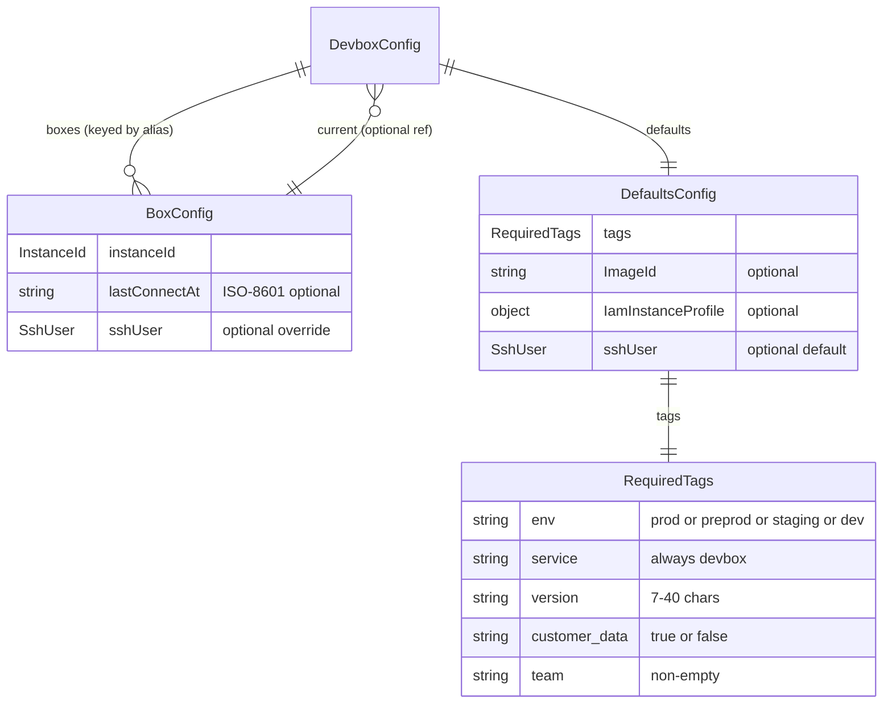
```mermaid
erDiagram
    DevboxConfig ||--o{ BoxConfig : "boxes (keyed by alias)"
    DevboxConfig ||--|| DefaultsConfig : "defaults"
    DevboxConfig }o--|| BoxConfig : "current (optional ref)"
    DefaultsConfig ||--|| RequiredTags : "tags"
    BoxConfig {
        InstanceId instanceId
        string lastConnectAt "ISO-8601 optional"
        SshUser sshUser "optional override"
    }
    DefaultsConfig {
        RequiredTags tags
        string ImageId "optional"
        object IamInstanceProfile "optional"
        SshUser sshUser "optional default"
    }
    RequiredTags {
        string env "prod or preprod or staging or dev"
        string service "always devbox"
        string version "7-40 chars"
        string customer_data "true or false"
        string team "non-empty"
    }
```

### 4.2 Primary Domain Entities

- **Box Alias**: a stable local name chosen by the user.
- **Tracked Box**: the durable local record for one alias. It binds an alias to an EC2 instance ID and optional metadata such as `sshUser` and `lastConnectAt`.
- **Current Box**: the optional pointer used by commands that operate without an explicit alias parameter.
- **Defaults**: shared config values, including required tags and optional launch or SSH-user defaults.
- **Launch Template Input**: a launch-template-style JSON document used by `init` to create exactly one EC2 instance.
- **AWS Instance**: the live resource observed through the active AWS account and region.
- **Remote Access Session**: a bounded interaction that verifies state, stages temporary access, starts transport, and cleans up.
- **Distribution Artifact**: either the `npm`-installed CLI or the bundled `dist/devbox.js` artifact.
- **Traceability Catalog**: the set of canonical spec identifiers discovered from active OpenSpec specs and checked against traced tests.

Authority boundaries:

- Alias membership and current selection come from the committed local config only.
- Instance existence and lifecycle state come from AWS describes at command time only.
- Resolved SSH user is derived from invocation override, per-box override, then defaults.
- `lastConnectAt` is local metadata about successful remote access, not proof of live reachability.

### 4.3 Branded Types and Encoding Constraints

The domain uses **phantom-branded string types** to prevent accidental interchange of semantically distinct identifiers at compile time:

| Type | Brand | Validation Rule | Construction |
|------|-------|----------------|--------------|
| `BoxAlias` | `"BoxAlias"` | `^[A-Za-z0-9][A-Za-z0-9_-]{0,63}$` | `parseAlias()` |
| `InstanceId` | `"InstanceId"` | Non-empty trimmed string | `parseInstanceId()` in config-schema |
| `SshUser` | `"SshUser"` | `^[^\s\x00-\x1f\x7f]+$` (no whitespace/control chars) | `parseSshUser()` in config-schema |
| `RemotePath` | `"RemotePath"` | Starts with `/` or `~/`; no null bytes; no ASCII control chars | `parseRemotePath()` |

**Encoding:** The config file is UTF-8 encoded JSON with 2-space indentation and a trailing newline. Serialization is deterministic (`JSON.stringify` with stable key order). A leading BOM is invalid and treated as a config error.

### 4.4 Persistent Config Model

The durable local registry is stored at `~/.config/devbox.json`. The advisory lock file is stored at `~/.config/devbox.json.lock`.

Top-level config shape:

| Field | Meaning | Constraints |
|---|---|---|
| `boxes` | alias-keyed tracked-box map | required; keys are unique aliases |
| `current` | current alias pointer | optional; if present, must name an existing alias |
| `defaults.tags` | required default tags | required; must contain the required tag keys |
| `defaults.ImageId` | default AMI | optional; must exist after merge for `init` |
| `defaults.IamInstanceProfile` | default instance profile | optional; must exist after merge for `init` |
| `defaults.sshUser` | default SSH user | optional |

Per-box shape:

| Field | Meaning | Constraints |
|---|---|---|
| `instanceId` | tracked EC2 instance ID | required |
| `sshUser` | per-box SSH user override | optional |
| `lastConnectAt` | last successful remote-access timestamp | optional; ISO-8601 UTC string |

### 4.5 Data Invariants

| ID | Invariant | Enforced By | Failure Mode |
|----|-----------|-------------|--------------|
| **D-1** | `current` references an existing key in `boxes` | `parseConfig()` validation | `ConfigError` |
| **D-2** | All alias keys satisfy `BoxAlias` pattern | `parseConfig()` iteration | `ConfigError` |
| **D-3** | Each `BoxConfig.instanceId` is non-empty | `parseBoxConfig()` | `ConfigError` |
| **D-4** | `defaults.tags` satisfies all `RequiredTags` constraints | `validateRequiredTags()` | `ConfigError` |
| **D-5** | `lastConnectAt` is valid ISO-8601 when present | `parseLastConnectAt()` | `ConfigError` |
| **D-6** | Config file permissions are `0o600` | `commitConfig()` write mode | OS-level enforcement |
| **D-7** | Round-trip: `parseConfig(JSON.parse(serializeConfig(c))) === c` | Module-level invariant | Property tests |
| **D-8** | Failed local mutations do not partially commit JSON | Atomic write protocol | Write-fsync-rename-fsync |
| **D-9** | Per-box `sshUser` and `lastConnectAt` only defined for tracked aliases | Map keying | `ConfigError` |

**Spec reference:** [`box-registry`](../openspec/specs/box-registry/spec.md) -- see `[ALIAS-FORMAT]`, `[CONFIG-CURRENT-VALID]`, `[TAG-DEFAULTS-SCHEMA]`.

### 4.6 Locking and Concurrency Constraints

- All config mutations flow through one adapter path.
- Mutation requires exclusive advisory lock acquisition.
- A live, recent lock holder is never preempted.
- Stale lock detection uses three criteria:
  1. Lock age exceeds `CONFIG_LOCK_STALE_AFTER_MS` (5 minutes)
  2. PID content is unparseable (corrupted)
  3. Referenced PID is dead (`kill(pid, 0)` fails with ESRCH)
- Stale-lock recovery is best effort and retried once.
- Single-writer semantics are preferred over concurrent merge behavior.

**Spec reference:** [`box-registry`](../openspec/specs/box-registry/spec.md) -- see `[CONFIG-ATOMIC-WRITE]`, `[CONFIG-LOCK-ADVISORY]`, `[CONFIG-LOCK-STALE-RECOVERY]`.

### 4.7 Launch Template and Tag Constraints

`init` accepts only the documented allowlist of launch-template-style top-level fields from the [`box-registry` spec](../openspec/specs/box-registry/spec.md). Unknown fields and `InstanceRequirements` are rejected before any AWS call.

Required values after merge:

- `ImageId` must be present
- `IamInstanceProfile` must be present
- required tags must be present and valid

Required tag constraints:

- `env` must be one of `prod`, `preprod`, `staging`, `dev`
- `service` must equal `devbox`
- `version` must be 7 to 40 characters, with `0000000` allowed as the built-in placeholder default
- `customer-data` must be one of `true`, `false`
- `team` must be a non-empty short identifier

Tag merge precedence for `init`:

1. built-in required tag defaults
2. `config.defaults.tags`
3. template instance `TagSpecifications`
4. forced `Name=<alias>` override
5. required-tag validation

Additional tag rules:

- `devbox` emits exactly one merged instance `TagSpecification`
- non-instance `TagSpecifications` pass through unchanged
- a template `Name` tag is ignored and replaced with the alias
- `UserData` passes through unchanged, including `file:` values

### 4.8 Remote Path and File Constraints

- `cp` accepts exactly one regular local file
- no artificial file size limit is imposed by `devbox`
- remote path must be non-empty after trimming
- remote path must not contain ASCII control characters or null bytes
- unsafe remote paths are rejected before any SSH, SCP, or AWS transport command is executed

---

## 5. Preconditions, Postconditions, and Invariants

### 5.1 System-Wide Invariants

| ID | Invariant | How Maintained |
|----|-----------|----------------|
| **I-1** | Config consistency: `current` always references an existing `boxes` key | Validated on load; enforced on every mutation |
| **I-2** | Alias uniqueness: no two boxes share an alias within the registry | Map keying (object keys are unique) |
| **I-3** | No shell interpolation: all subprocess calls use argv arrays | `process.ts` uses `execFile`, never `exec` |
| **I-4** | Bounded work: every polling loop has a finite timeout ceiling | `EC2_WAIT_TIMEOUT_MS`, `SSM_WAIT_TIMEOUT_MS` constants |
| **I-5** | Signal-safe cleanup: SIGINT/SIGTERM always trigger resource release | `finally` blocks + explicit signal handlers |
| **I-6** | Deterministic domain: all domain functions are pure (given same Clock) | No I/O in `src/domain/`; Clock is injectable |
| **I-7** | Error completeness: every error path produces a typed `DevboxError` | `Result<T,E>` return types; no thrown exceptions in domain |
| **I-8** | Destructive AWS effects occur only on explicit command paths | No implicit termination or deletion |
| **I-9** | Persisted state is never treated as authoritative for live AWS state | Re-describe before every action; no caching |
| **I-10** | `lastConnectAt` updates only after external success and local commit | Two-phase success gate |

### 5.2 Per-Command Contracts

| Command | Preconditions | Postconditions | Error Outcomes |
|---------|---------------|----------------|----------------|
| `--version` | none | stdout: version string; exit 0 | -- |
| `--help` | none | stdout: usage text; exit 0 | -- |
| `list` | Config loadable | stdout: all tracked boxes with AWS state | `ConfigError`, `AwsCliError` (degraded) |
| `init` | Valid alias (not taken), valid template file, valid defaults | New box tracked, instance launched, alias is `current` | `ValidationError`, `ConfigError`, `AwsCliError`, `ConsistencyError` |
| `add` | Valid alias (not taken), valid instance ID | Instance tracked under alias, set as `current` | `ValidationError`, `ConfigError` |
| `rm` | Alias exists in registry | Alias removed; if `--terminate`, instance terminated first | `ValidationError`, `ConfigError`, `AwsCliError`, `ConsistencyError` |
| `switch` | Alias exists in registry | `current` updated to target alias | `ValidationError`, `ConfigError` |
| `up` | `current` set, instance in {stopped, stopping, pending, running} | Instance in `running` state | `ConfigError`, `NotFoundError`, `InstanceStateError`, `TimeoutError`, `AwsCliError` |
| `down` | `current` set, instance in {running, stopping, stopped} | Instance in `stopped` state | `ConfigError`, `NotFoundError`, `InstanceStateError`, `TimeoutError`, `AwsCliError` |
| `connect` | Full remote-access precondition chain satisfied | Interactive SSH session established (exit code passthrough) | `ConfigError`, `NotFoundError`, `InstanceStateError`, `TimeoutError`, `TransportError`, `ConsistencyError` |
| `cp` | Full remote-access precondition chain + valid local/remote paths | File uploaded atomically to remote destination | `ValidationError`, `ConfigError`, `NotFoundError`, `InstanceStateError`, `TimeoutError`, `TransportError`, `ConsistencyError` |

**Spec references:**
- [`box-registry`](../openspec/specs/box-registry/spec.md) -- registry commands
- [`instance-lifecycle`](../openspec/specs/instance-lifecycle/spec.md) -- up/down
- [`remote-access`](../openspec/specs/remote-access/spec.md) -- connect/cp

### 5.3 Global Preconditions

- The process can access the user's home directory and config path when local state is needed.
- Config, if present and required, is valid according to the config model.
- AWS-dependent commands run with credentials, account, and region established outside `devbox`.
- Remote-access commands require the relevant local executables (`ssh`, `ssh-keygen`, `scp`) and SSM prerequisites.

### 5.4 Global Postconditions

- Successful mutating local commands leave a schema-valid committed config.
- Successful external mutation followed by failed local commit is reported explicitly as divergence (`ConsistencyError`).
- Supported distribution forms preserve the same user-visible command contracts.

---

## 6. State Machines

All state machines are implemented using discriminated unions with exhaustive switch statements and `assertNever` guards. The implementation pattern is documented in [docs/state_machines.md](state_machines.md).

### 6.1 Top-Level Invocation

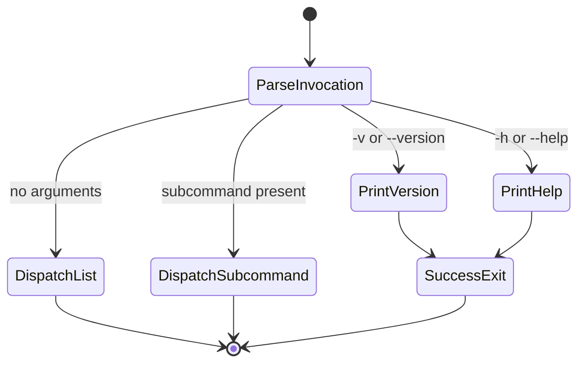
```mermaid
stateDiagram-v2
    [*] --> ParseInvocation
    ParseInvocation --> PrintVersion: -v or --version
    ParseInvocation --> PrintHelp: -h or --help
    ParseInvocation --> DispatchList: no arguments
    ParseInvocation --> DispatchSubcommand: subcommand present
    PrintVersion --> SuccessExit
    PrintHelp --> SuccessExit
    DispatchList --> [*]
    DispatchSubcommand --> [*]
    SuccessExit --> [*]
```

This state machine captures the pure informational fast paths and the no-argument default to `list`. The key invariant is that help and version do not cross config, AWS, or remote-access boundaries.

### 6.2 Config-Store Mutation

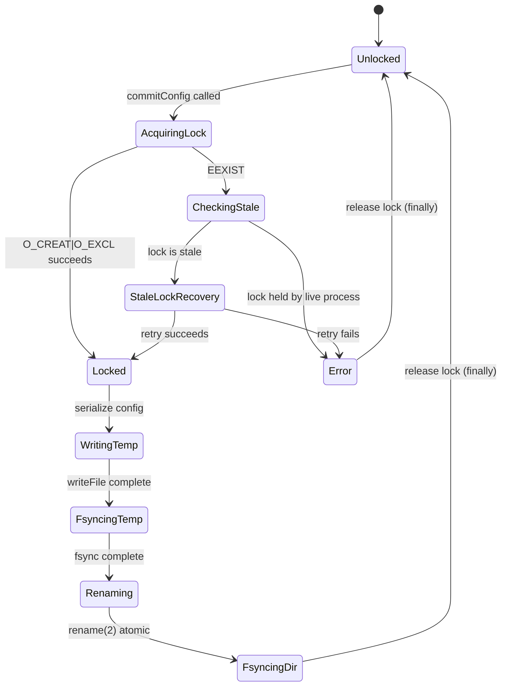
```mermaid
stateDiagram-v2
    [*] --> Unlocked

    Unlocked --> AcquiringLock : commitConfig called
    AcquiringLock --> Locked : O_CREAT|O_EXCL succeeds
    AcquiringLock --> CheckingStale : EEXIST
    CheckingStale --> StaleLockRecovery : lock is stale
    CheckingStale --> Error : lock held by live process
    StaleLockRecovery --> Locked : retry succeeds
    StaleLockRecovery --> Error : retry fails

    Locked --> WritingTemp : serialize config
    WritingTemp --> FsyncingTemp : writeFile complete
    FsyncingTemp --> Renaming : fsync complete
    Renaming --> FsyncingDir : rename(2) atomic
    FsyncingDir --> Unlocked : release lock (finally)

    Error --> Unlocked : release lock (finally)
```

**Safety claim:** No mutation can leave partially committed config state. Readers see either the old config or the new config; never an intermediate state.

**Liveness claim:** Bounded progress when the lock is free or stale rather than live and contended. Lock is always released via `finally` on every exit path.

**Durability guarantee:** After successful `commitConfig`, the new config survives power loss because both data (via temp fsync) and directory metadata (via dir fsync) are hardened before the lock is released.

**Spec reference:** [`box-registry`](../openspec/specs/box-registry/spec.md) -- see `[CONFIG-ATOMIC-WRITE]`, `[CONFIG-LOCK-ADVISORY]`, `[CONFIG-LOCK-STALE-RECOVERY]`.

### 6.3 Registry Mutation

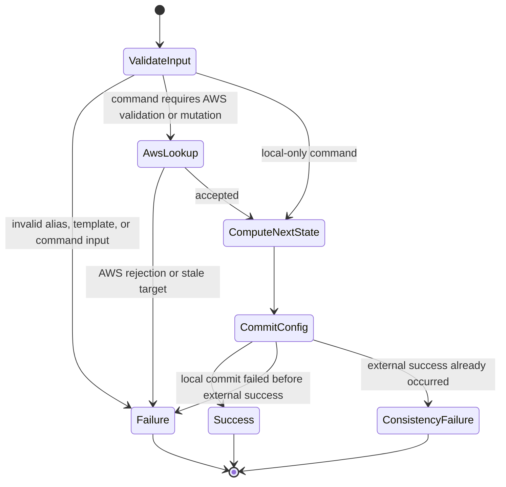
```mermaid
stateDiagram-v2
    [*] --> ValidateInput
    ValidateInput --> Failure: invalid alias, template, or command input
    ValidateInput --> AwsLookup: command requires AWS validation or mutation
    ValidateInput --> ComputeNextState: local-only command
    AwsLookup --> Failure: AWS rejection or stale target
    AwsLookup --> ComputeNextState: accepted
    ComputeNextState --> CommitConfig
    CommitConfig --> Success
    CommitConfig --> Failure: local commit failed before external success
    CommitConfig --> ConsistencyFailure: external success already occurred
    Success --> [*]
    Failure --> [*]
    ConsistencyFailure --> [*]
```

This machine covers `init`, `add`, `rm`, and `switch`. The critical distinction is between ordinary failure before any external success and explicit divergence (ConsistencyError) after AWS success plus local commit failure.

**Key properties:**
- `list` is read-only and degrades gracefully when AWS enrichment is unavailable
- `init` creates exactly one instance on success and then tracks it locally
- `add` tracks an already-existing instance and does not mutate AWS
- `rm` is local-only unless `--terminate` is explicit
- removing the current alias clears `current` rather than reassigning it
- `switch` updates only the current pointer and has no AWS dependency

**Spec reference:** [`box-registry`](../openspec/specs/box-registry/spec.md)

### 6.4 EC2 Instance Lifecycle -- Up

**Goal:** Bring the current instance to `running` state from any valid starting state.

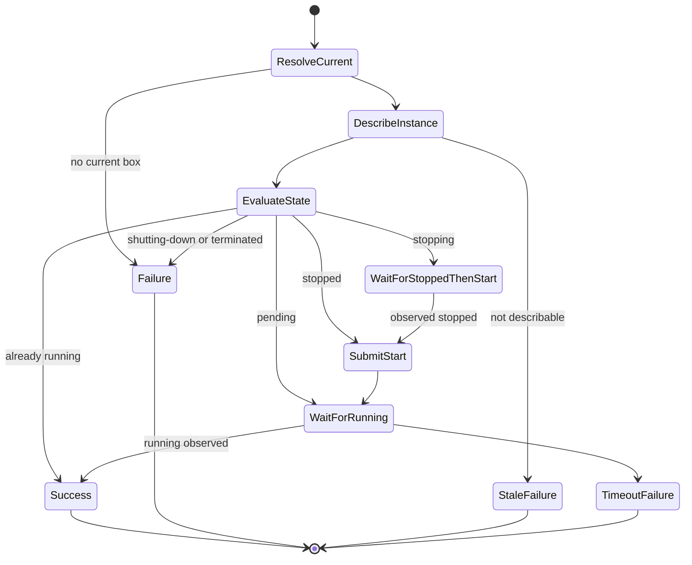
```mermaid
stateDiagram-v2
    [*] --> ResolveCurrent
    ResolveCurrent --> Failure: no current box
    ResolveCurrent --> DescribeInstance
    DescribeInstance --> StaleFailure: not describable
    DescribeInstance --> EvaluateState
    EvaluateState --> Success: already running
    EvaluateState --> WaitForRunning: pending
    EvaluateState --> SubmitStart: stopped
    EvaluateState --> WaitForStoppedThenStart: stopping
    EvaluateState --> Failure: shutting-down or terminated
    SubmitStart --> WaitForRunning
    WaitForStoppedThenStart --> SubmitStart: observed stopped
    WaitForRunning --> Success: running observed
    WaitForRunning --> TimeoutFailure
    Success --> [*]
    Failure --> [*]
    StaleFailure --> [*]
    TimeoutFailure --> [*]
```

**Decision table** (`decideUpAction` at `src/domain/instance-state.ts`):

| Current State | `submitStart` | `wait` | `waitForStoppedBeforeStart` | Outcome |
|---------------|:---:|:---:|:---:|---------|
| `running` | - | - | - | Already at target |
| `pending` | - | yes | - | Wait for running |
| `stopped` | yes | yes | - | Start then wait |
| `stopping` | - | yes | yes | Wait for stopped, then start, then wait for running |
| `shutting-down` | | | | **InstanceStateError** |
| `terminated` | | | | **InstanceStateError** |
| `unknown` | | | | **InstanceStateError** |

**Safety properties:**
- **No false success:** The command only reports success after observing `state === "running"`.
- **No start from terminal states:** `shutting-down`, `terminated`, and `unknown` are rejected immediately.
- **No start while stopping:** The machine waits for `stopped` before issuing `StartInstances`.
- A redundant start request is never sent when the instance is already `pending`.

**Liveness properties:**
- **Bounded polling:** All waits terminate within `EC2_WAIT_TIMEOUT_MS` (5 minutes).
- **Signal responsiveness:** SIGINT/SIGTERM abort polling immediately.
- The 5-minute budget applies to the full path, including `stopping -> stopped -> start -> running`.

**Spec reference:** [`instance-lifecycle`](../openspec/specs/instance-lifecycle/spec.md)

### 6.5 EC2 Instance Lifecycle -- Down

**Goal:** Bring the current instance to `stopped` state.

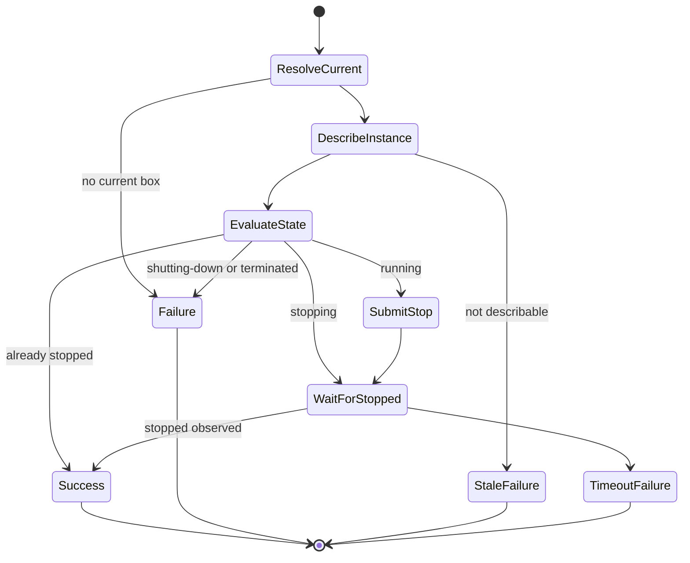
```mermaid
stateDiagram-v2
    [*] --> ResolveCurrent
    ResolveCurrent --> Failure: no current box
    ResolveCurrent --> DescribeInstance
    DescribeInstance --> StaleFailure: not describable
    DescribeInstance --> EvaluateState
    EvaluateState --> Success: already stopped
    EvaluateState --> WaitForStopped: stopping
    EvaluateState --> SubmitStop: running
    EvaluateState --> Failure: shutting-down or terminated
    SubmitStop --> WaitForStopped
    WaitForStopped --> Success: stopped observed
    WaitForStopped --> TimeoutFailure
    Success --> [*]
    Failure --> [*]
    StaleFailure --> [*]
    TimeoutFailure --> [*]
```

**Decision table** (`decideDownAction` at `src/domain/instance-state.ts`):

| Current State | `submitStop` | `wait` | Outcome |
|---------------|:---:|:---:|---------|
| `stopped` | - | - | Already at target |
| `stopping` | - | yes | Wait for stopped |
| `running` | yes | yes | Stop then wait |
| `shutting-down` | | | **InstanceStateError** |
| `terminated` | | | **InstanceStateError** |
| `pending` | | | **InstanceStateError** |
| `unknown` | | | **InstanceStateError** |

**Safety:** No stop from `pending` (instance may not have finished launching -- AWS would reject or produce undefined behavior). A redundant stop request is never sent when the instance is already `stopping`.

**Liveness:** Same bounded polling as Up (5 minutes, signal-abortable).

**Spec reference:** [`instance-lifecycle`](../openspec/specs/instance-lifecycle/spec.md)

### 6.6 EC2 Polling Loop

Both `waitForEc2TargetState` and `waitForSsmOnline` (at `src/domain/ec2-wait.ts`) follow the same bounded polling structure:

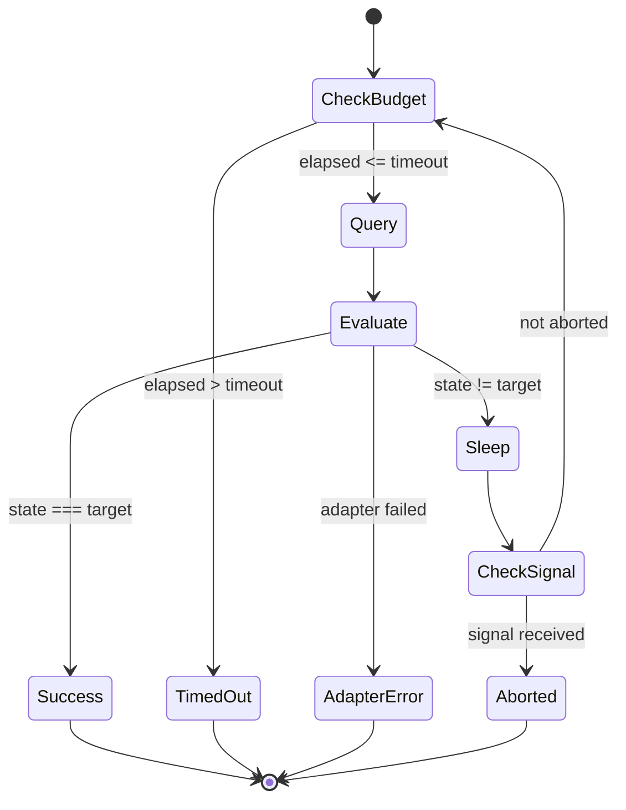
```mermaid
stateDiagram-v2
    [*] --> CheckBudget

    CheckBudget --> Query : elapsed <= timeout
    CheckBudget --> TimedOut : elapsed > timeout

    Query --> Evaluate
    Evaluate --> Success : state === target
    Evaluate --> Sleep : state != target
    Evaluate --> AdapterError : adapter failed

    Sleep --> CheckSignal
    CheckSignal --> CheckBudget : not aborted
    CheckSignal --> Aborted : signal received

    Success --> [*]
    TimedOut --> [*]
    AdapterError --> [*]
    Aborted --> [*]
```

**Parameters:**

| Loop | Poll Interval | Timeout | Target |
|------|:---:|:---:|--------|
| EC2 state | 5 s | 5 min | `"running"` or `"stopped"` |
| SSM readiness | 5 s | 2 min | `"Online"` |

**Invariants:**
- `elapsed` is monotonically non-decreasing (injectable `Clock`).
- Signal handlers are always cleaned up in `finally` blocks.
- Each iteration awaits the previous describe call before sleeping (no concurrent polls).

### 6.7 Remote Access

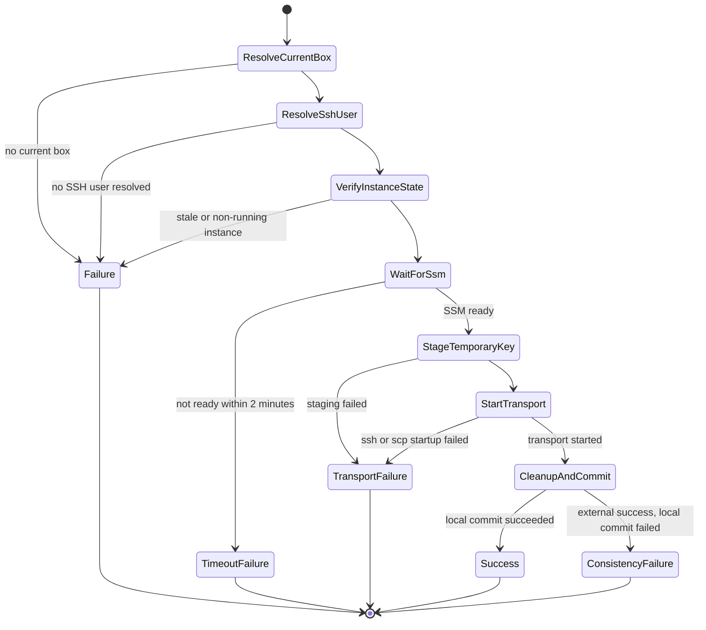
```mermaid
stateDiagram-v2
    [*] --> ResolveCurrentBox
    ResolveCurrentBox --> Failure: no current box
    ResolveCurrentBox --> ResolveSshUser
    ResolveSshUser --> Failure: no SSH user resolved
    ResolveSshUser --> VerifyInstanceState
    VerifyInstanceState --> Failure: stale or non-running instance
    VerifyInstanceState --> WaitForSsm
    WaitForSsm --> TimeoutFailure: not ready within 2 minutes
    WaitForSsm --> StageTemporaryKey: SSM ready
    StageTemporaryKey --> TransportFailure: staging failed
    StageTemporaryKey --> StartTransport
    StartTransport --> TransportFailure: ssh or scp startup failed
    StartTransport --> CleanupAndCommit: transport started
    CleanupAndCommit --> Success: local commit succeeded
    CleanupAndCommit --> ConsistencyFailure: external success, local commit failed
    Success --> [*]
    Failure --> [*]
    TimeoutFailure --> [*]
    TransportFailure --> [*]
    ConsistencyFailure --> [*]
```

This machine captures the shared precondition chain for `connect` and `cp`. The central safety rule is that no transport starts until the target is running, SSM-ready, and temporary authorization is staged.

**Forbidden transitions** (equally important as valid ones):
- `ResolveCurrentBox -> StartTransport` -- bypasses all gates
- `ResolveSshUser -> StartTransport` -- bypasses state verification
- `VerifyInstanceState -> StartTransport` -- bypasses SSM readiness and key staging
- `WaitForSsm -> StartTransport` -- bypasses key staging

**SSH user resolution precedence:**
1. invocation override (`--ssh-user`)
2. per-box `sshUser` override
3. `defaults.sshUser`

**Spec reference:** [`remote-access`](../openspec/specs/remote-access/spec.md)

### 6.8 `cp` Transfer and Finalization

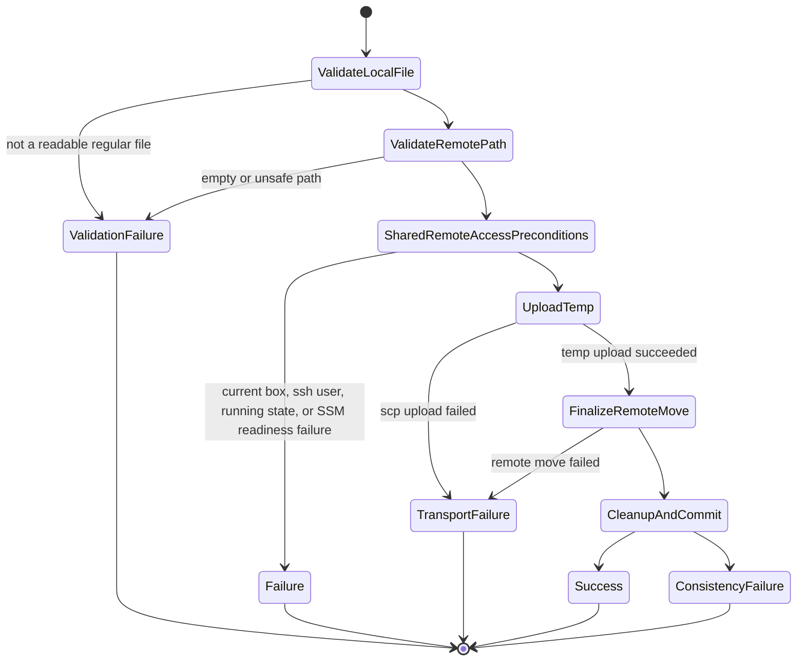
```mermaid
stateDiagram-v2
    [*] --> ValidateLocalFile
    ValidateLocalFile --> ValidationFailure: not a readable regular file
    ValidateLocalFile --> ValidateRemotePath
    ValidateRemotePath --> ValidationFailure: empty or unsafe path
    ValidateRemotePath --> SharedRemoteAccessPreconditions
    SharedRemoteAccessPreconditions --> Failure: current box, ssh user, running state, or SSM readiness failure
    SharedRemoteAccessPreconditions --> UploadTemp
    UploadTemp --> TransportFailure: scp upload failed
    UploadTemp --> FinalizeRemoteMove: temp upload succeeded
    FinalizeRemoteMove --> TransportFailure: remote move failed
    FinalizeRemoteMove --> CleanupAndCommit
    CleanupAndCommit --> Success
    CleanupAndCommit --> ConsistencyFailure
    Success --> [*]
    ValidationFailure --> [*]
    Failure --> [*]
    TransportFailure --> [*]
    ConsistencyFailure --> [*]
```

The safety property here is stronger than ordinary transport success: the final destination path is only replaced after successful upload to a temporary path and successful remote finalization. A failed `cp` does not partially overwrite the final remote destination.

**Spec reference:** [`remote-access`](../openspec/specs/remote-access/spec.md)

---

## 7. Interaction Protocols

### 7.1 Command Dispatch Flow

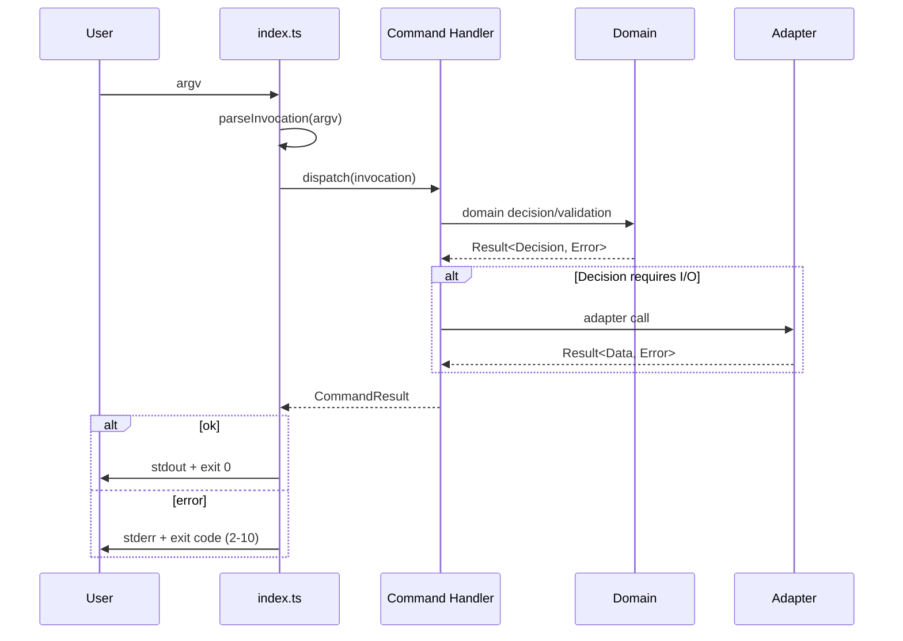
```mermaid
sequenceDiagram
    participant U as User
    participant E as index.ts
    participant C as Command Handler
    participant D as Domain
    participant A as Adapter

    U->>E: argv
    E->>E: parseInvocation(argv)
    E->>C: dispatch(invocation)
    C->>D: domain decision/validation
    D-->>C: Result<Decision, Error>
    alt Decision requires I/O
        C->>A: adapter call
        A-->>C: Result<Data, Error>
    end
    C-->>E: CommandResult
    alt ok
        E->>U: stdout + exit 0
    else error
        E->>U: stderr + exit code (2-10)
    end
```

This is the general shape of every command. The key pattern is: parse -> domain decision -> optional adapter call -> result rendering. No command handler directly performs I/O without going through an adapter.

### 7.2 `init` Sequence

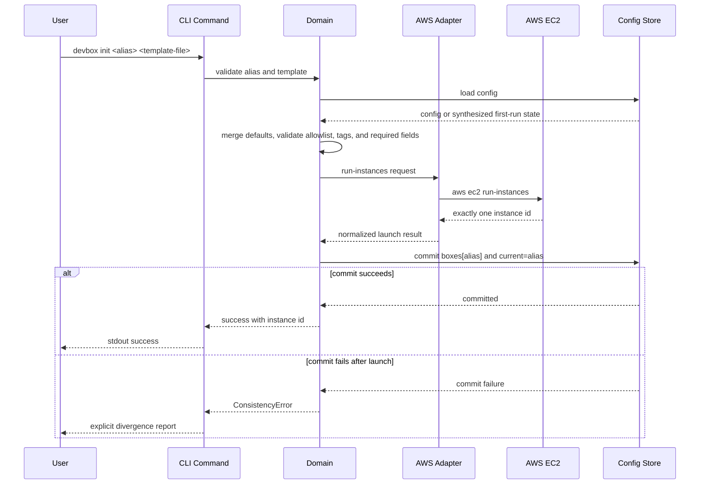
```mermaid
sequenceDiagram
    participant U as User
    participant C as CLI Command
    participant D as Domain
    participant A as AWS Adapter
    participant EC2 as AWS EC2
    participant S as Config Store

    U->>C: devbox init <alias> <template-file>
    C->>D: validate alias and template
    D->>S: load config
    S-->>D: config or synthesized first-run state
    D->>D: merge defaults, validate allowlist, tags, and required fields
    D->>A: run-instances request
    A->>EC2: aws ec2 run-instances
    EC2-->>A: exactly one instance id
    A-->>D: normalized launch result
    D->>S: commit boxes[alias] and current=alias
    alt commit succeeds
        S-->>D: committed
        D-->>C: success with instance id
        C-->>U: stdout success
    else commit fails after launch
        S-->>D: commit failure
        D-->>C: ConsistencyError
        C-->>U: explicit divergence report
    end
```

The ordering guarantee is strict: validation occurs before AWS mutation, and local tracking is committed only after AWS returns a successful launch result.

**Spec reference:** [`box-registry`](../openspec/specs/box-registry/spec.md)

### 7.3 `rm --terminate` Sequence

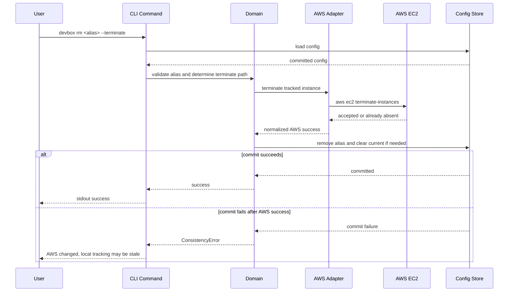
```mermaid
sequenceDiagram
    participant U as User
    participant C as CLI Command
    participant D as Domain
    participant A as AWS Adapter
    participant EC2 as AWS EC2
    participant S as Config Store

    U->>C: devbox rm <alias> --terminate
    C->>S: load config
    S-->>C: committed config
    C->>D: validate alias and determine terminate path
    D->>A: terminate tracked instance
    A->>EC2: aws ec2 terminate-instances
    EC2-->>A: accepted or already absent
    A-->>D: normalized AWS success
    D->>S: remove alias and clear current if needed
    alt commit succeeds
        S-->>D: committed
        D-->>C: success
        C-->>U: stdout success
    else commit fails after AWS success
        S-->>D: commit failure
        D-->>C: ConsistencyError
        C-->>U: AWS changed, local tracking may be stale
    end
```

The safety rule is that local tracking is not removed before AWS accepts termination or reports the instance already absent.

**Spec reference:** [`box-registry`](../openspec/specs/box-registry/spec.md)

### 7.4 Lifecycle Polling Activity

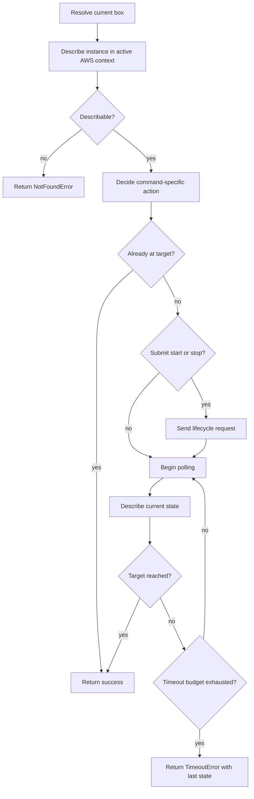
```mermaid
flowchart TD
    Start[Resolve current box] --> Describe[Describe instance in active AWS context]
    Describe --> Missing{Describable?}
    Missing -- no --> NotFound[Return NotFoundError]
    Missing -- yes --> Decide[Decide command-specific action]
    Decide --> Immediate{Already at target?}
    Immediate -- yes --> Success[Return success]
    Immediate -- no --> Request{Submit start or stop?}
    Request -- yes --> Submit[Send lifecycle request]
    Request -- no --> Poll[Begin polling]
    Submit --> Poll
    Poll --> Observe[Describe current state]
    Observe --> Reached{Target reached?}
    Reached -- yes --> Success
    Reached -- no --> Budget{Timeout budget exhausted?}
    Budget -- yes --> Timeout[Return TimeoutError with last state]
    Budget -- no --> Poll
```

This activity applies to both `up` and `down`. The key liveness condition is eventual success when the target state appears before the timeout bound. The key safety condition is that invalid transitions are rejected before any lifecycle request is sent.

**Spec reference:** [`instance-lifecycle`](../openspec/specs/instance-lifecycle/spec.md)

### 7.5 `connect` Sequence

```mermaid
sequenceDiagram
    participant U as User
    participant C as CLI Command
    participant S as Config Store
    participant D as Domain
    participant A as AWS Adapter
    participant EC2 as AWS EC2 or SSM
    participant SSH as SSH Adapter
    participant H as Remote Host

    U->>C: devbox connect [--ssh-user user]
    C->>S: load config
    S-->>C: committed config
    C->>D: resolve current box and ssh user
    D->>A: describe instance and poll SSM readiness
    A->>EC2: aws ec2 describe-instances / aws ssm checks
    EC2-->>A: running and Online
    A-->>D: normalized ready state
    D->>SSH: ensure key material and stage temporary key
    SSH->>EC2: send SSM-backed key staging command
    EC2->>H: install temporary key and cleanup job
    H-->>SSH: staging complete
    SSH-->>D: transport ready
    D->>SSH: start interactive SSH over SSM
    SSH->>H: establish session
    alt session startup and local commit succeed
        SSH-->>D: startup success
        D->>S: commit lastConnectAt
        S-->>D: committed
        D-->>C: hand off child exit status
        C-->>U: connect exits with ssh exit code
    else startup succeeds but local commit fails
        SSH-->>D: startup success
        D->>S: commit lastConnectAt
        S-->>D: commit failure
        D-->>C: ConsistencyError
        C-->>U: session started; local metadata may be stale
    end
```

This sequence spans the most trust boundaries in the product. The important design rule is that the command does not self-certify: every boundary crossing is gated by explicit preconditions and normalized results.

**Spec reference:** [`remote-access`](../openspec/specs/remote-access/spec.md)

### 7.6 `cp` Sequence

```mermaid
sequenceDiagram
    participant U as User
    participant C as CLI Command
    participant S as Config Store
    participant D as Domain
    participant A as AWS Adapter
    participant EC2 as AWS EC2 or SSM
    participant SSH as SSH Adapter
    participant H as Remote Host

    U->>C: devbox cp <local> <remote>
    C->>S: load config
    S-->>C: committed config
    C->>D: validate local file, current box, ssh user, and remote path
    D->>A: describe instance and poll SSM readiness
    A->>EC2: AWS readiness calls
    EC2-->>A: running and Online
    A-->>D: ready
    D->>SSH: ensure key material and stage temporary key
    SSH->>EC2: staging command
    EC2->>H: authorize temporary key
    H-->>SSH: staging complete
    D->>SSH: upload to temp path
    SSH->>H: scp temp upload
    H-->>SSH: temp upload complete
    D->>SSH: finalize with atomic remote move
    SSH->>H: mv temp to final path
    alt remote finalize and local commit succeed
        H-->>SSH: final destination updated
        D->>S: commit lastConnectAt
        S-->>D: committed
        D-->>C: success
        C-->>U: stdout success
    else remote finalize succeeds but local commit fails
        H-->>SSH: final destination updated
        D->>S: commit lastConnectAt
        S-->>D: commit failure
        D-->>C: ConsistencyError
        C-->>U: remote file updated; local metadata may be stale
    end
```

The critical safety rule is that the final destination path is not touched until the temporary upload is complete.

**Spec reference:** [`remote-access`](../openspec/specs/remote-access/spec.md)

---

## 8. Failure Modes and Error Model

### 8.1 Error Categories and Exit Codes

| Category | Exit Code | When |
|----------|:---------:|------|
| Success | 0 | Command completed successfully |
| `ValidationError` | 2 | Invalid user input (alias format, path format, SSH user, template) |
| `ConfigError` | 3 | Config missing, malformed, or lock contention |
| `DependencyError` | 4 | Required executable not found (`aws`, `ssh-keygen`, `ssh`) |
| `AwsCliError` | 5 | AWS CLI returned non-zero or unparseable output |
| `NotFoundError` | 6 | Instance does not exist in AWS (DescribeInstances empty) |
| `InstanceStateError` | 7 | Instance in a state incompatible with the requested operation |
| `TimeoutError` | 8 | Polling exceeded time budget without reaching target |
| `ConsistencyError` | 9 | External success followed by local commit failure |
| `TransportError` | 10 | SSH, SCP, or key-staging failure |

**Invariant:** Exit code 0 = success; exit code 1 = unexpected/unhandled failure; codes 2-10 are stable across versions.

### 8.2 Failure Mode Analysis

| Failure Mode | Detection | Impact | Mitigation |
|--------------|-----------|--------|------------|
| **AWS unreachable** | `aws` CLI returns non-zero | Cannot verify state or issue commands | `AwsCliError` with stderr details |
| **Stale instance state** | describeInstance returns unexpected state | Command may target wrong lifecycle phase | Re-describe before every action; no caching |
| **Config file corruption** | `JSON.parse` throws or `parseConfig` rejects | Cannot load registry | `ConfigError`; user can delete and re-init |
| **Lock contention** | `O_CREAT|O_EXCL` returns EEXIST for live PID | Concurrent write blocked | Stale-lock recovery; clear error message |
| **SSH key staging race** | Key expires (15s window) before session starts | Connection refused | Error propagated; user retries |
| **PID recycling (stale lock)** | Lock age exceeds 5min ceiling | Lock wrongly appears live | Age-based staleness overrides PID check |
| **Power loss during write** | N/A (detected on next load) | Config file might be old | Atomic rename ensures either old or new; never partial |
| **Signal during polling** | SIGINT/SIGTERM handlers fire | Incomplete operation | Cleanup handlers release resources; polling aborts cleanly |
| **Remote path injection** | Validation before any remote command | Malicious path could execute code | Reject paths with control chars/null bytes before crossing shell boundary |
| **Template with unknown fields** | Allowlist validation | Unintended AWS behavior | Reject unknown fields before any AWS call |
| **External success + local failure** | Config commit returns error after AWS accepted mutation | Registry diverges from AWS | Report `ConsistencyError` explicitly |
| **Concurrent local mutations** | Lock acquisition fails (EEXIST, live PID) | Second writer blocked | Single-writer semantics; user retries |

### 8.3 Failure Taxonomy

Unsafe inputs:
- invalid aliases
- malformed config or template JSON
- unsupported source file type for `cp`
- unsafe remote paths

Fragile formats:
- UTF-8 JSON config parsing
- AWS JSON parsing and normalization
- subprocess stderr propagation without losing normalized summaries

Inadequate control actions:
- repeated lifecycle requests when a transition is already in progress
- removing local tracking before AWS accepted termination
- starting transport before staging temporary authorization

Process-model flaws:
- local registry diverges from active AWS context
- AWS or remote side succeeded while local config commit failed
- persisted metadata is mistaken for live truth

Coordination failures:
- concurrent local mutation attempts
- stale or orphaned lock files
- cleanup failure after transport failure
- bounded waits that expire before target state is observed

### 8.4 Control and Recovery

- Reject invalid input before crossing effect boundaries.
- Keep all long waits bounded and return explicit timeout diagnostics.
- Recover stale locks with best-effort detection (three criteria) and one retry.
- Preserve the prior committed config on failed local mutation.
- Degrade `list` gracefully when AWS enrichment fails.
- Perform best-effort cleanup for temporary authorization and temp files.
- Report `ConsistencyError` when external success is already visible but local metadata could not be committed.
- No automatic retry policy: the CLI is designed for interactive use where the user can re-run on transient failures.

### 8.5 Result Type Contract

```typescript
type Result<T, E> =
  | { readonly ok: true; readonly value: T }
  | { readonly ok: false; readonly error: E };
```

**Domain rule:** No exceptions are thrown in domain code. All error paths are expressed as `Result` values with typed error unions. Adapter code catches system exceptions and wraps them into `Result` before returning to the CLI layer.

**Spec reference:** [`remote-access`](../openspec/specs/remote-access/spec.md) -- see `[CONNECT-ERROR-EXIT-CODE]`, `[CP-ERROR-EXIT-CODE]`.

---

## 9. Safety and Liveness Claims

### 9.1 Safety Properties

| Claim | Mechanism | Verification |
|-------|-----------|--------------|
| **No false success** (lifecycle) | Success reported only after observing target state | Alloy assertion `noFalseSuccess`; unit / contract tests |
| **No invalid transition** | `decideUpAction`/`decideDownAction` reject terminal/incompatible states | Alloy assertions `noInvalidUpDecision`, `noInvalidDownDecision`; exhaustive switch + `assertNever`; property tests |
| **No data loss on crash** | Atomic write protocol (temp -> fsync -> rename -> dir-fsync) | Integration tests with crash simulation |
| **No shell injection** | All subprocess calls use argv arrays via `execFile` | `process.ts` enforces this; no `exec` in codebase |
| **No partial config state visible** | Readers see old or new config; never intermediate | `rename(2)` atomicity guarantee |
| **No resource leak on signal** | SIGINT/SIGTERM handlers + `finally` blocks | Integration tests with signal injection |
| **Alias uniqueness preserved** | Object key uniqueness + validation on write | Property tests (fast-check) |
| **Destructive behavior never implicit** | `rm --terminate` is opt-in; no auto-termination | Unit / contract tests for `rm` without flag |
| **Unsafe remote paths never reach shell** | Validation rejects before any SSH/SCP command | Property tests for path validation |
| **Failed cp does not overwrite destination** | Upload to temp path; atomic remote move | Integration tests for partial-failure paths |
| **Failed access does not update lastConnectAt** | Two-phase success gate (external + local) | Unit / contract tests for failure paths |
| **Persisted state never authoritative for live AWS** | Re-describe before every action | Architectural invariant; integration tests |

### 9.2 Liveness Properties

| Claim | Mechanism | Bound |
|-------|-----------|-------|
| **EC2 polling terminates** | `EC2_WAIT_TIMEOUT_MS` ceiling + elapsed check | 5 minutes |
| **SSM polling terminates** | `SSM_WAIT_TIMEOUT_MS` ceiling + elapsed check | 2 minutes |
| **Stale locks are recoverable** | Age-based + PID-based staleness detection | 5 minutes (lock age threshold) |
| **Signal handlers fire cleanup** | Process-level SIGINT/SIGTERM listeners | Immediate (kernel delivery) |
| **Lock is always released** | `finally` block in `commitConfig` | On every exit path (success or error) |
| **list succeeds without AWS** | Graceful degradation when enrichment fails | Local visibility preserved |
| **rm --terminate completes** | Local tracking removed after accepted AWS termination | ConsistencyError if local commit fails |
| **Staged authorization cleaned up** | Remote cleanup job removes key entry after 15 seconds | Bounded; no long-lived authorization |

### 9.3 Formal Model

The EC2 lifecycle state machines are formally specified in an **Alloy 6** model embedded in [`instance-lifecycle` spec](../openspec/specs/instance-lifecycle/spec.md). The model verifies:

- **Safety assertions:** `noFalseSuccess`, `noInvalidUpDecision`, `noInvalidDownDecision`
- **Bounded liveness:** `pollingAlwaysTerminates`
- **State coverage:** All reachable states have defined transitions or explicit rejections

The Alloy model serves as the authoritative behavioral specification; the TypeScript implementation mirrors its structure (see `src/domain/instance-state.ts`).

---

## 10. Quality Attributes

| Attribute | Target | How Achieved |
|-----------|--------|--------------|
| **Determinism** | Domain functions produce identical output for identical input | Pure functions; injectable `Clock`; no ambient state |
| **Testability** | All business logic testable without AWS or filesystem | Domain/adapter separation; injected dependencies |
| **Correctness** | Implementations match formal specifications | Alloy models; spec traceability markers; property tests |
| **Operational simplicity** | Single config file, no background daemon, no database | Flat JSON file with atomic writes |
| **Bounded latency** | No unbounded waits or infinite loops | All polling has explicit time ceilings |
| **Safe defaults** | Destructive actions require explicit confirmation | `rm --terminate` is opt-in; no auto-termination |
| **Observability** | Structured stderr output for all failures | `[devbox] Category: message` format; detail lines indented |
| **Portability** | Runs anywhere Node >= 20 is available | Single ESM bundle; no native dependencies |

---

## 11. Verification Strategy

The project follows the **verification pyramid** from [docs/lfm.md](lfm.md):

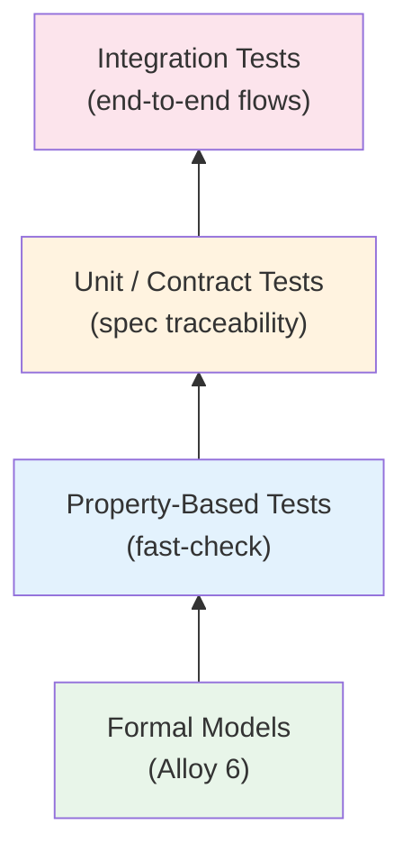
```mermaid
graph BT
    FM["Formal Models<br/>(Alloy 6)"] --> PBT["Property-Based Tests<br/>(fast-check)"]
    PBT --> CT["Unit / Contract Tests<br/>(spec traceability)"]
    CT --> IT["Integration Tests<br/>(end-to-end flows)"]

    style FM fill:#e8f5e9
    style PBT fill:#e3f2fd
    style CT fill:#fff3e0
    style IT fill:#fce4ec
```

| Layer | Coverage Focus | Location |
|-------|---------------|----------|
| **Formal models** | State machine correctness, safety/liveness | `openspec/specs/instance-lifecycle/spec.md` (Alloy) |
| **Property-based tests** | Invariants over generated inputs (alias tracking, config round-trip, EC2 lifecycle) | `test/property/` |
| **Unit / contract tests** | Spec requirement traceability (`[SPEC-ID]` markers) | `test/contract/` |
| **Integration tests** | End-to-end command flows, adapter behavior, build artifacts | `test/integration/` |

**Spec traceability:** Every testable requirement in `openspec/specs/` carries a bracketed identifier (e.g., `[ALIAS-FORMAT]`). Contract and unit tests reference these identifiers via `traceSpec(...)`, and the traceability tooling validates coverage.

Evidence layers in detail:

- unit / contract tests for stdout, stderr, exit codes, config parsing, output contracts, and command-specific rules
- property-based tests for alias/current integrity, lifecycle state machines, remote-path acceptance, and other invariants
- integration tests for command flows, adapter boundaries, polling behavior, cleanup paths, and consistency-error handling
- distribution checks for package and bundle parity
- traceability checks for spec identifier validation and full-catalog coverage in dedicated mode
- regression discipline so each discovered counterexample becomes a permanent test

The key design claim is not that the system is fully proved. The key claim is that its critical transitions, invariants, failure boundaries, and safety properties are explicit, checkable, and re-checked as the system evolves.

**Spec reference:** [`spec-traceability`](../openspec/specs/spec-traceability/spec.md)

---

## 12. Distribution and Packaging

| Artifact | Format | Target |
|----------|--------|--------|
| npm package | Standard npm tarball | `npm install -g` |
| `dist/devbox.js` | Single-file ESM bundle (esbuild) | Node >= 20 |

**Build invariants:**
- The bundle is a single `.js` file with no external dependencies at runtime.
- `#!/usr/bin/env node` shebang is prepended.
- Source maps are excluded from the distribution artifact.
- The bundled artifact passes the same integration tests as the source tree.
- Both distribution forms preserve the same help/version surface, output contracts, and exit-code behavior.

**Spec reference:** [`distribution`](../openspec/specs/distribution/spec.md)

---

## 13. Operational and Security Constraints

- Subprocesses are invoked with argv arrays rather than shell-interpolated command strings.
- Remote-path validation occurs before any shell quoting boundary is crossed.
- `connect` and `cp` use temporary SSH authorization rather than silently permanent access state.
- The SSH adapter prefers agent keys when available and otherwise falls back to `~/.ssh/ssm-ssh-tmp` and `~/.ssh/ssm-ssh-tmp.pub`.
- Remote staged-key cleanup is bounded; the staged cleanup job removes the authorized-key entry after 15 seconds, and the overall design does not permit unmanaged long-lived authorization.
- EC2 polling is bounded to 5 minutes with 5-second intervals.
- SSM readiness polling is bounded to 2 minutes with 5-second intervals.
- Signal handling aborts waits without rolling back already-submitted AWS state transitions.
- Error rendering is normalized and does not expose secrets as part of the first-line summary.
- Distribution targets preserve the same CLI semantics across `npm` and `dist/devbox.js`.

---

## 14. Command and Interaction Summary

| Command Family | Commands | Main Boundaries Crossed |
|---|---|---|
| Informational | `--help`, `--version` | local process only |
| Registry local-only | `switch`, `rm` without `--terminate` | config store |
| Registry with AWS | `list`, `init`, `add`, `rm --terminate` | config store, AWS |
| Lifecycle | `up`, `down` | config store, AWS |
| Remote access | `connect`, `cp` | config store, AWS, SSM, SSH/SCP, remote host |
| Distribution | `npm` install, `dist/devbox.js` | packaging and runtime contract |
| Traceability | `traceSpec(...)`, `test:trace` | spec catalog, test harness |

---

## 15. Relationship to Other Documents

- [`ARCHITECTURE.md`](../ARCHITECTURE.md) explains where behavior lives in code and which layer boundaries should be preserved.
- [`openspec/specs/`](../openspec/specs/) defines the normative behavior for each capability.
- The archived core change under [`openspec/changes/archive/2026-06-05-devbox-core/`](../openspec/changes/archive/2026-06-05-devbox-core/) is historical source material for the initial design baseline.
- [`lfm.md`](lfm.md) explains the assurance posture and evidence model.
- [`typescript_style.md`](typescript_style.md) and [`state_machines.md`](state_machines.md) explain how the implementation should embody the design.

---

## 16. Editorial and Maintenance Rules

This is a living document.

Update it when:

- command semantics change
- state machines change
- persistence or encoding rules change
- invariants or source-of-truth boundaries change
- failure contracts change
- safety or liveness guarantees change
- verification expectations change

Maintenance guidance:

- Summarize durable design intent rather than copying every requirement from the specs verbatim.
- Keep capability-specific sections linked to the relevant OpenSpec specs.
- Preserve the separation between design intent here and code location in `ARCHITECTURE.md`.
- Ensure new code, tests, and specs continue to support the claims made in this document.
- Keep the numbered section structure when adding new sections.
