## Context

### Current State
The repository has a clear product direction and a detailed planning document for the core CLI, but it does not yet have a durable implementation-neutral proposal paired with implementation-oriented OpenSpec artifacts. The system being designed is intentionally small: a TypeScript CLI that shells out to the AWS CLI, AWS SSM session features, and local OpenSSH tooling while persisting local tracking state in a single config file.

The core challenge is not raw feature breadth. It is preserving trust across local state, AWS state, and remote-host state without hiding partial failures. The design therefore centers on deterministic domain logic, explicit state transitions, bounded waits, conservative subprocess boundaries, and a config store that preserves atomicity under normal failure conditions.

### Constraints and Architecture Drivers
- The tool remains a thin wrapper around `aws`, `ssh`, `scp`, and supporting local executables rather than introducing the AWS SDK.
- Local tracking state is stored at a fixed config path and must behave as the durable source of truth for aliases and current-box selection.
- AWS account and region selection are external concerns; the active command environment is authoritative at runtime.
- Remote access must stage short-lived SSH authorization through AWS SSM and bound the lifetime of temporary authorization material.
- The implementation must match the repository TypeScript style guide: deterministic core logic, explicit state machines, bounded work, explicit error categories, strict runtime validation at boundaries, and a structure that supports property-based testing.
- Packaging is part of the product contract. The `npm`-installed CLI and bundled `dist/devbox.js` artifact must preserve the same behavior.

## Goals

- Create a layered CLI architecture that isolates deterministic domain logic from subprocess execution and filesystem effects.
- Preserve the key invariants from the proposal: alias uniqueness, valid `current` selection, local-versus-AWS source-of-truth boundaries, explicit destructive operations, and atomic local mutation.
- Make lifecycle and remote-access flows explicit enough to test as state machines.
- Normalize errors and output contracts so the CLI is predictable across success, validation failure, dependency failure, timeout, stale-resource, and cross-system consistency failure cases.
- Support both `npm` installation and bundled single-file execution with equivalent user-visible semantics.
- Produce a design that localizes future change by capability and architecture layer.

### Non-Goals
- Managing AWS credentials, profiles, or regions.
- Tracking or reconciling multiple AWS execution contexts in one registry.
- Introducing a background daemon, service process, or distributed lock manager.
- Supporting directory copy, download, sync, or general SSH orchestration beyond the documented `connect` and upload-only `cp` flows.
- Providing dedicated CLI commands for editing per-box SSH-user overrides in v1.
- Building a standalone Alloy, TLA+, or executable reference model artifact in this initial change.

## Proposed Design

### System Model

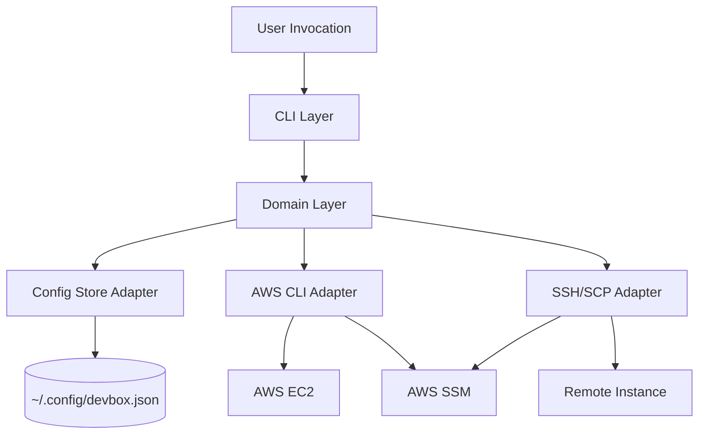

The CLI layer parses arguments, resolves command shape, and renders stdout/stderr.
The domain layer owns validation, state-transition rules, merge rules, and ordering guarantees.
The adapter layer executes subprocesses, persists config atomically, and normalizes boundary failures.

This architecture keeps the core logic close to a state-machine formulation:
- input command + current local state + observed AWS state -> validated domain action
- validated domain action + adapter result -> next local state or explicit failure

### Component Descriptions
- **CLI layer**: Parses commands and flags with a stable surface for top-level help/version behavior plus `list`, `init`, `add`, `rm`, `switch`, `up`, `down`, `connect`, and `cp`. It maps normalized domain and adapter failures to fixed exit codes and documented stderr output.
- **Domain layer**
  - **Registry domain**: Validates aliases, config structure, tag requirements, SSH-user resolution, launch-input merge rules, and local mutation rules.
  - **Lifecycle domain**: Defines legal EC2 starting states, stale-resource handling, and timeout semantics for `up` and `down`.
  - **Remote-access domain**: Defines SSM readiness gating, SSH-user precedence, remote-path safety rules, temporary-key lifecycle expectations, `lastConnectAt` rules, and `ConsistencyError` boundaries for `connect` and `cp`.
- **Adapter layer**
  - **Config-store adapter**: Owns advisory lock acquisition, stale-lock detection, temp-file write, `fsync`, atomic replace, and config parsing/serialization.
  - **AWS adapter**: Builds `aws` argv arrays, invokes subprocesses without shell interpolation, parses JSON responses, and normalizes EC2/SSM failures.
  - **SSH adapter**: Builds `ssh`, `scp`, and key-generation argv arrays, stages temporary access through SSM-backed workflows, and performs bounded cleanup.
- **Build/distribution tooling**: Produces the normal Node package entrypoint and the single-file `dist/devbox.js` artifact with the required shebang.

### System Invariant Tactics
- **Alias uniqueness**: Enforce at the domain boundary before any local or AWS mutation begins.
- **Valid current selection**: Validate config on read; every local mutation that removes or switches aliases updates `current` in the same in-memory next-state computation.
- **Local tracking truth**: `list`, `switch`, and local mutation commands operate only on tracked aliases present in the committed config.
- **AWS truth for live state**: Lifecycle and remote-access commands query AWS at runtime rather than trusting persisted live-state data.
- **Single-writer config semantics**: All local mutations go through one config-store path with exclusive lock creation and atomic replace.
- **Cross-system consistency visibility**: Domain flows that mutate AWS or remote-host state before local config commit map a post-external local write failure to `ConsistencyError` instead of collapsing it into a generic config error.
- **Explicit destructive behavior**: `rm` performs local-only deletion by default; AWS termination is available only through `rm --terminate`.
- **Bounded temporary authorization**: Remote access uses temporary keys with a 5-minute bound and best-effort cleanup rather than any long-lived hidden authorization state.

### Quality Attribute Tactics
- **Reliability**: Keep domain transitions deterministic and side-effect free until the adapter boundary so they can be property-tested over histories.
- **Safety**: Validate aliases, template structure, remote paths, and command preconditions before calling AWS or a remote shell.
- **Security**: Use argv-based subprocess invocation everywhere; never interpolate shell command strings from user-controlled values. Restrict remote-shell exposure to a conservative quoting boundary after path validation.
- **Bounded responsiveness**: Centralize polling constants and timeout budgets so waits are visible, testable, and consistent.
- **Maintainability**: Organize by architecture layer and capability so that command families share domain helpers without flattening all behavior into one command router.
- **Distribution consistency**: Treat packaging checks as contract verification, not just build success.

### Interaction Protocols
The core command families are specified as explicit interaction state machines so the legal transitions, stop conditions, and failure exits are visible in one place.

**Top-level informational protocol**

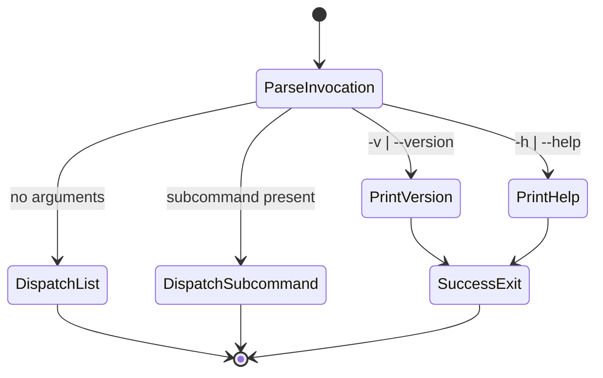

**Registry mutation protocol**

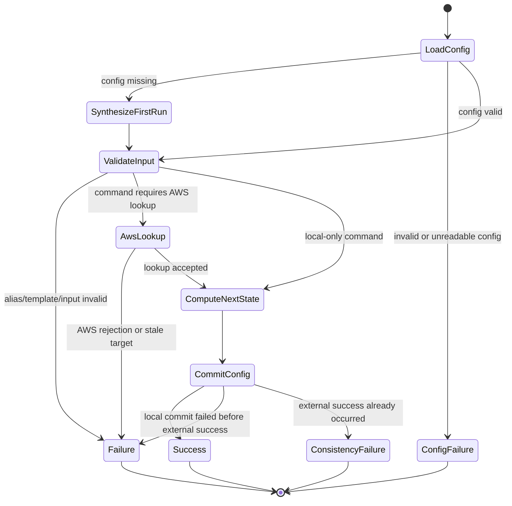

**Lifecycle protocol**

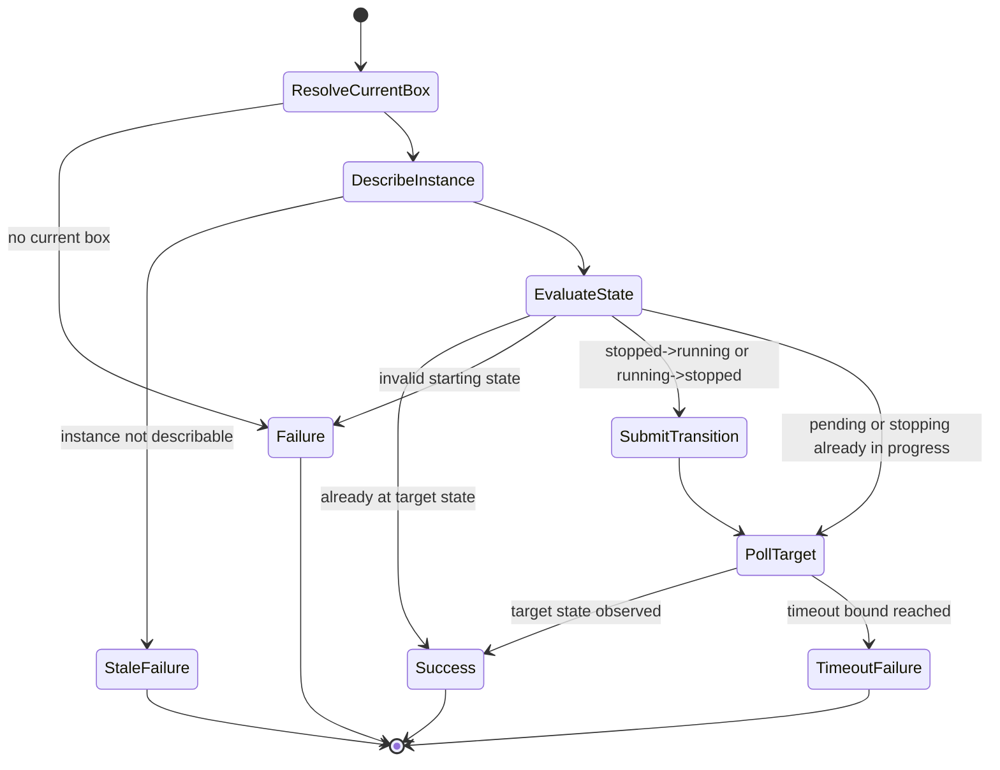

**Remote-access protocol**

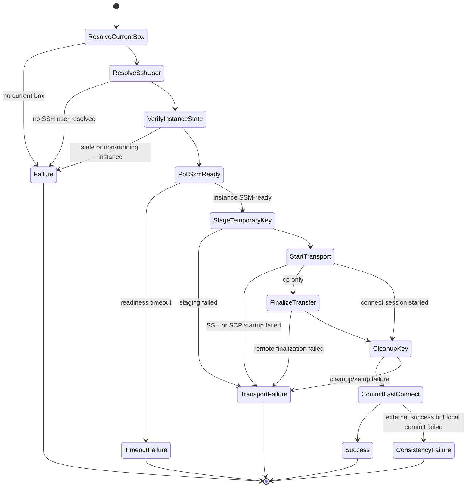

Protocol rules:
- Every cross-boundary step has an explicit preceding validation gate.
- Informational help/version flows exit before config reads or AWS interaction.
- No lifecycle or remote-access command guesses alternate AWS contexts.
- No remote transport starts before staging is confirmed.
- No successful external action is silently reclassified as a local-only failure.

Additional remote-access protocol clarification:
- The `CleanupKey` state represents best-effort cleanup that runs after successful transport. If cleanup itself fails, the command still proceeds to `CommitLastConnect` because the bounded remote background job provides the safety net. The `CleanupKey → TransportFailure` edge applies only when cleanup failure indicates that staging never actually succeeded (a retroactive staging detection failure).

### Forward Evolution
- The config model can later add explicit CLI support for editing per-box SSH-user overrides without changing the precedence model.
- The domain structure supports future optional strict modes, richer listing formats, or additional remote-access options without rewriting the adapter boundaries.
- State-machine-oriented domain modules make it practical to add a later lightweight executable model if the verification strategy needs to deepen.
- Packaging stays isolated so a future standalone executable or alternate bundler can be introduced without changing the command semantics.

### Alternatives Considered
- **AWS SDK instead of AWS CLI**: Rejected because the product is explicitly intended to remain a thin AWS CLI wrapper with fewer dependencies and a narrower trust surface.
- **Persist account and region per box**: Rejected for v1 because it would widen the domain model and imply context-management behavior that the product intentionally leaves to the user.
- **Long-lived SSH configuration or static key assumptions**: Rejected because the product requires short-lived staged authorization with bounded cleanup.
- **Best-effort local writes without locking or atomic replace**: Rejected because partial config corruption and multi-writer ambiguity would directly violate the core safety and reliability claims.

## Component Design

### Key Components

The key implementation units are the command handlers in `src/cli/commands/*`, the deterministic domain helpers in `src/domain/*`, and the side-effecting adapters in `src/adapters/*`. The diagrams below show the intended command-level control flow, the contract checkpoints that matter to the user, and the failure exits that must remain explicit in the implementation.

#### `devbox -v` / `devbox --version`

Primary modules: `src/index.ts`, CLI entrypoint metadata reader, output contract helpers.

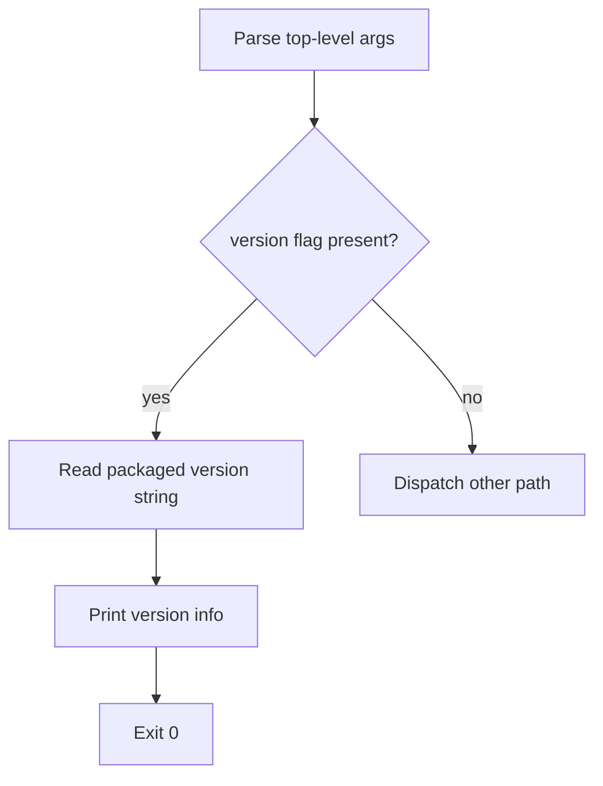

Contract notes:
- Success prints version information and exits with `0`.
- No config read, AWS call, or remote-access adapter call is permitted on this path.

#### `devbox -h` / `devbox --help`

Primary modules: `src/index.ts`, CLI command registry, help renderer, output contract helpers.

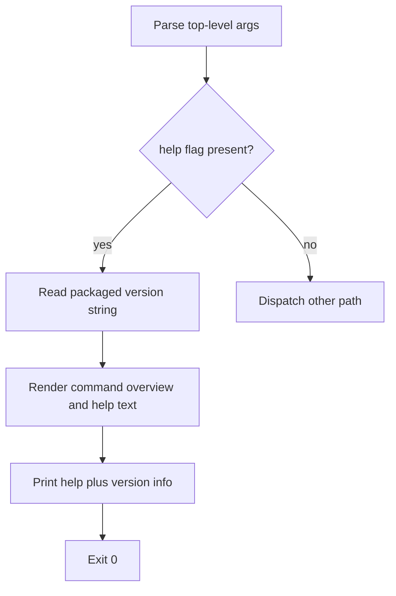

Contract notes:
- Success prints command overview, help text, and version information, then exits with `0`.
- No config read, AWS call, or remote-access adapter call is permitted on this path.

#### `devbox` / `devbox list`

Primary modules: `src/cli/commands/list.ts`, `src/domain/config-schema.ts`, `src/domain/output-contracts.ts`, `src/adapters/config-store.ts`, `src/adapters/aws-cli.ts`.

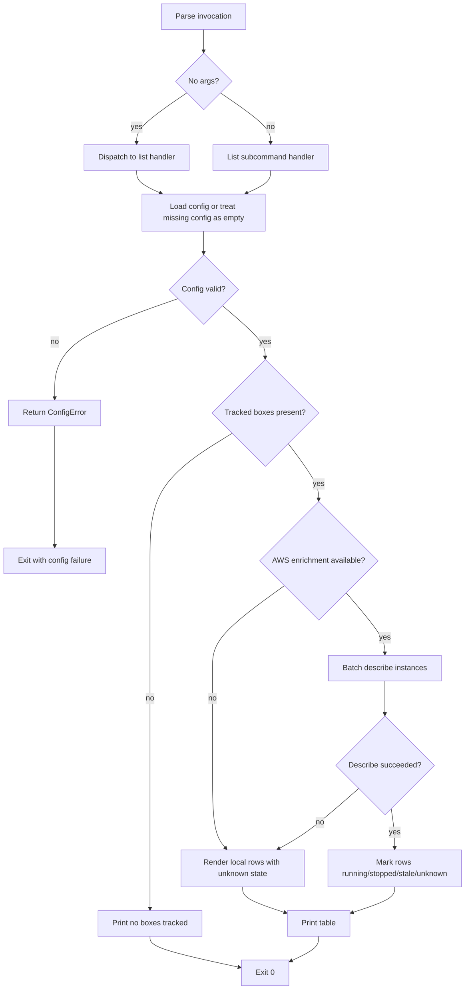

Contract notes:
- Bare `devbox` dispatches to this command path.
- Invalid config is fatal; AWS enrichment failure is non-fatal and degrades rows to local-only output.
- The handler must not mutate config.

#### `devbox init <alias> <template-file>`

Primary modules: `src/cli/commands/init.ts`, `src/domain/alias.ts`, `src/domain/init-mapper.ts`, `src/domain/tags.ts`, `src/adapters/aws-cli.ts`, `src/adapters/config-store.ts`.

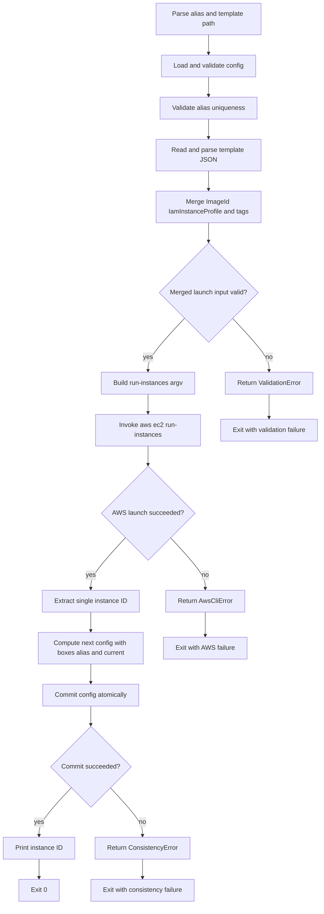

Contract notes:
- Validation failure must happen before any AWS launch call.
- Successful AWS launch followed by failed config commit must map to `ConsistencyError`.
- The implementation must force the `Name` tag to the alias and never create AWS launch template resources.

#### `devbox add <instance-id> <alias>`

Primary modules: `src/cli/commands/add.ts`, `src/domain/alias.ts`, `src/domain/output-contracts.ts`, `src/adapters/aws-cli.ts`, `src/adapters/config-store.ts`.

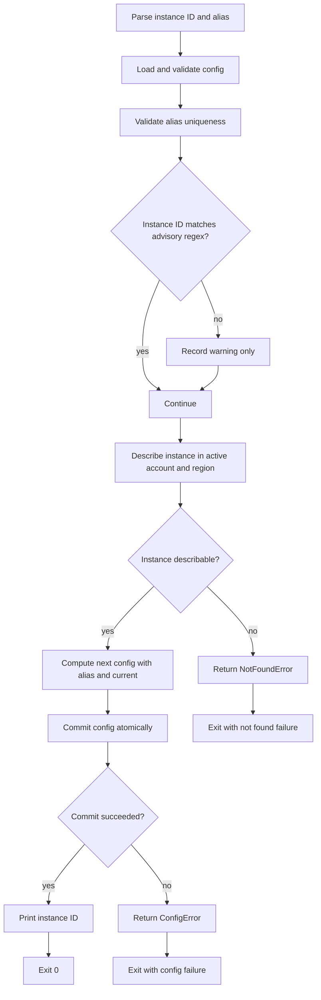

Contract notes:
- AWS describe is authoritative for existence in the active account and region.
- Advisory instance-ID format mismatch can warn but must not reject by itself.

#### `devbox rm <alias> [--terminate]`

Primary modules: `src/cli/commands/rm.ts`, `src/domain/output-contracts.ts`, `src/adapters/aws-cli.ts`, `src/adapters/config-store.ts`.

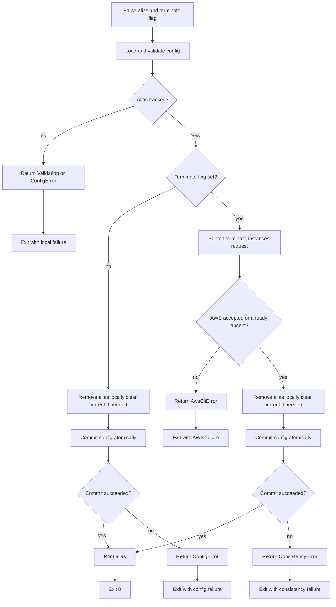

Contract notes:
- `rm` without `--terminate` is local-only and may remove stale aliases.
- `rm --terminate` must not remove local tracking before AWS accepts termination or reports the instance already absent.

#### `devbox switch <alias>`

Primary modules: `src/cli/commands/switch.ts`, `src/adapters/config-store.ts`.

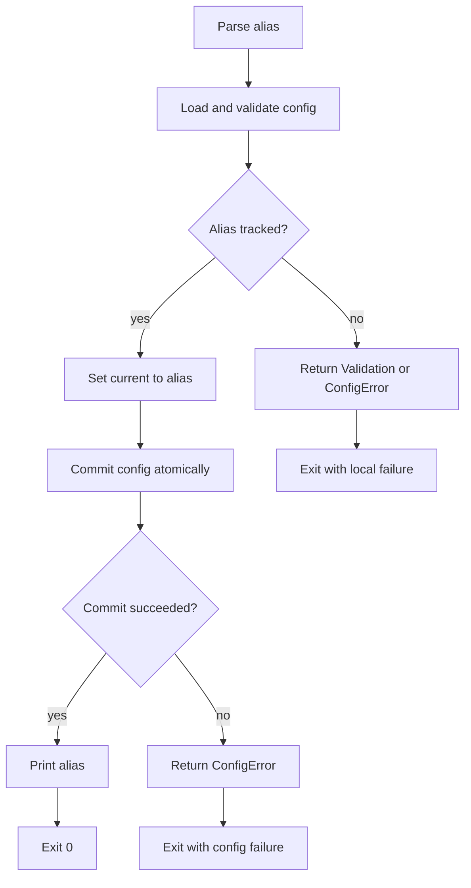

Contract notes:
- No AWS interaction is permitted on this path.
- `current` must always point to an existing alias after success.

#### `devbox up`

Primary modules: `src/cli/commands/up.ts`, `src/domain/instance-state.ts`, `src/domain/wait-policy.ts`, `src/adapters/aws-cli.ts`.

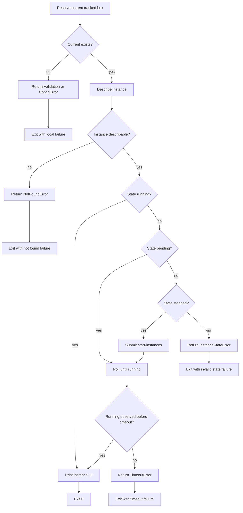

Contract notes:
- Only the current tracked instance may be targeted.
- Timeout must report expected state, last observed state, instance ID, and elapsed time.

#### `devbox down`

Primary modules: `src/cli/commands/down.ts`, `src/domain/instance-state.ts`, `src/domain/wait-policy.ts`, `src/adapters/aws-cli.ts`.

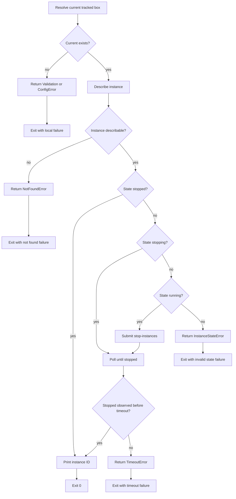

Contract notes:
- Only the current tracked instance may be targeted.
- The implementation must not submit redundant stop requests when the instance is already `stopping`.

#### `devbox connect`

Primary modules: `src/cli/commands/connect.ts`, `src/domain/ssm-readiness.ts`, `src/adapters/aws-cli.ts`, `src/adapters/ssh-cli.ts`, `src/adapters/config-store.ts`.

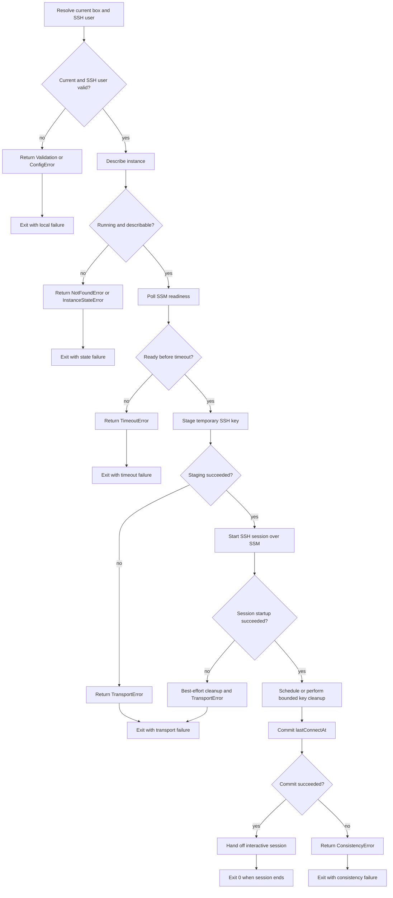

Contract notes:
- The SSH user must come from invocation override, per-box override, or `defaults.sshUser`.
- `lastConnectAt` updates only after successful session startup and successful local commit.
- The `devbox connect` process either execs into or waits on the SSH child process. The exit code is the exit code of the SSH session, not unconditionally 0.

#### `devbox cp <local> <remote>`

Primary modules: `src/cli/commands/cp.ts`, `src/domain/ssm-readiness.ts`, `src/adapters/aws-cli.ts`, `src/adapters/ssh-cli.ts`, `src/adapters/config-store.ts`.

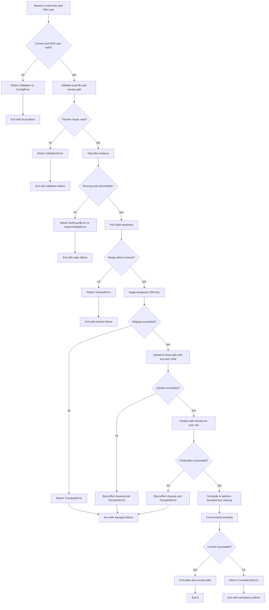

Contract notes:
- The final destination must only be replaced after successful upload to a temp path and successful remote finalization.
- Failed transfer attempts must not partially rewrite the final destination path.
- No enforced file size limit is applied. SCP and network bandwidth are the natural transfer constraints.

### Data Design
- **Config encoding**: UTF-8 JSON at `~/.config/devbox.json`.
- **Top-level config shape**:
  - `boxes`: required alias-keyed object.
  - `current`: optional alias.
  - `defaults`: object containing required `tags` and optional launch/remote-access defaults.
- **Per-box shape**:
  - `instanceId`: required tracked EC2 identifier.
  - `lastConnectAt`: optional ISO-8601 timestamp string.
  - `sshUser`: optional per-box override set only through manual config edits in v1.
- **Default remote-access value**:
  - `defaults.sshUser`: optional shared SSH user.
- **Validity rules**:
  - alias regex and uniqueness.
  - `current` absent or present in `boxes`.
  - required tag keys present after merge.
  - remote path non-empty after trim and free of ASCII control characters and null bytes.
  - instance-ID regex remains advisory for `add`; AWS describe is authoritative.
- **Time values**:
  - `lastConnectAt` stored as ISO-8601 UTC strings.
  - wait budgets and poll intervals represented as explicit millisecond constants in code (unsigned integers).

### Config File Permissions and Encoding

- Config files are created with mode `0644`. The config contains no secrets.
- The advisory lock file is created at `~/.config/devbox.json.lock` with mode `0644`.
- Lock file content is the PID of the holding process as a decimal ASCII string.
- All config I/O assumes UTF-8 without BOM. A leading BOM is treated as invalid JSON.

### Error Output Format

Stderr on failure:
- First line: `[devbox] <Category>: <concise message>`
- Subsequent lines: raw subprocess stderr indented with 2 spaces, when useful for diagnosis.

Examples:
```
[devbox] TimeoutError: instance i-abc123 did not reach running within 300s (last: pending)
[devbox] ConsistencyError: instance launched (i-abc123) but config write failed
[devbox] TransportError: SSH key staging failed for user ubuntu on i-abc123
```

### Exit Code Mapping

| Code | Category |
|------|----------|
| 0 | Success |
| 2 | ValidationError |
| 3 | ConfigError |
| 4 | DependencyError |
| 5 | AwsCliError |
| 6 | NotFoundError |
| 7 | InstanceStateError |
| 8 | TimeoutError |
| 9 | ConsistencyError |
| 10 | TransportError |

### Signal Handling

- During EC2/SSM polling (`up`, `down`, `connect`, `cp`): SIGINT/SIGTERM immediately abort the poll loop. No rollback of already-submitted AWS state transitions. Exit code is non-zero.
- During SSH session (`connect`): The `devbox` process either execs or waits on the SSH child process. Signals propagate via standard Unix process group behavior. The exit code of `devbox connect` is the exit code of the SSH session. Remote temporary key cleanup relies on the bounded background removal job (15-second `sed` on the remote host).
- During config write: If killed between temp-file write and atomic rename, the temp file is orphaned but committed config remains intact. Next invocation's stale-lock recovery handles cleanup.

### Version Source

The CLI version string is read from `package.json` at build time and embedded as a compile-time constant in the bundle. Both the `npm`-installed CLI and the single-file artifact report the same version. The `defaults.tags.version` tag default (`0000000`) is a separate concern for instance tagging.

### Interface Contracts
- **CLI to domain**: Passes parsed, typed command inputs and expects either a success result with output payload or a normalized error result.
- **Domain to config store**: Reads committed config state and submits a complete next-state object for atomic commit; the domain does not manage partial writes.
- **Domain to AWS adapter**: Requests concrete AWS operations in terms of explicit argv-compatible parameter objects; adapter returns parsed results or normalized failures.
- **Domain to SSH adapter**: Requests staging, transport, cleanup, and remote finalization through explicit operation objects that already contain resolved SSH user, instance ID, and validated path data.
- **Build tooling to runtime entrypoint**: Produces a bundled script that preserves the same top-level help/version behavior, command dispatch, and output behavior.
- **Stdout for `list`**: A human-readable terminal table with columns: current-box indicator (`*`), alias, instance ID, instance type, and state. Column widths adapt to content. When no boxes are tracked, a single line `No boxes tracked` is printed instead.

### Code Map

All functions use TSDoc to document preconditions, postconditions, invariants, failures, and safety requirements.
All code MUST adhere to the [Typescript Style Guide](docs/typescript_style.md).

General structure:

```text
src/
  index.ts
  cli/
    commands/
      list.ts
      init.ts
      add.ts
      rm.ts
      switch.ts
      up.ts
      down.ts
      connect.ts
      cp.ts
  domain/
    config-schema.ts
    alias.ts
    tags.ts
    init-mapper.ts
    instance-state.ts
    ssm-readiness.ts
    wait-policy.ts
    output-contracts.ts
    errors.ts
  adapters/
    aws-cli.ts
    ssh-cli.ts
    config-store.ts
build/
  esbuild.ts
dist/
  devbox.js
test/
  contract/
  property/
  integration/
  fixtures/
```

Code/component responsibilities:

- **`src/index.ts`**: CLI entrypoint and top-level process exit mapping.
- **`src/cli/commands/ .ts`**: Per-command argument parsing and call routing.
- **`src/domain/config-schema.ts`**: Runtime validation and normalization of config inputs.
- **`src/domain/alias.ts`**: Alias parsing and uniqueness helpers.
- **`src/domain/tags.ts`**: Required tag merge and validation rules.
- **`src/domain/init-mapper.ts`**: Launch-template-style input validation and `run-instances` argument mapping.
- **`src/domain/instance-state.ts`**: EC2 state legality and stale-resource handling.
- **`src/domain/ssm-readiness.ts`**: SSM readiness polling rules.
- **`src/domain/wait-policy.ts`**: Poll interval and timeout constants.
- **`src/domain/output-contracts.ts`**: Normalized success/failure rendering rules.
- **`src/domain/errors.ts`**: Tagged domain and boundary error categories.
- **`src/adapters/config-store.ts`**: Locking, temp-file writes, `fsync`, replace, and config I/O. Lock file is at `~/.config/devbox.json.lock` containing the holder PID. Staleness: PID missing/invalid, PID not running, or lock mtime older than 5 minutes.
- **`src/adapters/aws-cli.ts`**: AWS subprocess execution and response normalization.
- **`src/adapters/ssh-cli.ts`**: SSH/SCP command construction, key staging, and cleanup.
- **`build/esbuild.ts`**: Single-file bundle production.

## Failure and Reliability

### Failure Mode Analysis
- **Unsafe inputs**: Invalid aliases, malformed template structure, unsupported local source types, and unsafe remote paths could cause unintended side effects if they cross the boundary unchecked.
- **Fragile formats**: Config JSON and AWS JSON responses are parsing boundaries; invalid or unexpected payloads must fail closed with normalized errors.
- **Inadequate control actions**: Sending repeated lifecycle transitions, starting remote transport before key staging completes, or deleting local tracking before accepted termination would violate product rules.
- **Process model flaws**: Local tracking can diverge from AWS reality if the active account or region changes, or if AWS/remote success occurs before local config commit. The design treats these as first-class states rather than hidden anomalies.
- **Coordination failures**: Concurrent local mutations, stale locks, transport cleanup failures, and bounded wait expirations all arise from ordering and timing. These are handled with explicit sequencing and rejection rather than optimistic merge behavior.

### Control and Recovery
- Reject invalid local state before any external mutation.
- Normalize external subprocess failures near the boundary and preserve useful stderr detail after the normalized summary.
- Use bounded polling and explicit timeout failures instead of indefinite waiting.
- Recover stale locks with best-effort staleness detection and one retry.
- Preserve the prior committed config when a local mutation cannot complete.
- Escalate post-external local commit failures to `ConsistencyError` so operators know manual inspection may be required.
- Perform best-effort cleanup of temporary remote SSH authorization and remote temp files on failed remote-access flows.

## Security

Security depends on narrowing trust boundaries rather than adding a large internal security subsystem.

- All subprocesses are invoked with argv arrays, not shell-interpolated command strings.
- Remote paths are validated before any shell quoting occurs.
- SSH user resolution is explicit; the tool never guesses a remote user.
- Temporary SSH authorization is short-lived and bounded to a 5-minute lifetime with best-effort cleanup.
- AWS profile and region management remain outside the product boundary, reducing implicit authority within `devbox`.
- Error rendering excludes secrets and sensitive payload content.

## Risks / Trade-offs

- [AWS CLI and local tool dependence can vary across environments] -> Mitigation: model missing executables and boundary failures explicitly and verify them with contract tests.
- [Active account and region are external, so a tracked box may appear stale after user context changes] -> Mitigation: document the assumption clearly and treat stale-resource handling as a first-class product behavior.
- [Remote cleanup may fail after transport problems] -> Mitigation: keep cleanup best-effort, bound temporary authorization lifetime, and report failure details explicitly.
- [Atomic config semantics rely on local filesystem behavior and single-writer assumptions] -> Mitigation: localize the locking and replace strategy in one adapter and test crash-like sequences with property-based and fault-injection coverage.

## Verification Strategy

The initial evidence stack follows the repository lightweight-formal-methods guidance with a state-machine focus rather than a separate formal artifact.

- **Requirement and scenario coverage**: Every spec requirement and scenario maps to tests or verification checks.
- **Contract and unit tests**: Verify stdout, stderr, exit codes, and command preconditions/postconditions for every command family.
- **Property-based tests**: Model alias tracking, current-box integrity, atomic config mutation, lifecycle transitions, all state machines and state transitions, and remote-access sequencing as generated histories with invariants checked after every step.
- **Boundary tests**: Mock AWS CLI and SSH/SCP subprocess behavior to verify normalization, timeouts, stale-resource handling, and `ConsistencyError` mapping.
- **Distribution tests**: Smoke-test top-level help/version behavior plus local-only command behavior for the package entrypoint and bundled `dist/devbox.js` artifact.
- **Regression discipline**: Every discovered counterexample becomes a fixed regression test.

The key verification claim is not full formal proof. It is that the critical state transitions, invariants, and cross-system failure boundaries are explicit, mechanically checked, and kept live in CI.

## Open Questions

- No blocking product questions remain for the initial change proposal.
- Implementation may still choose exact internal module boundaries within the documented code map, provided the spec contracts and layer responsibilities remain intact.
